# Orion Dynamics – Enterprise Multi-Site Network Infrastructure


---

# Project Overview

This project simulates the enterprise network infrastructure of **Orion Dynamics**, a medium-to-large organization requiring a highly available, secure, and scalable network to support headquarters, multiple branch offices, centralized enterprise services, and secure Internet connectivity.

Designed and implemented using Cisco Packet Tracer, the network follows a hierarchical enterprise architecture featuring redundant Core and Distribution layers to eliminate single points of failure and ensure continuous business operations. Enterprise technologies including VLANs, EtherChannel, Rapid PVST+, HSRP, Multi-Area OSPF, DHCP Relay, Centralized DHCP, DNS, NAT/PAT, SSH, AAA, ACLs, Syslog, and NTP were integrated to create a resilient, fault-tolerant, and easily manageable network infrastructure.

The project was developed through structured implementation phases, progressing from the Layer 2 foundation to gateway redundancy, dynamic routing, enterprise services, network security, Internet connectivity, and comprehensive enterprise validation. The completed topology demonstrates a practical CCNA-level enterprise deployment while following industry best practices for scalability, security, and high availability.

---

# Project Objectives

- Design a scalable hierarchical enterprise network.
- Implement redundant Layer 2 and Layer 3 infrastructure.
- Deploy gateway redundancy using HSRP.
- Configure Multi-Area OSPF for dynamic routing between headquarters and branch offices.
- Centralize enterprise services using DHCP Relay, DHCP, DNS, Syslog, and NTP.
- Provide secure Internet connectivity using NAT/PAT.
- Secure the enterprise using SSH, AAA, ACLs, OSPF authentication, and device hardening.
- Validate network resiliency through enterprise verification and failover testing.

---

# Enterprise Network Topology

<p align="center">
    
</p>

---

# Technologies Implemented

| Category | Technologies |
|----------|--------------|
| **Layer 2** | VLANs, IEEE 802.1Q Trunking, Rapid PVST+, EtherChannel (LACP) |
| **Layer 3** | Inter-VLAN Routing, HSRP, Multi-Area OSPF |
| **Enterprise Services** | DHCP Relay, Centralized DHCP, DNS |
| **Internet Edge** | NAT/PAT, Default Route Advertisement |
| **Security** | SSH, AAA (Local Authentication), Standard ACLs, Extended ACLs, OSPF Authentication, Device Hardening |
| **Network Management** | Syslog, NTP |
| **Validation** | Branch Connectivity, Enterprise Verification, Redundancy Testing |

---

# Repository Structure

```text
Orion-Dynamics-Enterprise-Network/
│
├── configs/
├── screenshots/
│   ├── Topology/
│   ├── Phase1/
│   ├── Phase2/
│   ├── Phase3/
│   ├── Phase4/
│   ├── Phase5/
│   ├── Phase6/
│   ├── Phase7/
│   └── Phase8/
│
├── Orion-Dynamics-Enterprise-Network.pkt
├── README.md
└── LICENSE
```

---

# Network Implementation

The enterprise network was developed through structured implementation phases. Each phase introduces a set of enterprise technologies and concludes with verification demonstrating their successful deployment and operation throughout the network.

---
# Phase 1 – Layer 2 Infrastructure

## Objective

Build a secure and resilient Layer 2 infrastructure by implementing VLAN segmentation, IEEE 802.1Q trunking, Rapid PVST+, Port Security, DHCP Snooping, and Dynamic ARP Inspection (DAI).

---

## Implementation

The enterprise campus network was built upon a robust Layer 2 foundation. Department-specific VLANs were created to logically separate user traffic, while dedicated Management and Native VLANs improved administration and trunk security.

IEEE 802.1Q trunk links were configured between the access and distribution switches to transport VLAN traffic across the campus. Rapid PVST+ was implemented with optimized root bridge placement to provide a loop-free topology and fast convergence.

To strengthen network security, Port Security was enabled on user-facing access ports using sticky MAC learning and restrict violation mode. DHCP Snooping was configured to prevent rogue DHCP servers by allowing DHCP responses only from trusted interfaces, while Dynamic ARP Inspection (DAI) used the DHCP Snooping binding database to validate ARP packets and mitigate ARP spoofing attacks.

---

## Verification

### VLAN Configuration

Departmental VLANs were successfully created and verified across the enterprise switches.

<p align="center">
    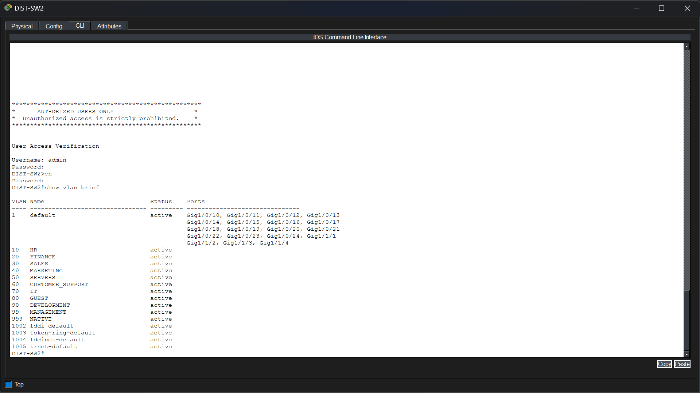
</p>

---

### IEEE 802.1Q Trunk Links

Trunk links were configured to transport multiple VLANs between switches while using VLAN 999 as the native VLAN.

<p align="center">
    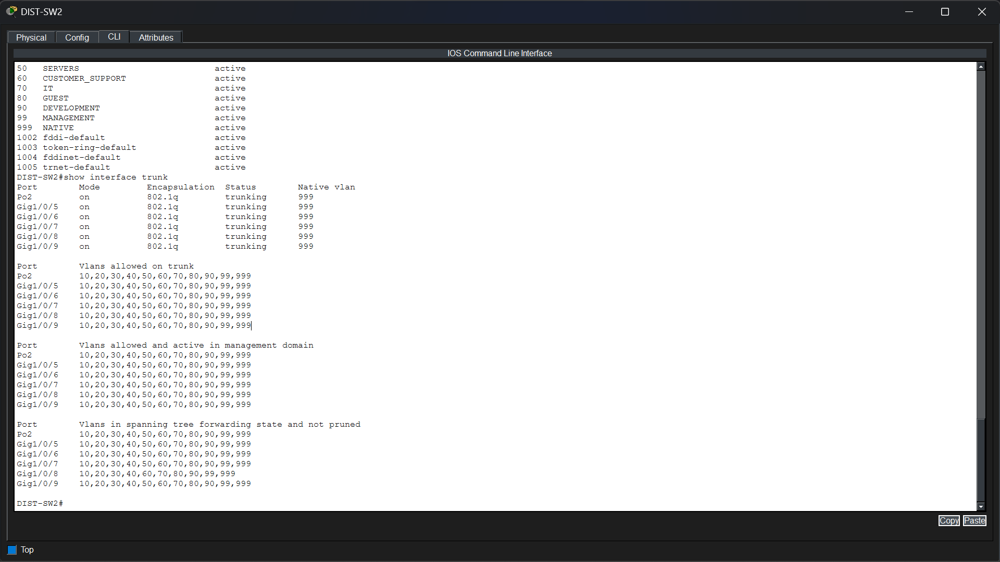
</p>

---

### Rapid PVST+

Rapid PVST+ was configured with optimized root bridge placement, ensuring a loop-free Layer 2 topology and rapid convergence.

<p align="center">
    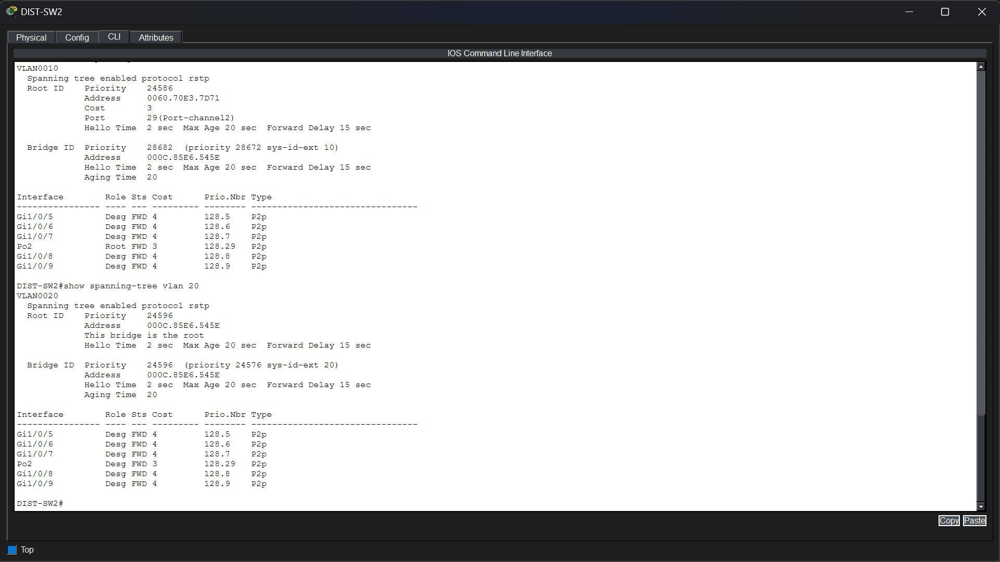
</p>

---

### Port Security

Port Security was enabled on user-facing access ports using sticky MAC learning, a maximum of two secure MAC addresses, and the **restrict** violation mode to prevent unauthorized devices from connecting to the network.

<p align="center">
    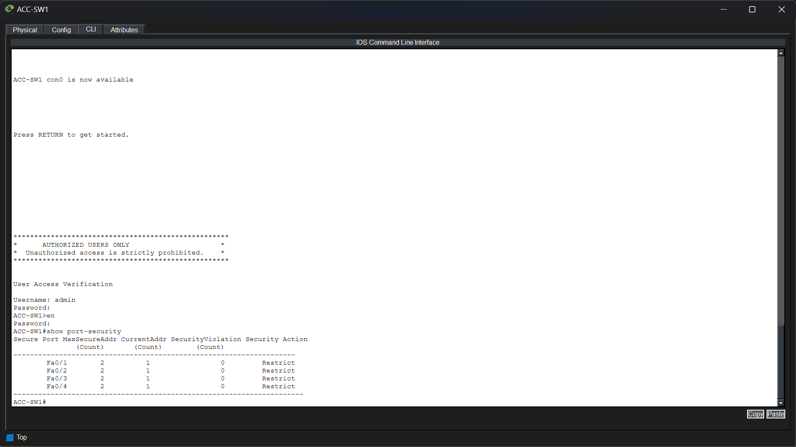
</p>

---

### DHCP Snooping

DHCP Snooping was enabled on all user VLANs to protect the network against rogue DHCP servers. Uplink interfaces were configured as trusted while access ports remained untrusted.

<p align="center">
    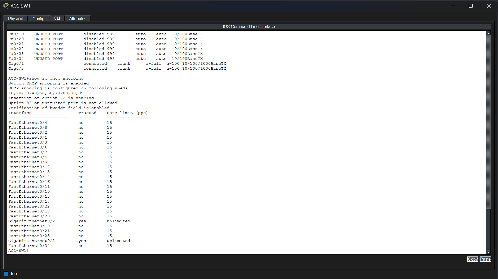
</p>

---

### Dynamic ARP Inspection (DAI)

Dynamic ARP Inspection (DAI) was configured to validate ARP packets against the DHCP Snooping binding database, protecting the network from ARP spoofing attacks.

<p align="center">
    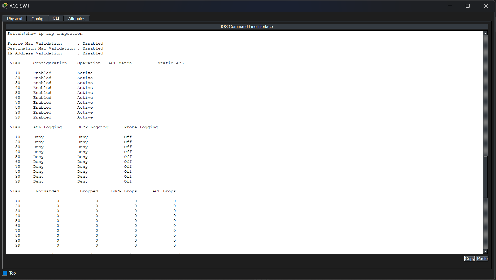
</p>

---

## Result

A secure and resilient Layer 2 infrastructure was successfully deployed. VLAN segmentation, secure trunking, Rapid PVST+, Port Security, DHCP Snooping, and Dynamic ARP Inspection collectively provide a scalable, fault-tolerant, and secure foundation for the enterprise campus network.

---
# Phase 2 – Layer 3 Redundancy & Inter-VLAN Routing

## Objective

Implement a highly available Layer 3 architecture by configuring Switch Virtual Interfaces (SVIs), Inter-VLAN Routing, and Hot Standby Router Protocol (HSRP) to provide resilient default gateway redundancy for all enterprise VLANs.

---

## Implementation

The distribution layer switches were upgraded to operate as Layer 3 switches, allowing them to perform Inter-VLAN Routing without relying on external routers. A Switch Virtual Interface (SVI) was created for every user and management VLAN, enabling routing between departments while maintaining logical network segmentation.

To eliminate the single point of failure associated with a default gateway, Hot Standby Router Protocol (HSRP) was deployed across both distribution switches. A virtual IP address was configured for every VLAN, providing hosts with a single default gateway regardless of which distribution switch is actively forwarding traffic.

Gateway load balancing was achieved by splitting the HSRP Active role across the two distribution switches. Dist-SW1 serves as the Active gateway for half of the VLANs, while Dist-SW2 serves the remaining VLANs. HSRP priorities and preemption were configured so that, after a failure, the preferred switch automatically resumes the Active role once it returns to service.

---

## Verification

### Switch Virtual Interfaces (SVIs)

SVIs were successfully configured for every VLAN and are operational, providing Layer 3 connectivity for all enterprise networks.

<p align="center">
    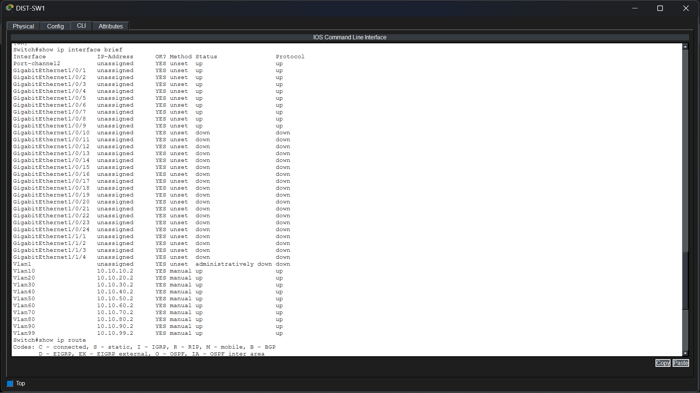
</p>

---

### Inter-VLAN Routing

The routing table confirms that all VLAN networks are directly connected through their respective SVIs, enabling communication between departments.

<p align="center">
    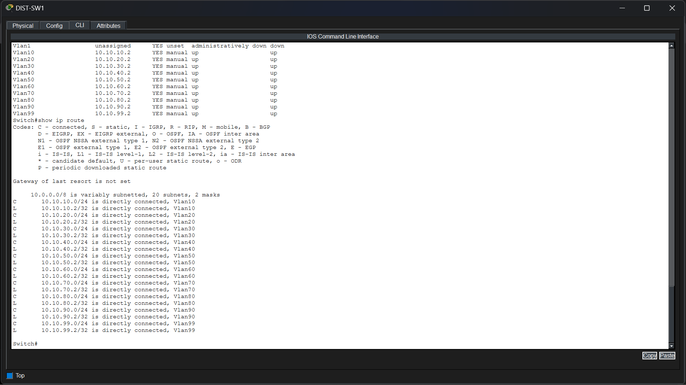
</p>

---

### Hot Standby Router Protocol (HSRP)

HSRP is operational across all VLANs, with Active and Standby gateway responsibilities distributed between both Layer 3 switches to provide gateway redundancy and load sharing.

<p align="center">
    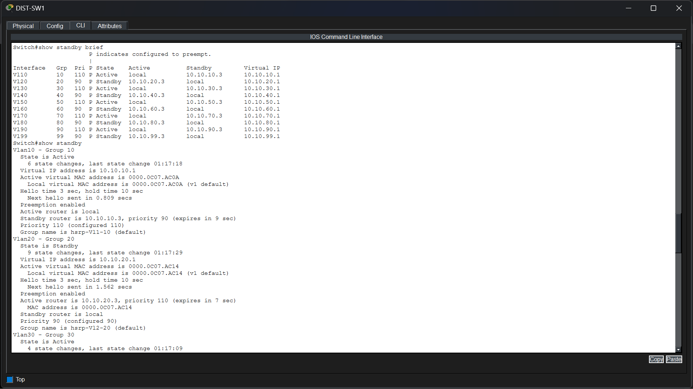
</p>

---

## Result

A resilient Layer 3 infrastructure was successfully deployed. Inter-VLAN Routing enables communication between all enterprise VLANs, while HSRP provides seamless default gateway redundancy, automatic failover, and balanced gateway utilization across the distribution layer.

---
# Phase 3 – OSPF Dynamic Routing

## Objective

Configure Open Shortest Path First (OSPF) to provide dynamic routing across the enterprise network. This phase enables automatic route exchange between the Distribution, Core, and Edge layers while ensuring scalability, redundancy, and rapid convergence.

---

## Technologies Implemented

- OSPF Process 1
- Area 0 Backbone
- Router IDs
- Passive Interfaces
- Equal-Cost Multi-Path (ECMP)
- Default Route Advertisement
- Dynamic Route Learning

---

## Configuration Summary

The following devices participated in the OSPF routing domain:

- DIST-SW1
- DIST-SW2
- CORE-SW1
- CORE-SW2
- EDGE-R1

### Key Configuration Tasks

- Assigned IP addresses to all routed Layer 3 links.
- Configured OSPF Process 1 on all Layer 3 devices.
- Assigned unique Router IDs.
- Advertised VLAN interfaces and routed links into Area 0.
- Configured passive interfaces for user VLANs.
- Advertised the default route from the Edge Router.
- Verified OSPF neighbor adjacencies and routing table synchronization.

---

# Verification

## 1. Edge Router Layer 3 Interfaces

Verified that routed interfaces connecting the Edge Router to the Core layer are operational.

**Verification Command**

```bash
show ip interface brief
```

<p align="center">
  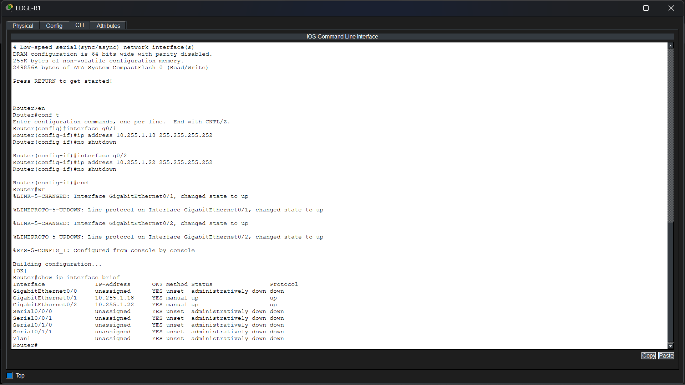
</p>

---

## 2. Core Switch Layer 3 Interfaces

Verified Layer 3 connectivity and IP addressing on CORE-SW1.

**Verification Command**

```bash
show ip interface brief
```

<p align="center">
  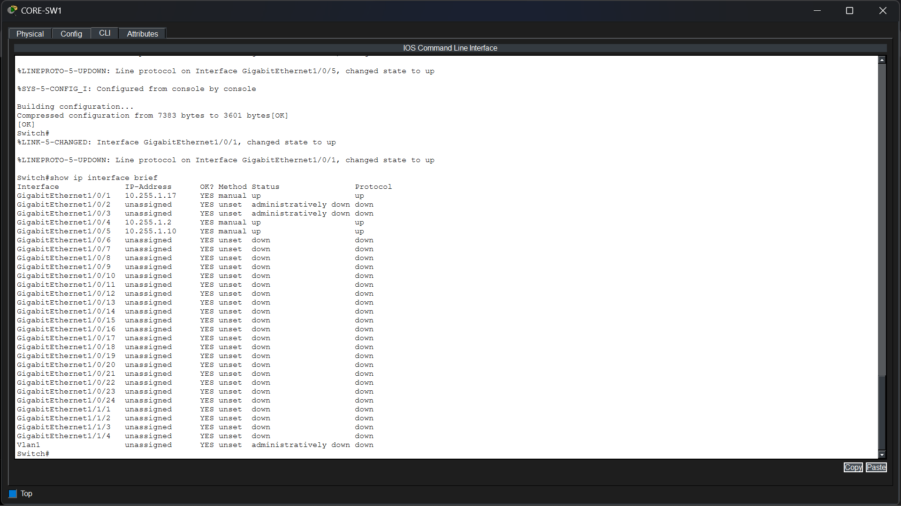
</p>

---

## 3. Distribution Switch Layer 3 Interfaces

Verified all VLAN interfaces and routed uplinks on DIST-SW1 before OSPF adjacency formation.

**Verification Command**

```bash
show ip interface brief
```

<p align="center">
  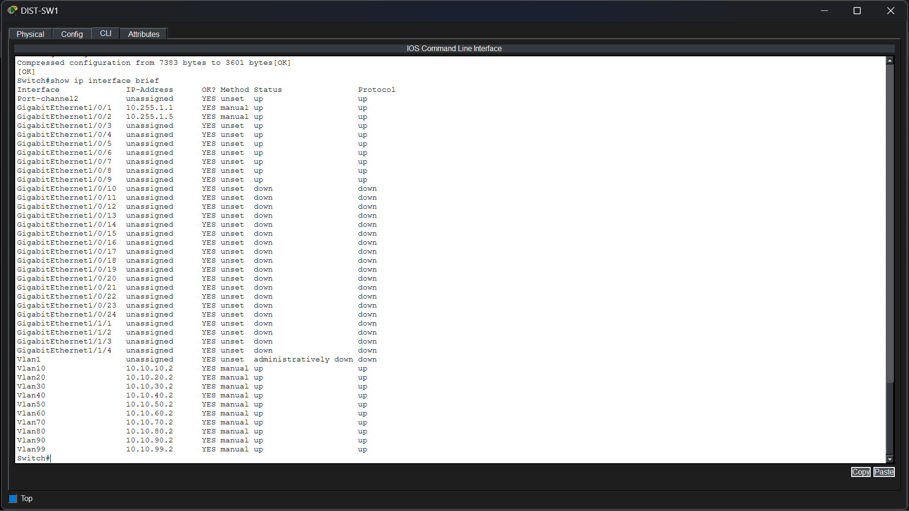
</p>

---

## 4. OSPF Neighbor Adjacencies and Learned Routes

Confirmed successful OSPF neighbor establishment and verified dynamically learned routes across the enterprise network.

**Verification Commands**

```bash
show ip ospf neighbor
show ip route ospf
```

<p align="center">
  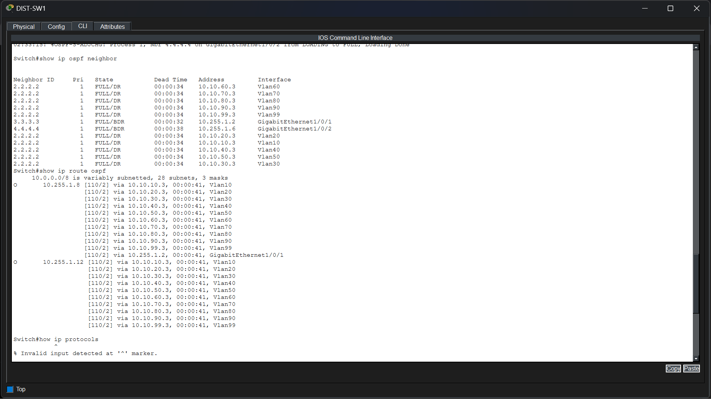
</p>

---

## 5. OSPF Process Verification

Verified the OSPF process configuration, Router ID, advertised networks, passive interfaces, and routing information sources.

**Verification Command**

```bash
show ip protocols
```

<p align="center">
  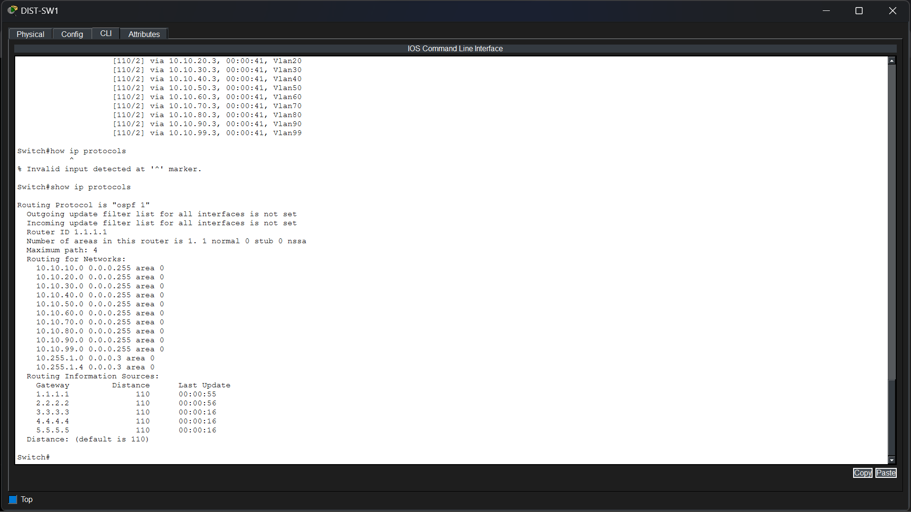
</p>

---

## 6. OSPF Routing Table Verification

Confirmed that routes were dynamically learned through OSPF, including intra-area, inter-area, and default routes.

**Verification Command**

```bash
show ip route
```

<p align="center">
  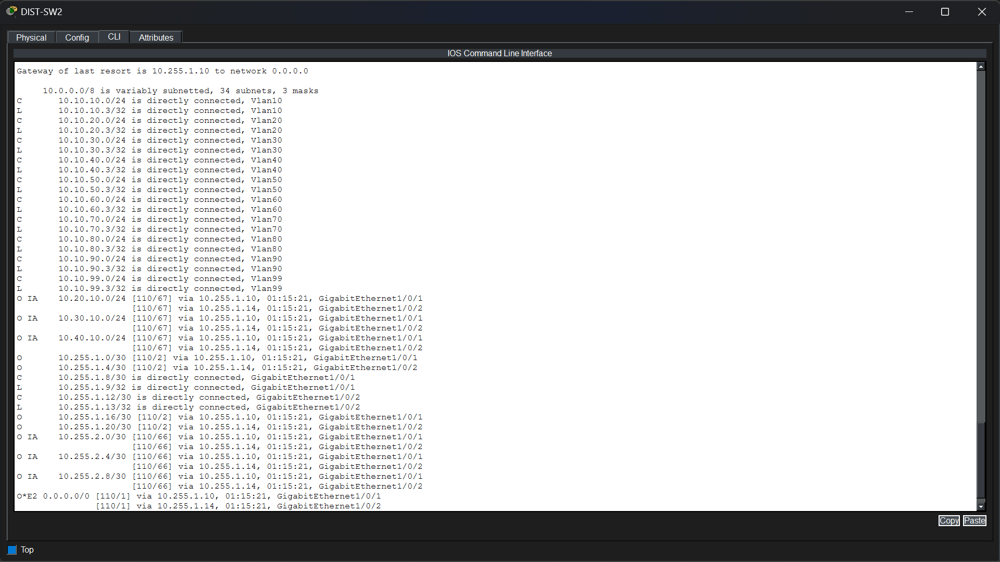
</p>

---

# Result

- Successfully deployed OSPF Process 1 throughout the enterprise network.
- Established FULL neighbor adjacencies between Distribution, Core, and Edge devices.
- Enabled automatic exchange of VLAN and infrastructure routes.
- Successfully propagated the default route from the Edge Router.
- Implemented Equal-Cost Multi-Path (ECMP) for redundant Layer 3 forwarding.
- Achieved scalable, resilient, and dynamically converging enterprise routing.

---
# Phase 4 – WAN Connectivity, Multi-Area OSPF & GRE VPN

## Objective

Build a scalable and resilient enterprise WAN by establishing point-to-point serial connectivity between Headquarters and all branch offices, implementing Multi-Area OSPF for dynamic routing, and deploying a GRE tunnel between Headquarters and Branch A to provide secure logical connectivity across the WAN.

---

## Implementation

Point-to-point serial WAN links were established between Headquarters and each branch office using /30 networks. DCE interfaces were configured with clock rates, interface descriptions were assigned, and all WAN links were verified to ensure end-to-end connectivity.

Multi-Area OSPF was implemented to provide scalable dynamic routing across the enterprise. Headquarters was configured as the backbone (Area 0), while each branch was assigned its own area. Router IDs, network advertisements, and passive interfaces were configured to minimize unnecessary routing traffic while allowing OSPF neighbors to form across WAN links.

A GRE (Generic Routing Encapsulation) tunnel was deployed between Headquarters and Branch A. The tunnel provides a logical point-to-point connection over the existing WAN infrastructure, allowing internal traffic to traverse the WAN independently of the underlying transport network.

To validate network resiliency, WAN link failures were simulated by shutting down serial interfaces. OSPF dynamically detected the failures, removed affected routes, and automatically re-established neighbor relationships and routing information when connectivity was restored.

---

## Verification

### WAN Connectivity

All WAN serial interfaces were successfully configured and verified. End-to-end connectivity between Headquarters and all branch routers was confirmed through interface status and ICMP testing.

<p align="center">
    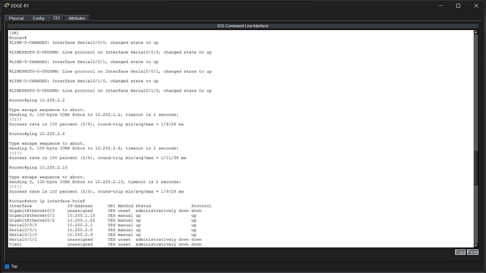
</p>

---

### DCE Clock Rate Verification

The DCE side of the WAN connection was verified to ensure proper clock rate configuration for serial communication.

<p align="center">
    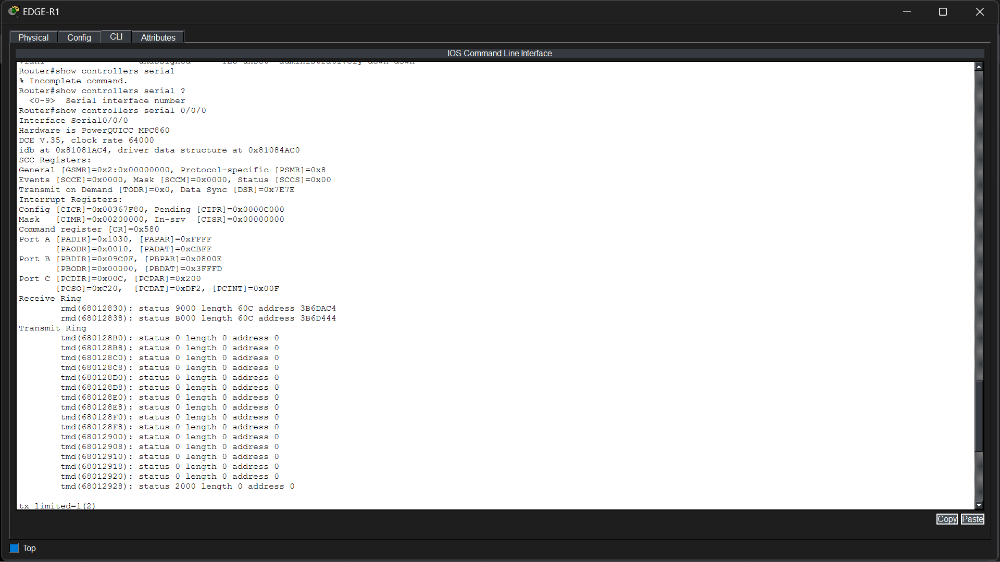
</p>

---

### Branch Router Configuration

Branch router LAN and WAN interfaces were successfully configured and verified for operational status.

<p align="center">
    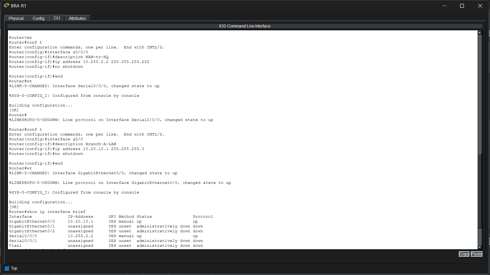
</p>

---

### Multi-Area OSPF

OSPF neighbor relationships were successfully established across all WAN links, and the routing table confirms dynamic route exchange between Headquarters and every branch area.

<p align="center">
    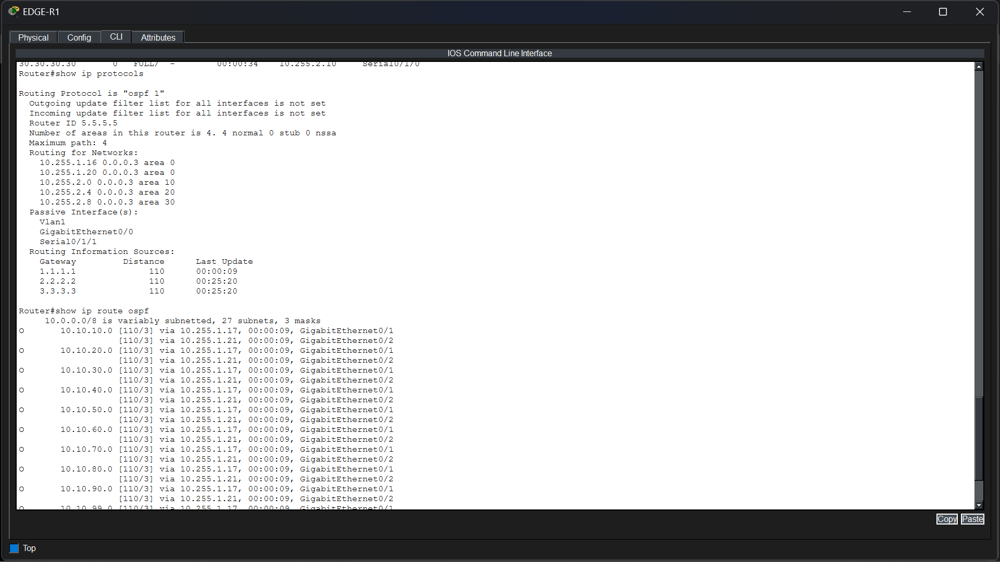
</p>

---

### GRE Tunnel Verification

The GRE tunnel between Headquarters and Branch A was successfully established, with Tunnel0 operational and carrying traffic across the WAN.

<p align="center">
    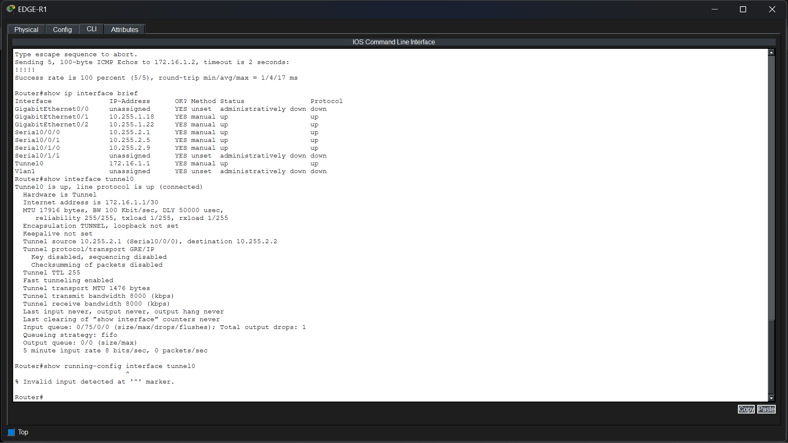
</p>

---

### OSPF Failover & Recovery

A WAN failure was simulated by disabling a serial interface. OSPF detected the neighbor loss, removed affected routes, and automatically restored adjacency and routing after the link was re-enabled.

<p align="center">
    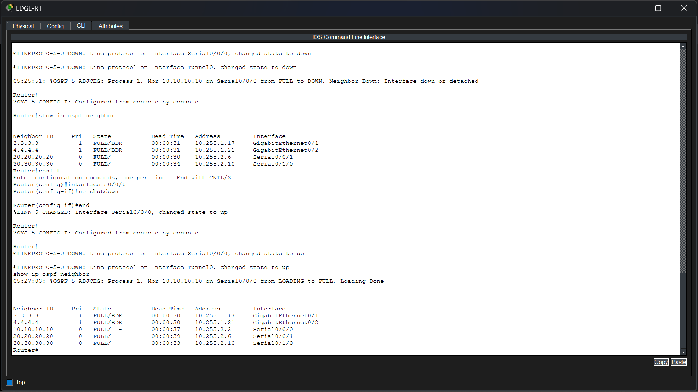
</p>

---

### Branch Failover Validation

Connectivity was tested from the branch during a WAN outage. Communication failed while the link was down and was automatically restored once the interface recovered, validating dynamic routing convergence.

<p align="center">
    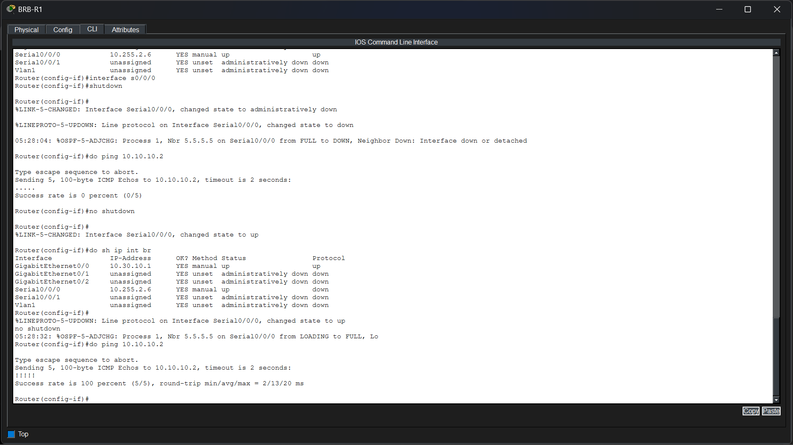
</p>

---

### Additional Branch Recovery Test

An additional failover test performed from another branch confirmed successful OSPF reconvergence and restoration of end-to-end connectivity following WAN recovery.

<p align="center">
    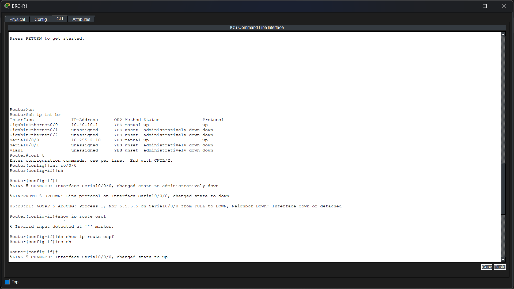
</p>

---

## Result

A scalable enterprise WAN was successfully deployed using point-to-point serial links, Multi-Area OSPF, and GRE tunneling. Dynamic routing enables efficient communication between Headquarters and all branch offices, while GRE provides logical site-to-site connectivity. OSPF automatically detects WAN failures, reconverges the network, and restores connectivity after link recovery, ensuring a resilient and highly available WAN infrastructure.

---
# Phase 5 – Enterprise Network Services

## Objective

Deploy centralized enterprise network services to automate host configuration, simplify resource access, provide centralized monitoring, maintain consistent time synchronization, and secure administrative access across the network.

---

## Implementation

A dedicated server VLAN was used to host critical network services, ensuring centralized management and simplifying administration.

A centralized DHCP server was deployed to automatically assign IP addresses, subnet masks, default gateways, and DNS server information to all client VLANs. Since the DHCP server resides on a different subnet, DHCP Relay (IP Helper Address) was configured on every Layer 3 Switch Virtual Interface (SVI), allowing DHCP requests to traverse VLAN boundaries.

A centralized DNS server was configured with A records for enterprise services, enabling devices to access resources using hostnames instead of IP addresses.

To improve network monitoring and troubleshooting, a centralized Syslog server was deployed. All network devices were configured to forward system logs to the server, providing a single location for event collection and auditing.

An NTP server was implemented to synchronize the system clocks of all network devices, ensuring consistent timestamps across logs and simplifying event correlation.

Finally, AAA Local Authentication was configured to secure administrative access. User credentials stored locally on each switch are used to authenticate management sessions, providing controlled access to network infrastructure.

---

## Verification

### DHCP Configuration

The centralized DHCP server contains address pools for every enterprise VLAN, while clients successfully receive IP addressing information through DHCP Relay.

<p align="center">
    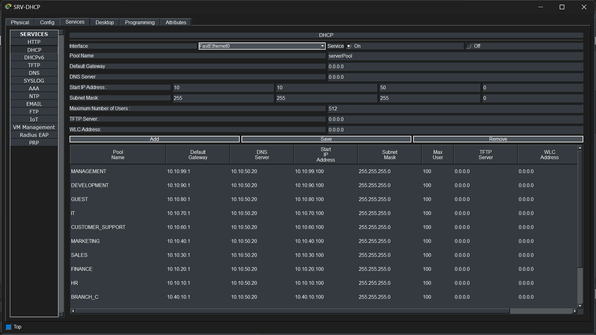
</p>

<p align="center">
    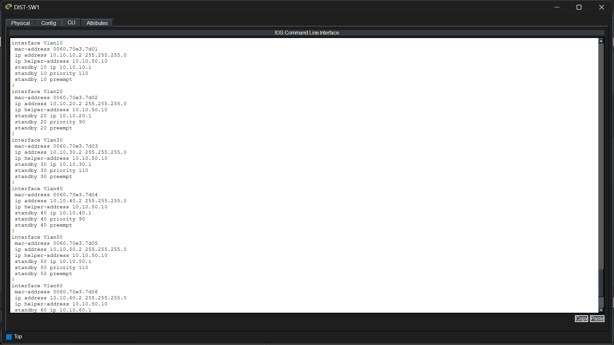
</p>

<p align="center">
    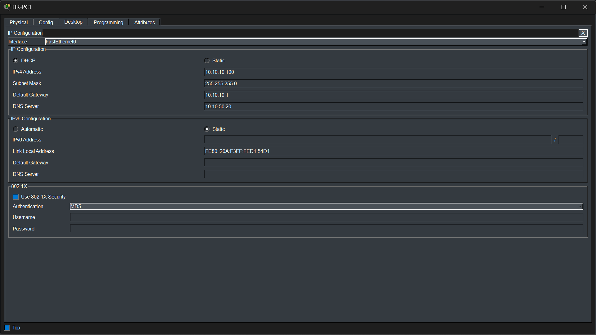
</p>

---

### DNS Name Resolution

The DNS server successfully resolves enterprise hostnames using configured A records, allowing clients to access resources by name instead of IP address.

<p align="center">
    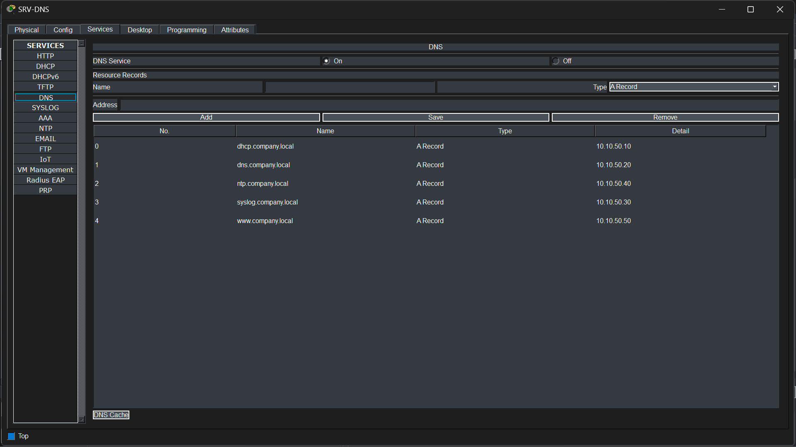
</p>

<p align="center">
    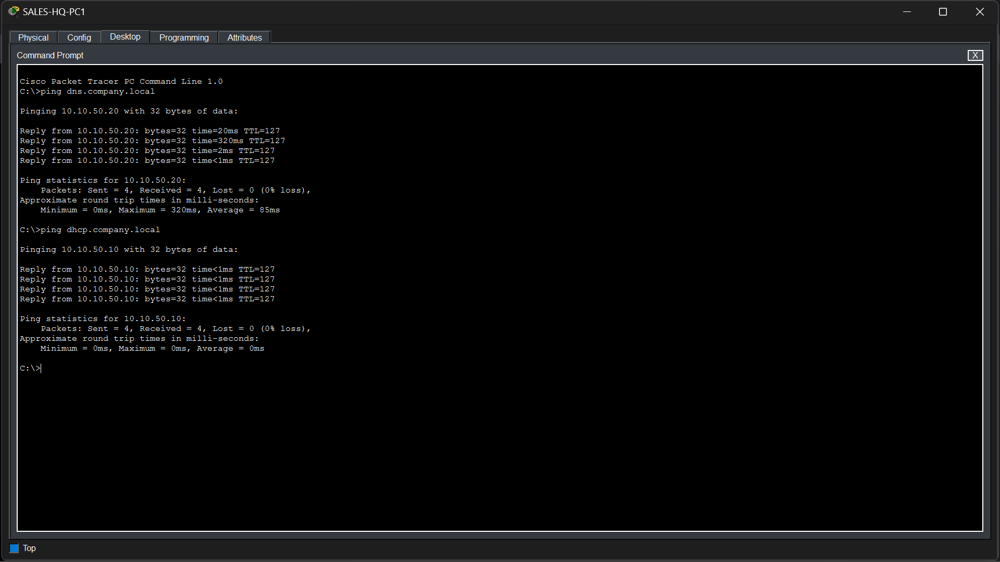
</p>

---

### Syslog Monitoring

Network devices successfully forward system log messages to the centralized Syslog server, enabling centralized event monitoring and troubleshooting.

<p align="center">
    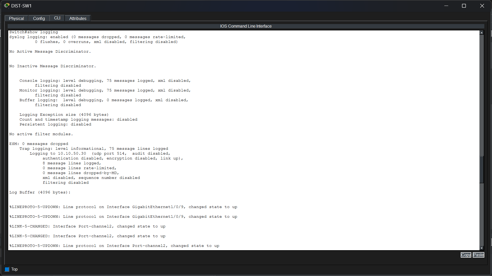
</p>

<p align="center">
    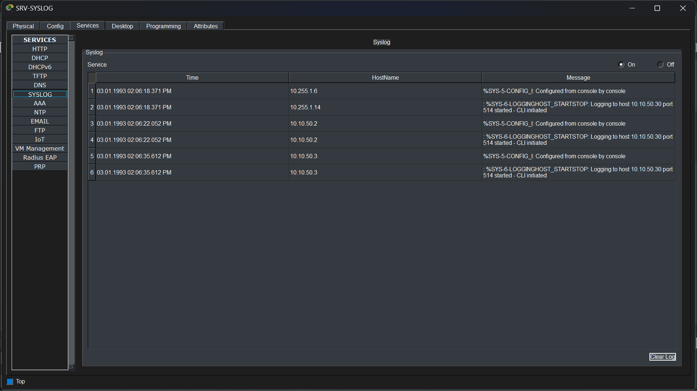
</p>

---

### Network Time Protocol (NTP)

Network devices successfully synchronize their clocks with the centralized NTP server, ensuring consistent timestamps across the enterprise network.

<p align="center">
    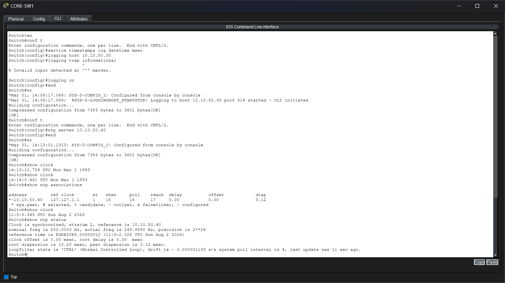
</p>

---

### AAA Local Authentication

Administrative access is secured through AAA Local Authentication, requiring valid local user credentials before granting management access.

<p align="center">
    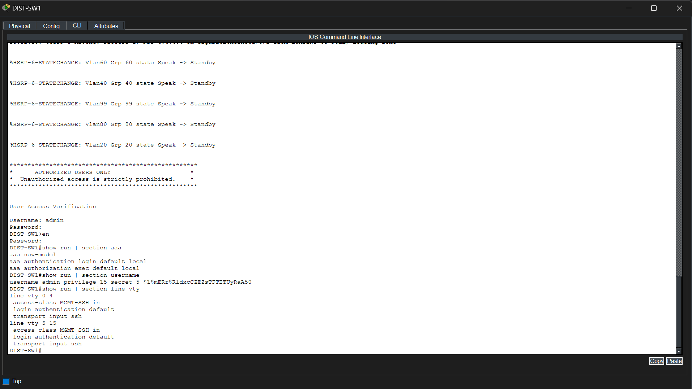
</p>

---

## Result

Centralized enterprise network services were successfully deployed. DHCP automates IP address allocation across all VLANs, DNS provides hostname resolution, Syslog enables centralized event logging, NTP maintains synchronized system time, and AAA secures administrative access. Together, these services improve network manageability, operational efficiency, monitoring capabilities, and overall security.

---
# Phase 6 – Infrastructure Security

## Objective

Improve the security of the enterprise network by implementing Layer 2 hardening, secure remote device management, and Access Control Lists (ACLs) to enforce departmental access policies and protect critical network resources.

---

## Implementation

Multiple security measures were deployed to strengthen the network infrastructure and reduce the overall attack surface.

Unused switch interfaces were assigned to an unused VLAN (VLAN 999), administratively shut down, and labeled with descriptive interface names to prevent unauthorized physical access.

Secure remote management was configured using SSH Version 2. RSA encryption keys were generated, local user authentication was enabled, and VTY lines were configured to accept only SSH connections. Access to the management plane was further restricted using a dedicated Management ACL, allowing only authorized management hosts to remotely administer network devices.

Extended Access Control Lists (ACLs) were implemented to enforce security policies between departments. Guest users were prevented from accessing internal enterprise networks, while Finance users were restricted from accessing HR resources without affecting access to permitted services such as servers and management systems.

---

## Verification

### Layer 2 Port Hardening

Unused switch interfaces were successfully assigned to VLAN 999, administratively disabled, and labeled as unused ports.

<p align="center">
    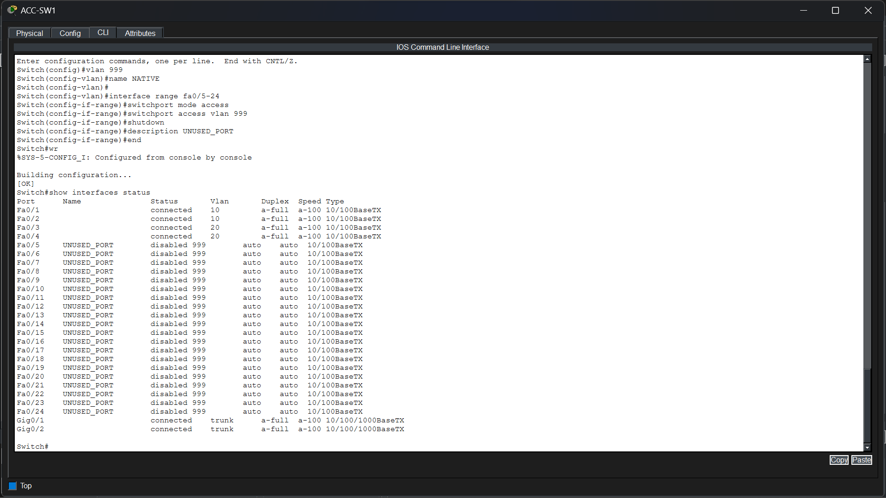
</p>

---

### SSH Configuration

SSH Version 2 was successfully configured with RSA encryption keys, local authentication, and secure VTY access.

<p align="center">
    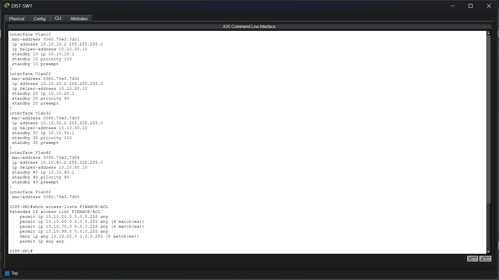
</p>

---

### Management Network Connectivity

The management workstation successfully reached enterprise devices before establishing encrypted SSH sessions.

<p align="center">
    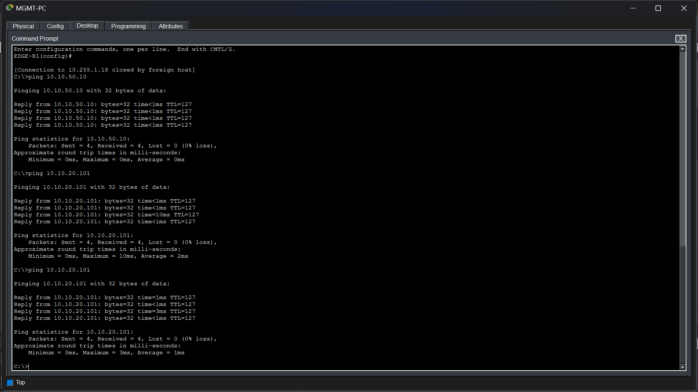
</p>

---

### Secure Remote Administration

SSH authentication was successfully verified by remotely accessing enterprise devices from the management workstation.

<p align="center">
    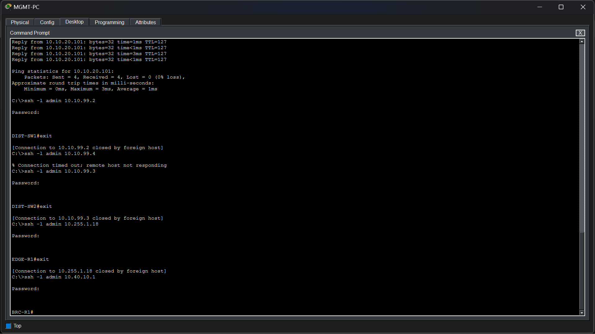
</p>

---

### Guest Network Isolation

The Guest ACL was successfully applied, preventing Guest VLAN users from accessing internal enterprise networks while recording ACL hit counters.

<p align="center">
    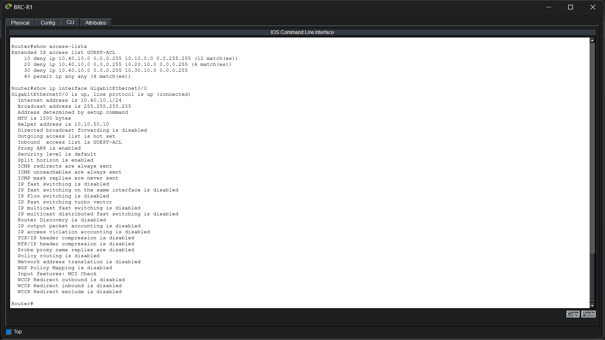
</p>

Guest users were unable to communicate with protected internal resources, confirming successful ACL enforcement.

<p align="center">
    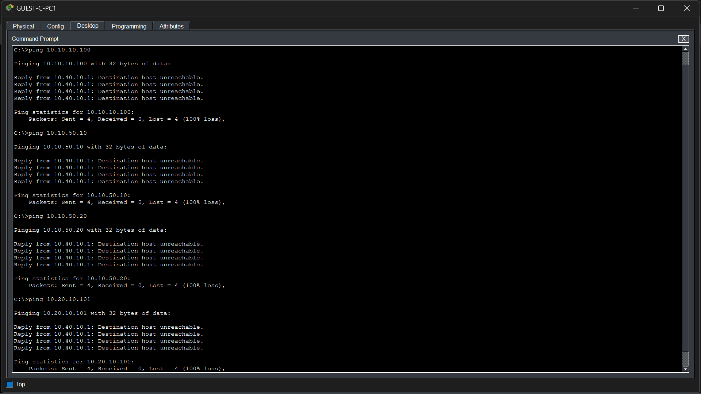
</p>

---

### Finance Department Access Control

The Finance ACL successfully restricted unauthorized access while permitting approved enterprise services. ACL hit counters confirmed that traffic matched the configured security policy.

<p align="center">
    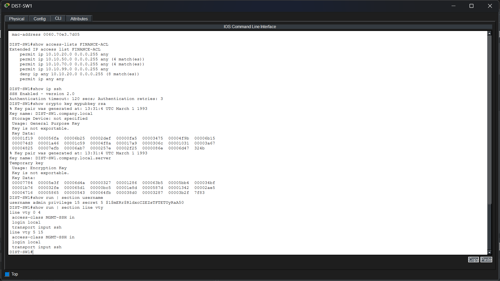
</p>

Attempted communication with restricted HR resources was successfully blocked, verifying correct ACL operation.

<p align="center">
    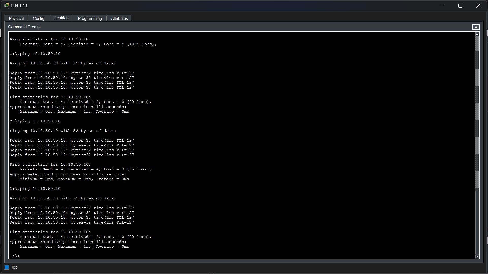
</p>

---

## Result

The enterprise network now incorporates multiple layers of security to protect both the infrastructure and enterprise resources. Physical access risks were reduced by disabling unused switch ports, secure remote administration was enforced through SSH with restricted management access, and extended ACLs successfully isolated the Guest network while enforcing inter-department access policies. Together, these controls significantly improve the confidentiality, integrity, and overall security posture of the enterprise network.


---
# Phase 7 – Network Address Translation (NAT)

## Objective

Enable enterprise devices to access external networks using Network Address Translation (NAT) with Port Address Translation (PAT), allowing multiple internal hosts to share a single public IP address while conserving public IPv4 addresses.

---

## Implementation

Dynamic NAT overload (PAT) was configured on the edge router to translate private enterprise IP addresses into a single public IP address assigned to the Internet-facing interface.

The LAN-facing interfaces were configured as NAT inside interfaces, while the ISP-facing interface was configured as the NAT outside interface. An access list identified all internal enterprise networks eligible for translation, and NAT overload was enabled using the public interface address.

The edge router also advertised the default route into the OSPF domain, allowing all internal networks to reach external destinations through the Internet gateway.

---

## Verification

### NAT Configuration and Translation Table

The edge router successfully identifies inside and outside interfaces, performs Port Address Translation (PAT), and dynamically creates translation entries as internal devices communicate with external networks.

<p align="center">
    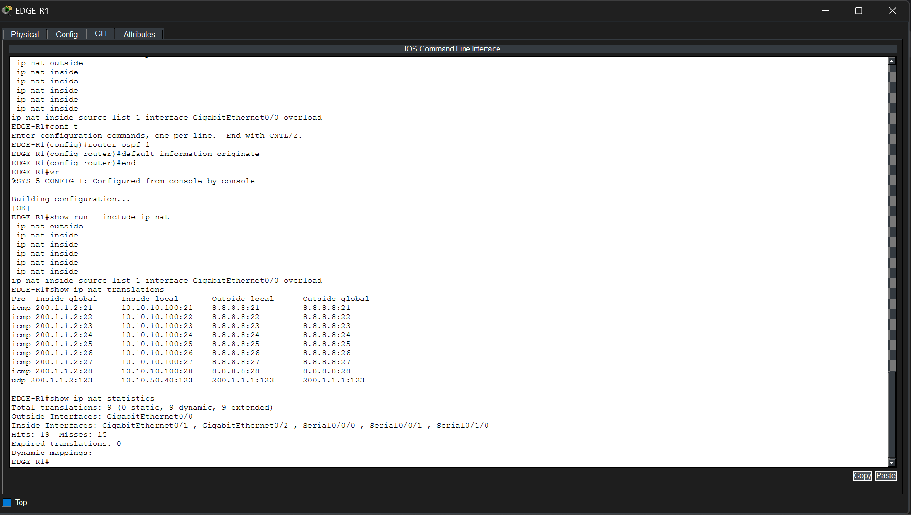
</p>

Active NAT translations verified that internal enterprise traffic was successfully translated to the public interface address during Internet communication.

---

### Internet Connectivity

Enterprise hosts successfully reached external Internet resources through the translated public IP address, confirming successful NAT overload operation.

<p align="center">
    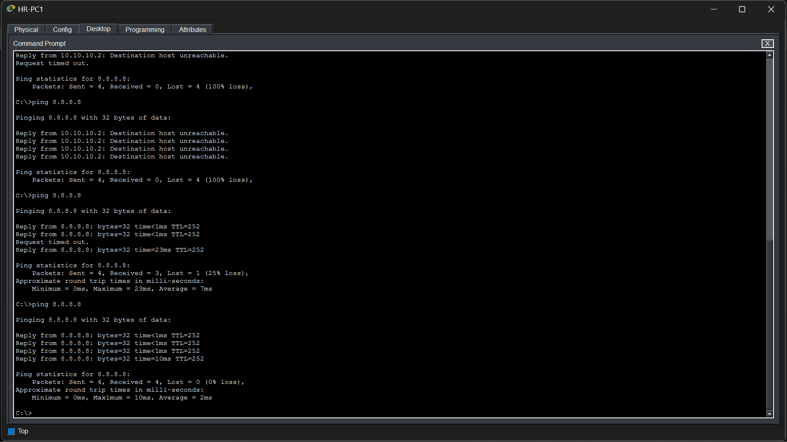
</p>

Successful end-to-end Internet connectivity confirmed correct PAT operation and default route advertisement throughout the enterprise network.

---

## Result

Dynamic NAT overload (PAT) was successfully implemented on the enterprise edge router, allowing multiple internal hosts to securely share a single public IP address for Internet access. Translation tables confirmed active address translation, and successful communication with external resources verified end-to-end Internet connectivity across the enterprise network.

---
# Phase 8 – End-to-End Enterprise Validation

## Objective

Verify that all implemented technologies operate together as a fully functional, secure, redundant, and highly available enterprise network.

---

## Validation

Rather than validating individual technologies separately, this phase confirms that the completed enterprise infrastructure operates as an integrated solution.

The following components were successfully validated:

- Inter-VLAN Routing
- Multi-Area OSPF Routing
- HSRP Gateway Redundancy
- EtherChannel
- DHCP Services
- DNS Name Resolution
- NAT/PAT Internet Access
- SSH Secure Management
- Access Control Lists (ACLs)
- Syslog Logging
- NTP Time Synchronization

---

## Verification

### Final Enterprise Topology

The completed enterprise topology demonstrates the hierarchical campus architecture with redundant core and distribution layers, centralized enterprise services, Internet connectivity, and integrated branch offices.

<p align="center">
    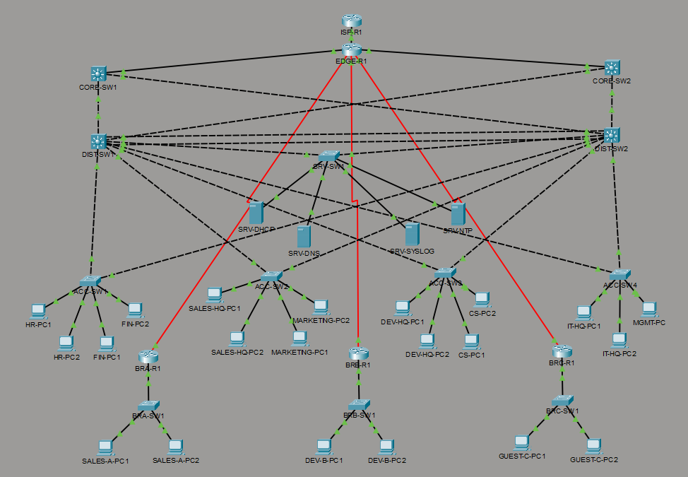
</p>

---

### HSRP Gateway Redundancy

Gateway redundancy was validated by forcing the active HSRP gateway to fail. During failover, the standby gateway successfully transitioned to the Active state, restoring connectivity after only minimal packet loss and demonstrating uninterrupted gateway availability.

<p align="center">
    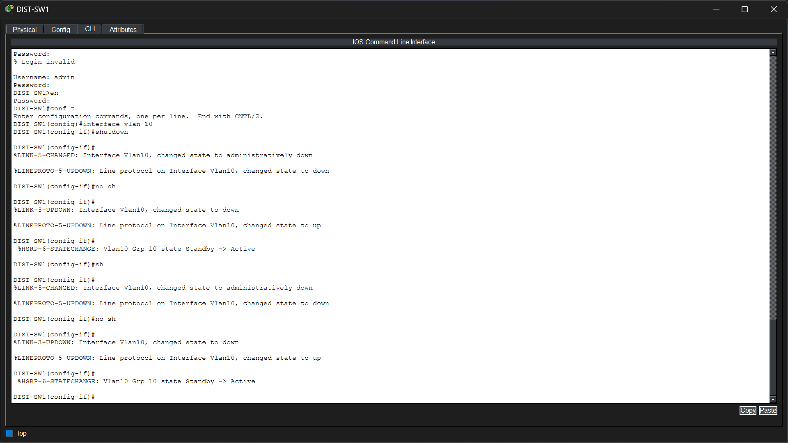
</p>

The corresponding client connectivity test confirmed successful failover.

<p align="center">
    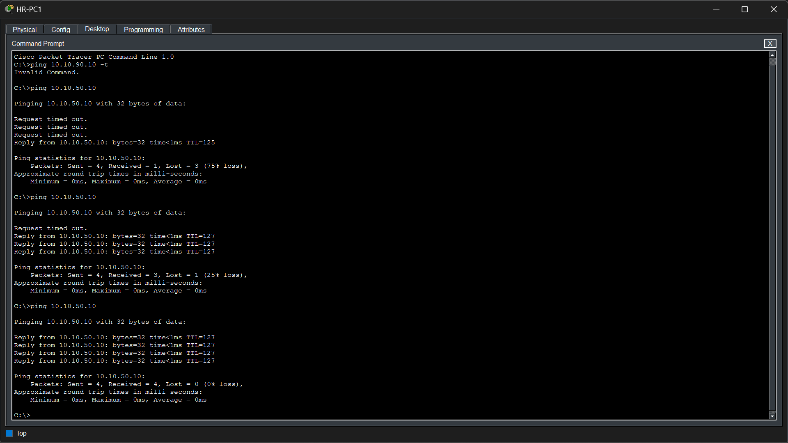
</p>

---

### OSPF Routing Verification

Routing tables confirmed successful route advertisement across headquarters and branch offices while maintaining redundant routing paths throughout the enterprise.

<p align="center">
    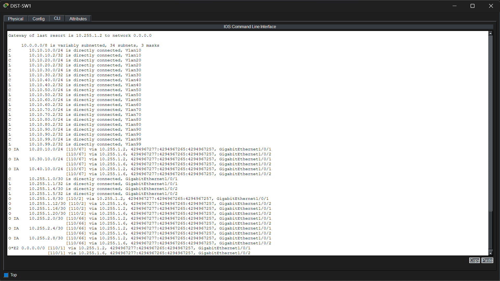
</p>

---

### DHCP Client Verification

Enterprise hosts successfully received IP addressing information from the centralized DHCP server, including the correct IP address, subnet mask, default gateway, DHCP server, and DNS server configuration.

<p align="center">
    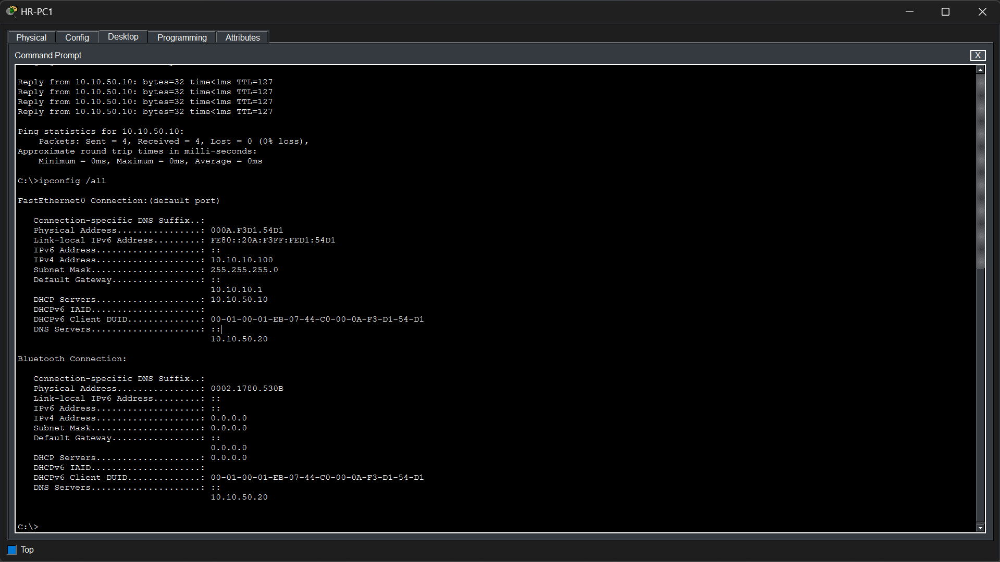
</p>

---

## Result

The completed enterprise network successfully demonstrated the integrated operation of all implemented technologies, including VLAN segmentation, Inter-VLAN Routing, Multi-Area OSPF, HSRP gateway redundancy, EtherChannel, Rapid PVST+, DHCP, DNS, NAT/PAT, SSH, ACLs, Syslog, and NTP.

Comprehensive end-to-end validation confirmed reliable communication between headquarters, branch offices, enterprise services, and external networks while maintaining redundancy, security, and high availability throughout the infrastructure.

---

# Conclusion

The **Orion Dynamics – Enterprise Multi-Site Network Infrastructure** successfully demonstrates the design, implementation, and validation of a secure, scalable, and highly available enterprise network using Cisco Packet Tracer. Developed through a structured nine-phase implementation, the project progresses from building the Layer 2 foundation to implementing gateway redundancy, dynamic routing, enterprise network services, security, Internet connectivity, and comprehensive end-to-end validation.

The completed network integrates a hierarchical headquarters architecture with three branch offices, providing resilient connectivity through redundant core and distribution layers while maintaining centralized enterprise services.

Throughout the project, enterprise technologies including VLANs, IEEE 802.1Q Trunking, Rapid PVST+, EtherChannel (LACP), Inter-VLAN Routing, HSRP, Multi-Area OSPF, GRE VPN, DHCP Relay, Centralized DHCP, DNS, NAT/PAT, SSH, AAA, Access Control Lists (ACLs), OSPF Authentication, Syslog, and NTP were implemented to create a production-style enterprise infrastructure focused on scalability, redundancy, security, and simplified management.

Comprehensive verification and failover testing confirmed the successful operation of all implemented technologies. Gateway redundancy, dynamic routing, WAN connectivity, enterprise services, security policies, and Internet access were validated to ensure the network maintained reliable communication under both normal operating conditions and simulated failure scenarios.

This project represents a comprehensive CCNA-level enterprise implementation, demonstrating practical skills in enterprise network design, routing, switching, redundancy, security, WAN technologies, centralized services, troubleshooting, documentation, and validation while following industry best practices.

---

# Repository Structure

```text
Orion-Dynamics-Enterprise-Network/
│
├── configs/
│   ├── CORE-SW1.txt
│   ├── CORE-SW2.txt
│   ├── DIST-SW1.txt
│   ├── DIST-SW2.txt
│   ├── ACC-SW1.txt
│   ├── ACC-SW2.txt
│   ├── ACC-SW3.txt
│   ├── ACC-SW4.txt
│   ├── SRV-SW1.txt
│   ├── EDGE-R1.txt
│   ├── ISP-R1.txt
│   ├── BRA-R1.txt
│   ├── BRB-R1.txt
│   ├── BRC-R1.txt
│   └── Server_Config.txt
│
├── screenshots/
│   ├── Topology/
│   ├── Phase1/
│   ├── Phase2/
│   ├── Phase3/
│   ├── Phase4/
│   ├── Phase5/
│   ├── Phase6/
│   ├── Phase7/
│   ├── Phase8/
│
├── Orion-Dynamics-Enterprise-Network.pkt
├── README.md
└── LICENSE
```

---

# License

This project is licensed under the MIT License. See the [LICENSE](LICENSE) file for more information.

---

# Author

**Zidan K**

- GitHub: https://github.com/z10an/CCNA-Labs
- LinkedIn: https://www.linkedin.com/in/zi0an/
