# ABC Solutions Enterprise Network

<p align="center">
  
</p>

<p align="center">
  <strong>A complete enterprise network designed and implemented using Cisco Packet Tracer.</strong><br>
  Simulating the infrastructure of a small-to-medium-sized organization with secure switching, routing,
  enterprise network services, infrastructure security, centralized management, and Internet connectivity.
</p>

---

# Project Overview

The **ABC Solutions Enterprise Network** is a comprehensive enterprise networking project that simulates the IT infrastructure of **ABC Solutions Pvt. Ltd.**, a fictional organization with approximately **40 employees** across multiple departments.

Rather than implementing isolated networking features, this project follows a structured deployment methodology where each technology is introduced in logical phases, progressively transforming the network into a secure, scalable, and fully functional enterprise environment.

Beginning with Layer 2 switching and VLAN segmentation, the network evolves through Layer 3 routing, centralized network services, infrastructure security, device management, monitoring, and public Internet connectivity. Every implementation phase builds upon the previous one and is thoroughly validated using Cisco IOS verification commands and end-to-end testing.

This repository documents the complete implementation process, including network design, configurations, verification, and supporting documentation for each deployment phase.

---

# Project Objectives

- Design a scalable enterprise network for a small-to-medium-sized organization.
- Segment departments using Virtual LANs (VLANs).
- Enable secure communication through Layer 3 switching and routing.
- Deploy centralized DHCP and DNS services.
- Provide Internet access using Network Address Translation (NAT/PAT).
- Secure the infrastructure using enterprise Layer 2 security mechanisms.
- Enable encrypted remote administration through SSH.
- Implement centralized logging and time synchronization.
- Validate complete end-to-end communication across the enterprise network.

---

# Project Highlights

| Feature | Details |
|----------|---------|
| Project Type | Enterprise Network Implementation |
| Platform | Cisco Packet Tracer |
| Deployment Approach | Phase-by-Phase Enterprise Build |
| Network Devices | 6 Cisco Devices |
| End Devices | Multiple Client PCs and Servers |
| Enterprise Services | DHCP, DNS, NAT/PAT |
| Security Features | SSH, Port Security, DHCP Snooping, Dynamic ARP Inspection |
| Management Features | NTP, Syslog |
| Internet Simulation | Public DNS and Web Server |
| Documentation | Detailed implementation and verification for every phase |

> **Note**
>
> This project is intended to simulate the deployment of an enterprise network using Cisco Packet Tracer. While Packet Tracer has certain platform limitations, every implemented technology follows standard Cisco networking concepts and industry best practices.

---

# Project Objectives

The primary objective of this project was to design and implement a secure, scalable, and well-structured enterprise network that reflects real-world networking practices. The implementation follows a phased deployment approach, where each technology is introduced, configured, verified, and integrated into the overall network infrastructure.

The project focuses on applying Cisco networking concepts in a practical environment while emphasizing proper documentation, verification, and network design.

### Objectives

- Design a structured enterprise network for a small-to-medium-sized organization.
- Segment departmental traffic using Virtual Local Area Networks (VLANs).
- Enable communication between VLANs through Layer 3 switching.
- Implement centralized IP address allocation using DHCP.
- Configure centralized DNS services for internal and external name resolution.
- Provide secure Internet access using Network Address Translation (NAT/PAT).
- Secure network devices through SSH-based remote management.
- Protect the Layer 2 infrastructure using Port Security, DHCP Snooping, and Dynamic ARP Inspection (DAI).
- Implement centralized network monitoring using Syslog.
- Synchronize network devices using the Network Time Protocol (NTP).
- Validate every deployment phase using Cisco IOS verification commands and end-to-end connectivity testing.

---

# Technologies Used

The enterprise network was implemented using Cisco Packet Tracer and a range of industry-standard networking technologies commonly deployed in enterprise environments.

| Category | Technologies |
|----------|--------------|
| Network Simulation | Cisco Packet Tracer |
| Switching | VLANs, Trunking, Rapid PVST |
| Layer 3 Services | Inter-VLAN Routing, Static Routing |
| IP Services | DHCP, DNS |
| WAN & Internet | Static Routing, NAT, PAT |
| Remote Management | SSH |
| Layer 2 Security | Port Security, DHCP Snooping, Dynamic ARP Inspection (DAI) |
| Network Management | Syslog, NTP |
| Internet Services | HTTP, DNS |
| Verification | Cisco IOS Show Commands, Ping, NSLookup, Web Browser Testing |

### Cisco Devices

- Cisco ISR Routers
- Cisco Catalyst Layer 3 Switch
- Cisco Catalyst Access Switches
- Cisco Servers
- Cisco End Devices (PCs)

> **Implementation Approach**
>
> Rather than configuring independent networking features, every technology in this project was deployed as part of a single enterprise network. Each implementation phase builds upon the previous one, creating a complete, integrated infrastructure that closely resembles a real-world enterprise deployment.

---

# Enterprise Topology

The enterprise network was designed using a hierarchical architecture consisting of an edge router, a Layer 3 distribution switch, multiple access switches, and dedicated network services. This design provides clear separation between user access, network distribution, and external connectivity while maintaining scalability and ease of management.

The topology below represents the final implementation after all deployment phases were completed.

<p align="center">
  
</p>

<p align="center">
  <em>Figure 1 – Final Enterprise Network Topology</em>
</p>

---

# Network Architecture

The enterprise network follows a simplified hierarchical design that separates network functions into logical layers.

| Layer | Devices | Purpose |
|--------|---------|---------|
| Internet | Public Web Server | Simulated external services accessible from the enterprise network |
| WAN Edge | ISP-R1, EDGE-R1 | Provides WAN connectivity, Internet access, and Network Address Translation (NAT/PAT) |
| Distribution | DIST-SW1 | Performs Layer 3 switching, Inter-VLAN Routing, gateway services, and traffic distribution |
| Access | ACC-SW1, ACC-SW2, SRV-SW1 | Connects end devices and servers while enforcing Layer 2 policies |
| End Devices | PCs and Servers | User workstations and enterprise network services |

---

# Network Overview

The enterprise infrastructure consists of multiple departments connected through dedicated VLANs, enabling secure traffic segmentation while allowing controlled communication through Layer 3 routing.

Core network services such as DHCP and DNS are centrally hosted, allowing automatic IP address allocation and name resolution across the enterprise. Internet connectivity is provided through an edge router using NAT/PAT, enabling internal users to access external resources while preserving private IP addressing.

To strengthen network security, technologies including SSH, Port Security, DHCP Snooping, and Dynamic ARP Inspection (DAI) were implemented. Centralized monitoring and time synchronization were achieved using Syslog and NTP, providing improved network management and operational consistency.

This architecture demonstrates how individual networking technologies integrate to form a secure, manageable, and scalable enterprise network.

---

# Network Design

The network was designed following enterprise networking best practices, with a strong emphasis on scalability, security, centralized management, and ease of maintenance. Each department was logically separated using dedicated VLANs while shared network services were centralized to simplify administration and improve resource utilization.

The overall design allows new departments, devices, and services to be added with minimal disruption to the existing infrastructure.

---

# Department Layout

The organization is divided into multiple departments, each assigned its own VLAN to provide logical separation and improve security.

| Department | VLAN ID | Purpose |
|------------|:-------:|---------|
| HR | 10 | Human Resources |
| Finance | 20 | Financial Operations |
| Sales | 30 | Sales Department |
| IT | 40 | Network Administration and IT Support |
| Servers | 50 | Enterprise Servers and Network Services |
| Management | 99 | Network Device Management |
| Native VLAN | 999 | Native VLAN for Trunk Links |

---

# IP Addressing Plan

Each VLAN uses an independent subnet to simplify routing, troubleshooting, and future expansion.

| VLAN | Network | Default Gateway |
|------|---------|-----------------|
| VLAN 10 | 192.168.10.0/24 | 192.168.10.1 |
| VLAN 20 | 192.168.20.0/24 | 192.168.20.1 |
| VLAN 30 | 192.168.30.0/24 | 192.168.30.1 |
| VLAN 40 | 192.168.40.0/24 | 192.168.40.1 |
| VLAN 50 | 192.168.50.0/24 | 192.168.50.1 |
| VLAN 99 | 192.168.99.0/24 | 192.168.99.1 |

---

# Network Services

Centralized network services are hosted within the enterprise infrastructure to provide automated network configuration, name resolution, and network management.

| Service | Purpose |
|----------|---------|
| DHCP | Automatic IP address allocation |
| DNS | Internal and external name resolution |
| NAT/PAT | Internet access for private hosts |
| SSH | Secure remote administration |
| Syslog | Centralized event logging |
| NTP | Time synchronization across network devices |
| HTTP | Simulated public web service |

---

# Device Naming Convention

A consistent naming convention was used throughout the project to improve readability, simplify troubleshooting, and reflect common enterprise deployment practices.

| Device Type | Naming Convention |
|-------------|------------------|
| ISP Router | ISP-R1 |
| Edge Router | EDGE-R1 |
| Distribution Switch | DIST-SW1 |
| Access Switches | ACC-SW1, ACC-SW2 |
| Server Switch | SRV-SW1 |
| Internal Server | SRV1 |
| Public Web Server | WEB-SRV |

---

# Design Principles

The enterprise network was designed around several key principles that guided every implementation phase.

- **Scalability** — New departments and devices can be integrated with minimal configuration changes.
- **Security** — VLAN segmentation, Layer 2 security mechanisms, and secure remote administration protect the network infrastructure.
- **Centralization** — Core services such as DHCP, DNS, Syslog, and NTP are centrally managed.
- **Manageability** — Consistent device naming, structured IP addressing, and centralized services simplify administration and troubleshooting.
- **Modularity** — Each implementation phase builds upon the previous one without requiring major redesigns.

---

# Implementation Phases

The enterprise network was implemented using a structured, phase-by-phase deployment approach. Rather than configuring isolated networking features, each phase introduces a specific technology that builds upon the existing infrastructure.

Every implementation was verified using Cisco IOS show commands, end-to-end connectivity testing, and supporting screenshots to ensure the network functioned as expected before progressing to the next stage.

The implementation journey is summarized below.

| Phase | Technology | Documentation |
|:-----:|------------|---------------|
| **1** | Layer 2 Network Configuration | [View](phases/phase01-layer2-network/README.md) |
| **2** | Inter-VLAN Routing | [View](phases/phase02-inter-vlan-routing/README.md) |
| **3** | Routed Link Between DIST-SW1 and EDGE-R1 | [View](phases/phase03-routed-link/README.md) |
| **4** | Centralized DHCP Configuration | [View](phases/phase04-dhcp/README.md) |
| **5** | DNS Configuration | [View](phases/phase05-dns/README.md) |
| **6** | Network Address Translation (NAT/PAT) | [View](phases/phase06-nat/README.md) |
| **7** | Secure Remote Management (SSH) | [View](phases/phase07-ssh/README.md) |
| **8** | Port Security | [View](phases/phase08-port-security/README.md) |
| **9** | DHCP Snooping | [View](phases/phase09-dhcp-snooping/README.md) |
| **10** | Dynamic ARP Inspection (DAI) | [View](phases/phase10-dynamic-arp-inspection/README.md) |
| **11** | Network Time Protocol (NTP) | [View](phases/phase11-ntp/README.md) |
| **12** | Syslog | [View](phases/phase12-syslog/README.md) |
| **13** | Internet Connectivity & Public Web Server | [View](phases/phase13-internet-connectivity/README.md) |

---

## Enterprise Deployment Journey

The network evolved incrementally, with each implementation phase extending the capabilities of the previous one.

```text
Layer 2 Network
        │
        ▼
Inter-VLAN Routing
        │
        ▼
Routed Infrastructure
        │
        ▼
DHCP Services
        │
        ▼
DNS Services
        │
        ▼
Internet Access (NAT/PAT)
        │
        ▼
Secure Remote Management (SSH)
        │
        ▼
Layer 2 Security
(Port Security • DHCP Snooping • DAI)
        │
        ▼
Infrastructure Management
(NTP • Syslog)
        │
        ▼
Public Internet Connectivity
```

The following sections provide a concise overview of each implementation phase. Readers interested in the technical details, configurations, verification commands, and additional screenshots can access the dedicated documentation linked above.

---

# Phase 1 – Layer 2 Network Configuration

## Objective

Establish the Layer 2 foundation of the enterprise network by implementing VLAN segmentation, trunk links, and Rapid PVST. This phase creates the switching infrastructure required for secure communication between departments and provides the foundation for all subsequent enterprise networking services.

---

## Technologies Implemented

- VLAN Configuration
- IEEE 802.1Q Trunking
- Native VLAN
- Rapid PVST (Rapid Per-VLAN Spanning Tree)

---

## Implementation Summary

The enterprise switching infrastructure was configured by creating dedicated VLANs for each department and assigning the appropriate access ports. IEEE 802.1Q trunk links were established between the distribution and access switches to transport VLAN traffic throughout the network.

Rapid PVST was implemented to prevent Layer 2 switching loops while providing fast convergence and network stability. Together, these technologies formed the core Layer 2 infrastructure that supports all routing, security, and management services implemented in later phases.

---

## Key Accomplishments

- Created departmental VLANs for logical network segmentation.
- Configured IEEE 802.1Q trunk links between switches.
- Implemented Rapid PVST to prevent Layer 2 switching loops.
- Verified VLAN membership, trunk operation, and spanning-tree status.

---

## Verification

The Layer 2 implementation was verified using Cisco IOS commands to confirm:

- Correct VLAN creation and port assignments.
- Successful trunk establishment between switches.
- Proper VLAN propagation across the network.
- Rapid PVST operation and root bridge election.

<p align="center">
  <em>Figure 2 – Layer 2 Network Topology</em>
</p>

<p align="center">
  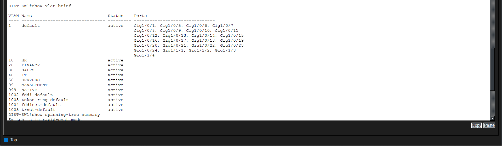
</p>

<p align="center">
  <em>Figure 3 – VLAN Configuration Verification</em>
</p>

<p align="center">
  
</p>

<p align="center">
  <em>Figure 4 – Trunk Link Verification</em>
</p>

<p align="center">
  
</p>

<p align="center">
  <em>Figure 5 – Rapid PVST Verification</em>
</p>

---

## Outcome

A stable and scalable Layer 2 infrastructure was successfully established through VLAN segmentation, trunking, and Rapid PVST. This completed the switching foundation of the enterprise network and prepared the infrastructure for Layer 3 routing and subsequent enterprise services.

---

### 📖 Detailed Documentation

➡️ **[View Phase 1 Documentation](phases/phase01-layer2-network/README.md)**

---

# Phase 2 – Inter-VLAN Routing

## Objective

Enable communication between devices located in different VLANs by implementing Layer 3 switching on the distribution switch. This phase transforms isolated departmental VLANs into a fully connected enterprise network while preserving logical network segmentation.

---

## Technologies Implemented

- Switched Virtual Interfaces (SVIs)
- Inter-VLAN Routing
- Default Gateway Configuration
- IP Routing

---

## Implementation Summary

Switched Virtual Interfaces (SVIs) were configured on the Layer 3 distribution switch to serve as the default gateway for each departmental VLAN. IP routing was then enabled, allowing traffic to be routed efficiently between VLANs while maintaining logical separation.

This implementation established the Layer 3 foundation of the enterprise network and enabled seamless communication between departments.

---

## Key Accomplishments

- Configured SVIs for all departmental VLANs.
- Assigned gateway IP addresses to each VLAN.
- Enabled Layer 3 routing on the distribution switch.
- Established communication between different VLANs.
- Verified successful routing through the Layer 3 switch.

---

## Verification

The implementation was verified by confirming:

- Successful creation and operation of all SVIs.
- Correct routing table entries for connected VLAN networks.
- Proper Layer 3 forwarding between VLANs.

<p align="center">
  
</p>

<p align="center">
  <em>Figure 6 – Switched Virtual Interface (SVI) Verification</em>
</p>

<p align="center">
  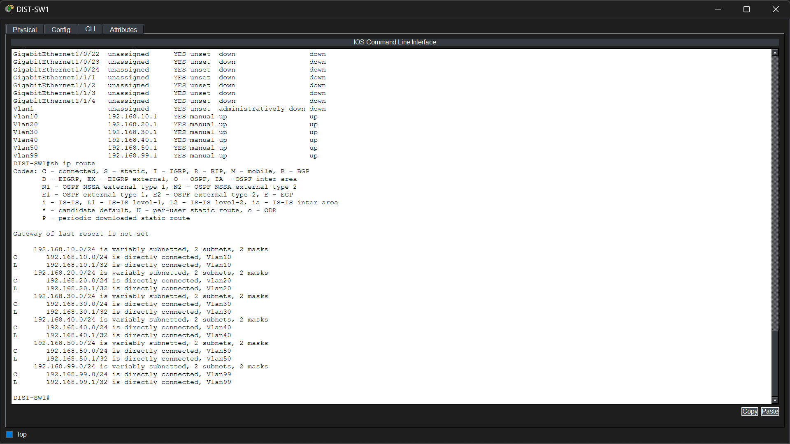
</p>

<p align="center">
  <em>Figure 7 – Routing Table Verification</em>
</p>

---

## Outcome

Inter-VLAN routing was successfully implemented, enabling secure communication between departmental VLANs while maintaining network segmentation. This completed the internal routing infrastructure and prepared the enterprise network for WAN connectivity and centralized network services.

---

### 📖 Detailed Documentation

➡️ **[View Phase 2 Documentation](phases/phase02-inter-vlan-routing/README.md)**

---

# Phase 3 – Routed Link Between DIST-SW1 and EDGE-R1

## Objective

Establish Layer 3 connectivity between the enterprise network and the edge router by converting the uplink between the distribution switch and edge router into a routed point-to-point connection. This enables communication beyond the local VLANs and prepares the network for WAN connectivity and Internet access.

---

## Technologies Implemented

- Routed Port Configuration
- Point-to-Point Layer 3 Link
- Static Routing
- Directly Connected Networks

---

## Implementation Summary

The physical connection between the Layer 3 distribution switch and the edge router was converted from a traditional switched link into a routed interface. IP addresses were assigned to both ends of the point-to-point connection, creating a dedicated Layer 3 path between the enterprise network and the edge router.

Static routes were then configured to allow both devices to exchange traffic between the internal VLAN networks and external destinations. This implementation established the routing infrastructure required for centralized services and future Internet connectivity.

---

## Key Accomplishments

- Converted the uplink into a Layer 3 routed interface.
- Assigned IP addressing to the point-to-point link.
- Configured static routing between the distribution switch and edge router.
- Established bidirectional communication between the enterprise network and the edge router.
- Verified successful route installation on both devices.

---

## Verification

The routed infrastructure was verified by confirming:

- Successful operation of the routed interface.
- Correct IP addressing on the point-to-point link.
- Static routes installed on both routing devices.
- Reachability between internal and external network segments.

<p align="center">
  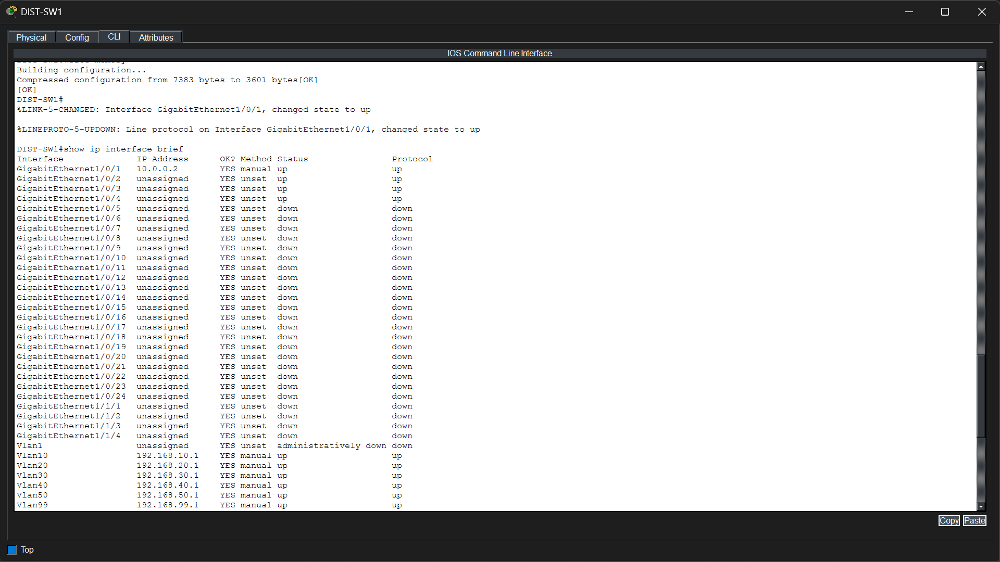
</p>

<p align="center">
  <em>Figure 8 – Routed Interface Verification on DIST-SW1</em>
</p>

<p align="center">
  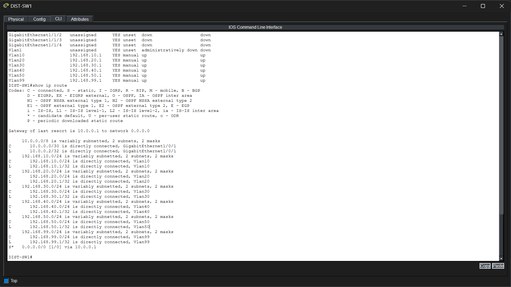
</p>

<p align="center">
  <em>Figure 9 – Routing Table Verification on DIST-SW1</em>
</p>

<p align="center">
  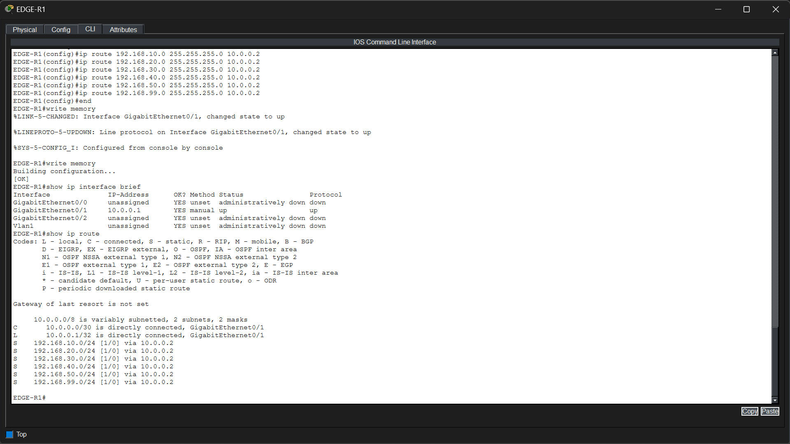
</p>

<p align="center">
  <em>Figure 10 – Routing Table Verification on EDGE-R1</em>
</p>

---

## ✅ Outcome

A dedicated Layer 3 routed connection was successfully established between the distribution switch and the edge router. Static routing enabled communication between the enterprise LAN and upstream networks, completing the enterprise routing foundation required for centralized network services and Internet connectivity.

---

## 📖 Detailed Documentation

➡️ **[View Phase 3 Documentation](phases/phase03-routed-link/README.md)**

---

# Phase 4 – Centralized DHCP Configuration

## Objective

Implement centralized Dynamic Host Configuration Protocol (DHCP) services to automate IP address allocation across the enterprise network. This phase eliminates manual IP configuration while ensuring devices receive the correct network settings based on their respective VLANs.

---

## Technologies Implemented

- Centralized DHCP Server
- DHCP Relay Agent
- DHCP Address Pools
- Automatic IP Address Allocation

---

## Implementation Summary

A centralized DHCP server was deployed to provide automatic IP address assignment for all departmental VLANs. Since the DHCP server resides on a different network segment, DHCP Relay was configured on the Layer 3 distribution switch to forward DHCP broadcast requests to the server.

Dedicated DHCP pools were created for each VLAN, allowing clients to automatically receive an IP address, subnet mask, default gateway, and DNS server information. This centralized approach simplifies administration while ensuring consistent network configuration across the enterprise.

---

## Key Accomplishments

- Deployed a centralized DHCP server.
- Configured DHCP Relay for cross-VLAN DHCP communication.
- Created DHCP pools for all departmental VLANs.
- Enabled automatic IP address assignment for client devices.
- Verified successful DHCP lease allocation across multiple VLANs.

---

## Verification

The DHCP implementation was verified by confirming:

- Successful DHCP Relay configuration on the distribution switch.
- Correct DHCP pool configuration on the server.
- Automatic IP address assignment for client devices.
- Successful lease acquisition from different departmental VLANs.

<p align="center">
  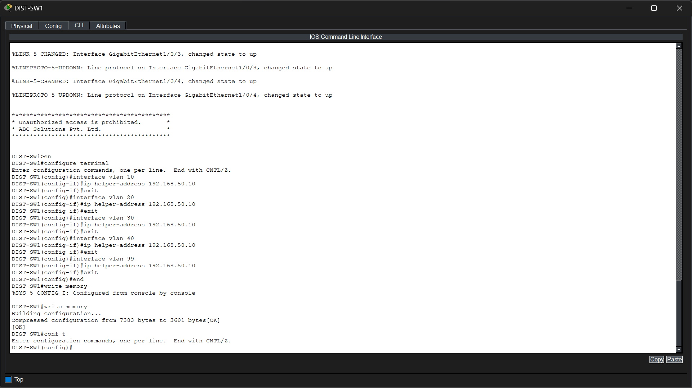
</p>

<p align="center">
  <em>Figure 11 – DHCP Relay Configuration</em>
</p>

<p align="center">
  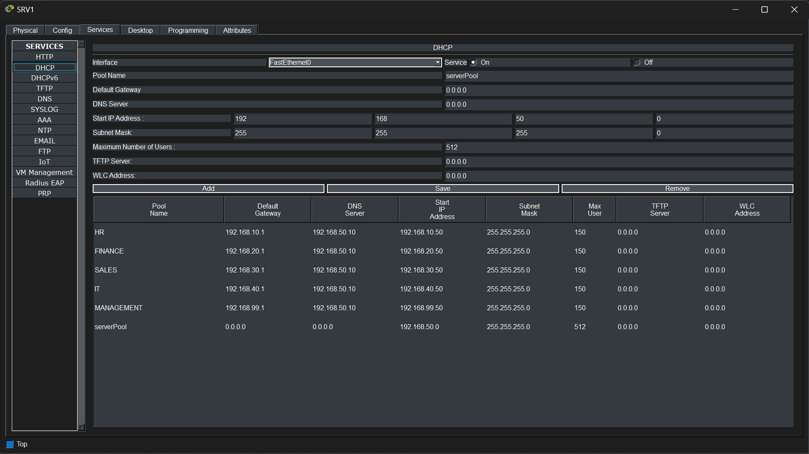
</p>

<p align="center">
  <em>Figure 12 – DHCP Server Configuration</em>
</p>

<p align="center">
  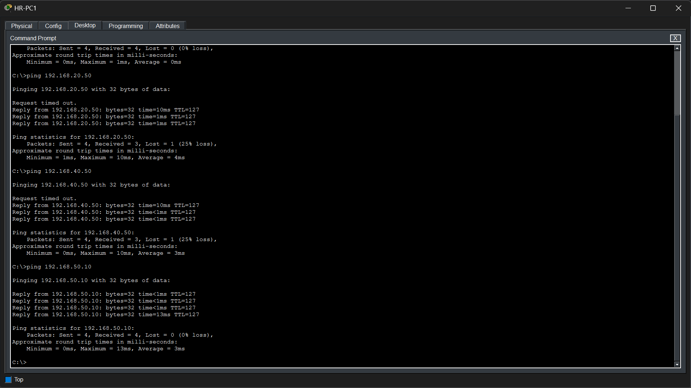
</p>

<p align="center">
  <em>Figure 13 – Automatic IP Address Assignment (HR PC)</em>
</p>

<p align="center">
  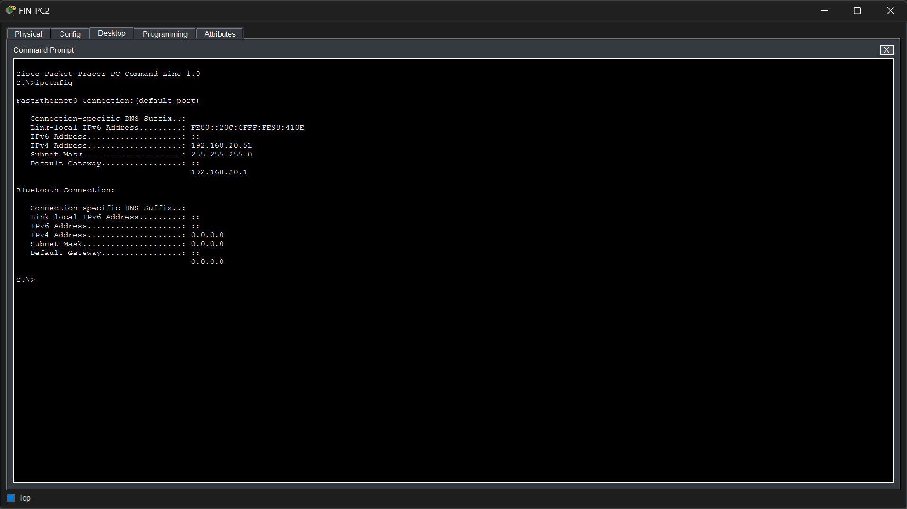
</p>

<p align="center">
  <em>Figure 14 – Automatic IP Address Assignment (Finance PC)</em>
</p>

---

## ✅ Outcome

The enterprise network successfully transitioned from manual host addressing to centralized IP address management. Client devices across multiple VLANs automatically received the correct network configuration through the centralized DHCP server, significantly improving scalability, consistency, and administrative efficiency.

---

## 📖 Detailed Documentation

➡️ **[View Phase 4 Documentation](phases/phase04-dhcp/README.md)**

---

# Phase 5 – DNS Configuration

> With automatic IP address allocation now in place, the next step is to provide centralized name resolution so users and network devices can communicate using hostnames instead of IP addresses.

## Objective

Implement centralized Domain Name System (DNS) services to provide hostname-to-IP address resolution throughout the enterprise network. This phase improves network usability by allowing users and administrators to access internal resources using meaningful hostnames instead of numerical IP addresses.

---

## Technologies Implemented

- Centralized DNS Server
- DNS Host Records
- DHCP-DNS Integration
- Hostname Resolution

---

## Implementation Summary

A centralized DNS server was deployed to provide name resolution services for the enterprise network. DNS records were created for internal network devices and services, allowing clients to access resources using hostnames instead of memorizing IP addresses.

The DHCP configuration was updated to automatically distribute the DNS server address to all clients. As a result, devices receiving their network configuration through DHCP could immediately perform DNS lookups without requiring any manual client-side configuration.

This centralized approach simplifies network administration, improves usability, and establishes the foundation for future Internet name resolution.

---

## Key Accomplishments

- Deployed a centralized DNS server.
- Created DNS records for enterprise resources.
- Integrated DNS settings with DHCP.
- Enabled automatic DNS configuration for clients.
- Verified successful hostname resolution across the enterprise network.

---

## Verification

The DNS implementation was verified by confirming:

- Correct DNS server configuration.
- Successful integration between DHCP and DNS.
- Automatic DNS configuration on client devices.
- Successful hostname resolution using DNS queries.

<p align="center">
  
</p>

<p align="center">
  <em>Figure 15 – DNS Server Configuration</em>
</p>

<p align="center">
  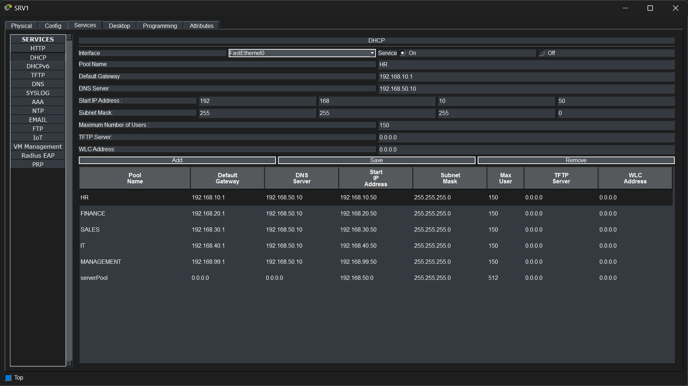
</p>

<p align="center">
  <em>Figure 16 – DHCP DNS Configuration</em>
</p>

<p align="center">
  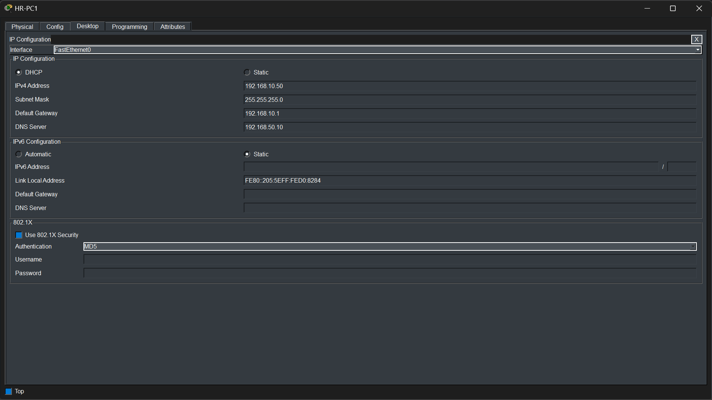
</p>

<p align="center">
  <em>Figure 17 – Client DNS Configuration</em>
</p>

<p align="center">
  
</p>

<p align="center">
  <em>Figure 18 – DNS Resolution Verification (Part 1)</em>
</p>

<p align="center">
  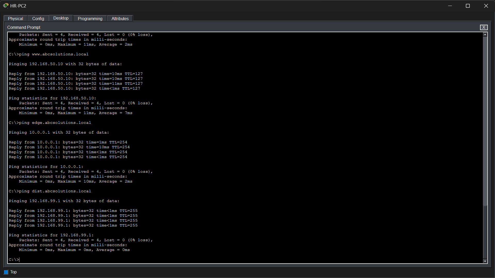
</p>

<p align="center">
  <em>Figure 19 – DNS Resolution Verification (Part 2)</em>
</p>

---

## ✅ Outcome

The enterprise network gained centralized hostname resolution, allowing users and administrators to access internal resources using meaningful hostnames instead of IP addresses. Combined with DHCP, client devices now automatically receive both IP addressing and DNS configuration, creating a more scalable, user-friendly, and easily managed network environment.

---

## 📖 Detailed Documentation

➡️ **[View Phase 5 Documentation](phases/phase05-dns/README.md)**

---

# Phase 6 – Network Address Translation (NAT/PAT)

> With centralized IP addressing and DNS services in place, the next step is to provide controlled Internet connectivity while preserving the enterprise's private IP addressing scheme.

## Objective

Implement Network Address Translation (NAT/PAT) to enable internal hosts using private IP addresses to communicate with external networks. This phase establishes Internet connectivity while conserving public IPv4 addresses and protecting the internal network structure.

---

## Technologies Implemented

- Static Routing
- Network Address Translation (NAT)
- Port Address Translation (PAT)
- Default Route

---

## Implementation Summary

Network Address Translation (NAT) was configured on the edge router to translate private enterprise addresses into a public IP address before forwarding traffic toward the ISP. Port Address Translation (PAT) was used to allow multiple internal hosts to share a single public IP address simultaneously.

Static routing was verified between the enterprise edge router and the ISP router to ensure successful packet forwarding beyond the enterprise network.

This implementation completed the enterprise WAN connectivity and enabled secure communication between internal users and external networks.

---

## Key Accomplishments

- Configured NAT/PAT on the edge router.
- Established Internet connectivity for internal hosts.
- Verified static routing toward the ISP.
- Successfully translated private IP addresses to a public address.
- Validated outbound connectivity through NAT translations.

---

## Verification

The NAT implementation was verified by confirming:

- Successful NAT translation entries on the edge router.
- Correct routing between the enterprise network and ISP.
- Successful connectivity from internal hosts to external destinations.

<p align="center">
  
</p>

<p align="center">
  <em>Figure 20 – NAT Translation Verification on EDGE-R1</em>
</p>

<p align="center">
  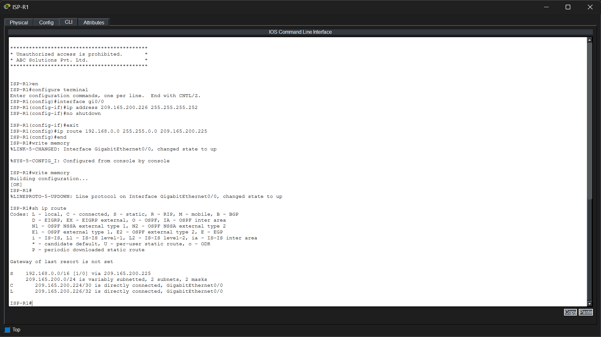
</p>

<p align="center">
  <em>Figure 21 – Static Route Verification on ISP-R1</em>
</p>

<p align="center">
  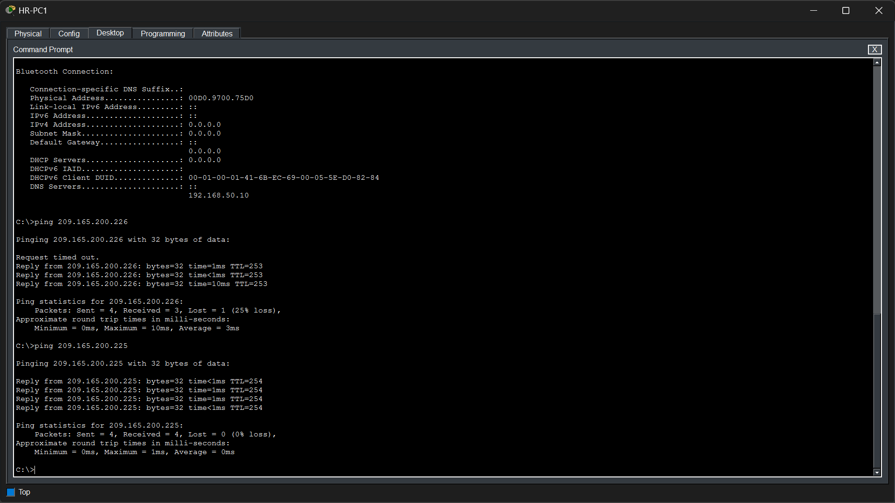
</p>

<p align="center">
  <em>Figure 22 – Client Internet Connectivity Verification</em>
</p>

---

## ✅ Outcome

The enterprise network successfully gained Internet connectivity through Network Address Translation. Internal devices were able to communicate with external networks while maintaining private IP addressing, improving both address conservation and network security.

---

## 📖 Detailed Documentation

➡️ **[View Phase 6 Documentation](phases/phase06-nat/README.md)**

---

# Phase 7 – Secure Remote Management (SSH)

> With enterprise connectivity established, the next step is to secure administrative access to all network devices through encrypted remote management.

## Objective

Implement Secure Shell (SSH) across the enterprise infrastructure to provide encrypted remote administration. This phase replaces insecure remote management methods and ensures that network devices can be managed securely from authorized systems.

---

## Technologies Implemented

- Secure Shell (SSH)
- Local User Authentication
- RSA Key Generation
- SSH Version 2

---

## Implementation Summary

SSH was configured on every router and switch within the enterprise network to provide secure remote administrative access. Local user authentication was implemented, RSA cryptographic keys were generated, and SSH Version 2 was enabled to establish encrypted management sessions.

The configuration ensures that administrators can securely access network devices without exposing credentials or management traffic to interception, significantly improving the security of the enterprise infrastructure.

---

## Key Accomplishments

- Enabled SSH on all enterprise routers and switches.
- Configured local administrative user authentication.
- Generated RSA encryption keys for secure communication.
- Enabled SSH Version 2 across the infrastructure.
- Verified successful encrypted remote login to every network device.

---

## Verification

The SSH implementation was verified by confirming:

- Successful SSH login to every network device.
- Proper SSH session establishment.
- Successful authentication using local credentials.
- Secure remote management across the enterprise infrastructure.

<p align="center">
  
</p>

<p align="center">
  <em>Figure 23 – SSH Login to DIST-SW1</em>
</p>

<p align="center">
  
</p>

<p align="center">
  <em>Figure 24 – SSH Verification on DIST-SW1</em>
</p>

<p align="center">
  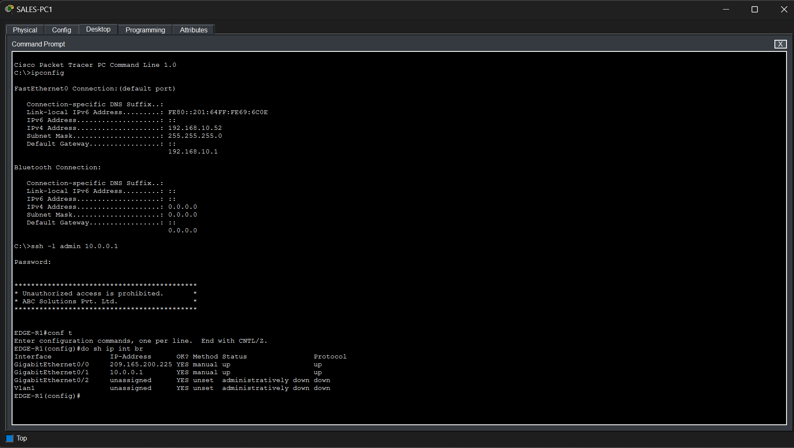
</p>

<p align="center">
  <em>Figure 25 – SSH Login to EDGE-R1</em>
</p>

<p align="center">
  
</p>

<p align="center">
  <em>Figure 26 – SSH Verification on EDGE-R1</em>
</p>

<p align="center">
  
</p>

<p align="center">
  <em>Figure 27 – SSH Login to ACC-SW1</em>
</p>

<p align="center">
  
</p>

<p align="center">
  <em>Figure 28 – SSH Verification on ACC-SW1</em>
</p>

<p align="center">
  
</p>

<p align="center">
  <em>Figure 29 – SSH Login to ACC-SW2</em>
</p>

<p align="center">
  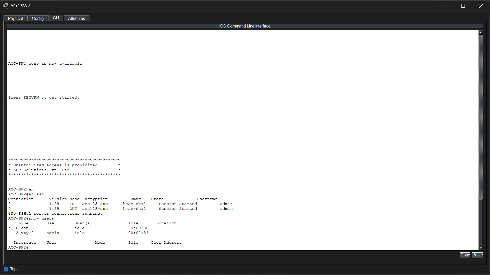
</p>

<p align="center">
  <em>Figure 30 – SSH Verification on ACC-SW2</em>
</p>

<p align="center">
  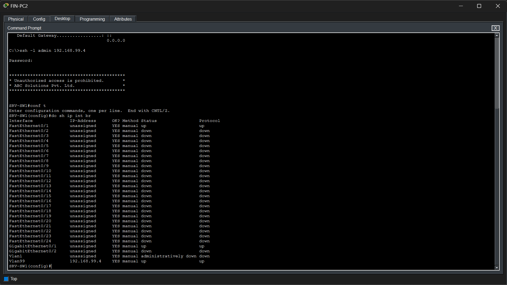
</p>

<p align="center">
  <em>Figure 31 – SSH Login to SRV-SW1</em>
</p>

<p align="center">
  
</p>

<p align="center">
  <em>Figure 32 – SSH Verification on SRV-SW1</em>
</p>

<p align="center">
  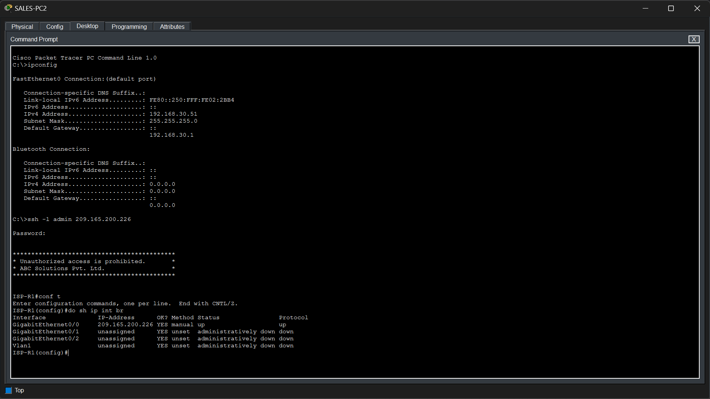
</p>

<p align="center">
  <em>Figure 33 – SSH Login to ISP-R1</em>
</p>

<p align="center">
  
</p>

<p align="center">
  <em>Figure 34 – SSH Verification on ISP-R1</em>
</p>

---

## ✅ Outcome

Encrypted remote management was successfully implemented across the entire enterprise infrastructure. All routers and switches now support secure administrative access using SSH, improving the security of device management while eliminating the risks associated with unencrypted remote access.

---

## 📖 Detailed Documentation

➡️ **[View Phase 7 Documentation](phases/phase07-ssh/README.md)**

---

# Phase 8 – Port Security

> With secure remote administration in place, the next step is to protect the enterprise access layer by preventing unauthorized devices from connecting to the network.

## Objective

Implement Port Security on access switch interfaces to restrict unauthorized device connections and strengthen Layer 2 access control. This phase protects the enterprise network by allowing only trusted devices to communicate through designated access ports.

---

## Technologies Implemented

- Port Security
- Sticky MAC Address Learning
- Maximum MAC Address Limitation
- Violation Protection

---

## Implementation Summary

Port Security was configured on all user-facing access ports of the enterprise access switches. Sticky MAC Address learning was enabled to dynamically learn and securely store legitimate device MAC addresses while limiting the number of permitted devices per interface.

Violation protection was configured to detect unauthorized devices attempting to connect to secured ports. This implementation enhances network security by preventing unauthorized access at the network edge while maintaining normal connectivity for legitimate users.

---

## Key Accomplishments

- Enabled Port Security on enterprise access ports.
- Configured Sticky MAC Address learning.
- Limited the number of permitted MAC addresses per interface.
- Implemented violation protection for unauthorized devices.
- Verified secure operation on both access switches.

---

## Verification

The Port Security implementation was verified by confirming:

- Successful Port Security configuration on access ports.
- Sticky MAC Address learning and secure MAC storage.
- Correct enforcement of maximum allowed MAC addresses.
- Detection of unauthorized device connections through configured violation actions.

<p align="center">
  
</p>

<p align="center">
  <em>Figure 35 – Port Security Verification on ACC-SW1</em>
</p>

<p align="center">
  
</p>

<p align="center">
  <em>Figure 36 – Port Security Verification on ACC-SW2</em>
</p>

<p align="center">
  
</p>

<p align="center">
  <em>Figure 37 – Port Security Violation Detection</em>
</p>

---

## ✅ Outcome

Port Security was successfully implemented across the enterprise access layer, ensuring that only authorized devices can connect to secured switch ports. The network now provides an additional layer of defense against unauthorized physical access while maintaining reliable connectivity for legitimate users.

---

## 📖 Detailed Documentation

➡️ **[View Phase 8 Documentation](phases/phase08-port-security/README.md)**

---

# Phase 9 – DHCP Snooping

> With access ports secured, the next step is to protect the enterprise network from rogue DHCP servers by ensuring that only trusted devices are permitted to distribute IP address information.

## Objective

Implement DHCP Snooping across the enterprise switching infrastructure to prevent unauthorized DHCP servers from assigning incorrect network configurations to client devices. This phase enhances Layer 2 security by validating DHCP traffic and permitting DHCP server messages only on trusted interfaces.

---

## Technologies Implemented

- DHCP Snooping
- Trusted Interfaces
- Untrusted Access Ports
- DHCP Snooping Binding Table

---

## Implementation Summary

DHCP Snooping was enabled throughout the enterprise switching infrastructure to protect clients from rogue DHCP servers. Uplink interfaces connecting to the legitimate DHCP server and other trusted network devices were configured as trusted ports, while all user-facing access ports remained untrusted.

This configuration ensures that only authorized DHCP messages are forwarded through the network, preventing malicious devices from distributing incorrect IP addressing information. DHCP Snooping also builds a binding database that serves as the foundation for additional Layer 2 security technologies implemented in later phases.

---

## Key Accomplishments

- Enabled DHCP Snooping across the enterprise switching infrastructure.
- Configured trusted uplink interfaces.
- Protected user access ports from rogue DHCP servers.
- Established the DHCP Snooping binding database.
- Verified successful DHCP Snooping operation on all switches.

---

## Verification

The DHCP Snooping implementation was verified by confirming:

- DHCP Snooping enabled on all enterprise switches.
- Correct trusted interface configuration.
- Proper protection of access ports.
- Successful operation of the DHCP Snooping binding process.

<p align="center">
  
</p>

<p align="center">
  <em>Figure 38 – DHCP Snooping Verification on DIST-SW1</em>
</p>

<p align="center">
  
</p>

<p align="center">
  <em>Figure 39 – DHCP Snooping Verification on ACC-SW1</em>
</p>

<p align="center">
  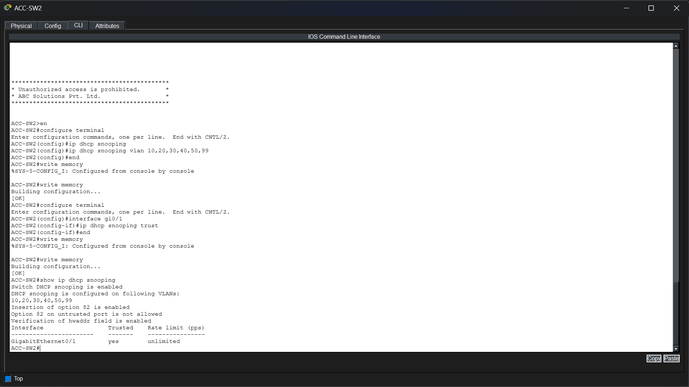
</p>

<p align="center">
  <em>Figure 40 – DHCP Snooping Verification on ACC-SW2</em>
</p>

<p align="center">
  
</p>

<p align="center">
  <em>Figure 41 – DHCP Snooping Verification on SRV-SW1</em>
</p>

---

## ✅ Outcome

DHCP Snooping was successfully deployed across the enterprise switching infrastructure, ensuring that only trusted devices can provide DHCP services. The network is now protected against rogue DHCP servers while maintaining reliable automatic IP address assignment for legitimate clients.

---

## 📖 Detailed Documentation

➡️ **[View Phase 9 Documentation](phases/phase09-dhcp-snooping/README.md)**

---

# Phase 10 – Dynamic ARP Inspection (DAI)

> With DHCP Snooping protecting DHCP traffic, the next step is to secure the Address Resolution Protocol (ARP) by validating ARP packets and preventing ARP spoofing attacks.

## Objective

Implement Dynamic ARP Inspection (DAI) across the enterprise switching infrastructure to protect hosts from ARP spoofing and ARP cache poisoning attacks. This phase strengthens Layer 2 security by ensuring that only valid ARP packets are forwarded within the network.

---

## Technologies Implemented

- Dynamic ARP Inspection (DAI)
- DHCP Snooping Binding Validation
- Trusted Interfaces
- ARP Packet Validation

---

## Implementation Summary

Dynamic ARP Inspection (DAI) was enabled on the enterprise switches to inspect and validate ARP packets before forwarding them through the network. DAI uses the DHCP Snooping binding database created in the previous phase to verify that ARP packets contain legitimate IP-to-MAC address mappings.

Trusted uplink interfaces were configured to allow valid ARP traffic between network devices, while user-facing access ports remained untrusted. This implementation prevents malicious hosts from impersonating other devices through forged ARP messages and significantly improves the security of the enterprise LAN.

---

## Key Accomplishments

- Enabled Dynamic ARP Inspection across the enterprise switches.
- Leveraged the DHCP Snooping binding database for ARP validation.
- Configured trusted uplink interfaces.
- Protected access ports against ARP spoofing attacks.
- Verified successful DAI operation throughout the switching infrastructure.

---

## Verification

The Dynamic ARP Inspection implementation was verified by confirming:

- DAI enabled on all enterprise switches.
- Trusted interface configuration.
- Successful ARP validation using DHCP Snooping bindings.
- Proper operation of Dynamic ARP Inspection across the network.

<p align="center">
  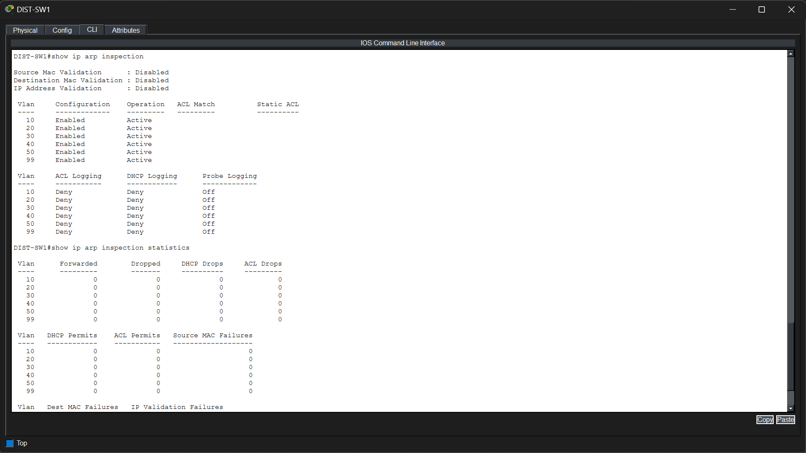
</p>

<p align="center">
  <em>Figure 42 – Dynamic ARP Inspection Verification on DIST-SW1</em>
</p>

<p align="center">
  
</p>

<p align="center">
  <em>Figure 43 – Dynamic ARP Inspection Verification on ACC-SW1</em>
</p>

<p align="center">
  
</p>

<p align="center">
  <em>Figure 44 – Dynamic ARP Inspection Verification on ACC-SW2</em>
</p>

<p align="center">
  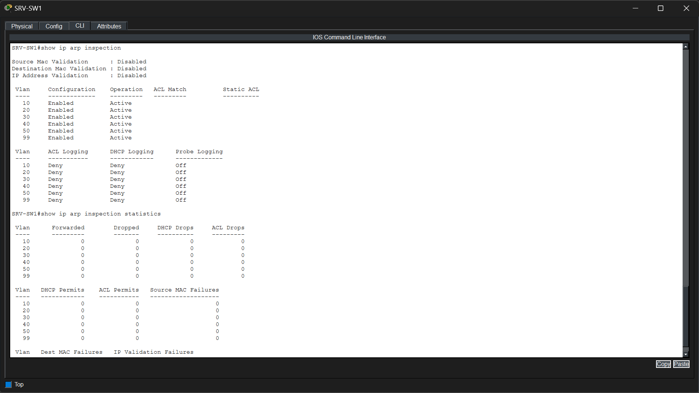
</p>

<p align="center">
  <em>Figure 45 – Dynamic ARP Inspection Verification on SRV-SW1</em>
</p>

---

## ✅ Outcome

Dynamic ARP Inspection was successfully implemented across the enterprise switching infrastructure, ensuring that only valid ARP packets are forwarded within the network. Combined with DHCP Snooping, the enterprise now has robust Layer 2 protection against ARP spoofing and other address resolution attacks.

---

## 📖 Detailed Documentation

➡️ **[View Phase 10 Documentation](phases/phase10-dynamic-arp-inspection/README.md)**

---

# Phase 11 – Network Time Protocol (NTP)

> With the enterprise infrastructure secured, the next step is to synchronize the system clocks of all network devices to ensure consistent timestamps for monitoring, logging, and troubleshooting.

## Objective

Implement Network Time Protocol (NTP) to synchronize the clocks of enterprise network devices. Accurate time synchronization is essential for centralized logging, troubleshooting, security auditing, and maintaining consistent timestamps across the network.

---

## Technologies Implemented

- Network Time Protocol (NTP)
- NTP Master
- NTP Client Configuration
- Time Synchronization

---

## Implementation Summary

An NTP hierarchy was established by configuring the ISP router as the NTP master while the remaining enterprise routers and switches were configured as NTP clients. This design allows all devices to synchronize their clocks from a common time source, ensuring consistent timestamps across the network.

Although Cisco Packet Tracer has limitations regarding full NTP synchronization, the configuration demonstrates the correct implementation methodology and follows standard Cisco enterprise deployment practices.

---

## Key Accomplishments

- Configured the ISP router as the enterprise NTP master.
- Configured enterprise routers and switches as NTP clients.
- Established centralized time synchronization.
- Verified NTP configuration across the enterprise infrastructure.
- Prepared the network for accurate event logging and monitoring.

---

## Verification

The NTP implementation was verified by confirming:

- NTP master configuration on the ISP router.
- NTP client configuration on enterprise routers and switches.
- Successful NTP status verification across the infrastructure.

<p align="center">
  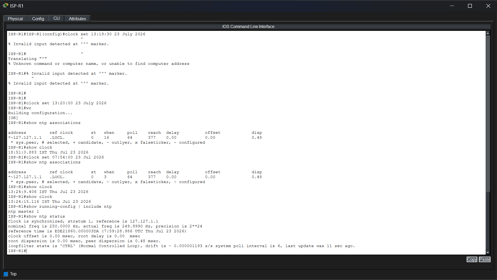
</p>

<p align="center">
  <em>Figure 46 – NTP Master Configuration on ISP-R1</em>
</p>

<p align="center">
  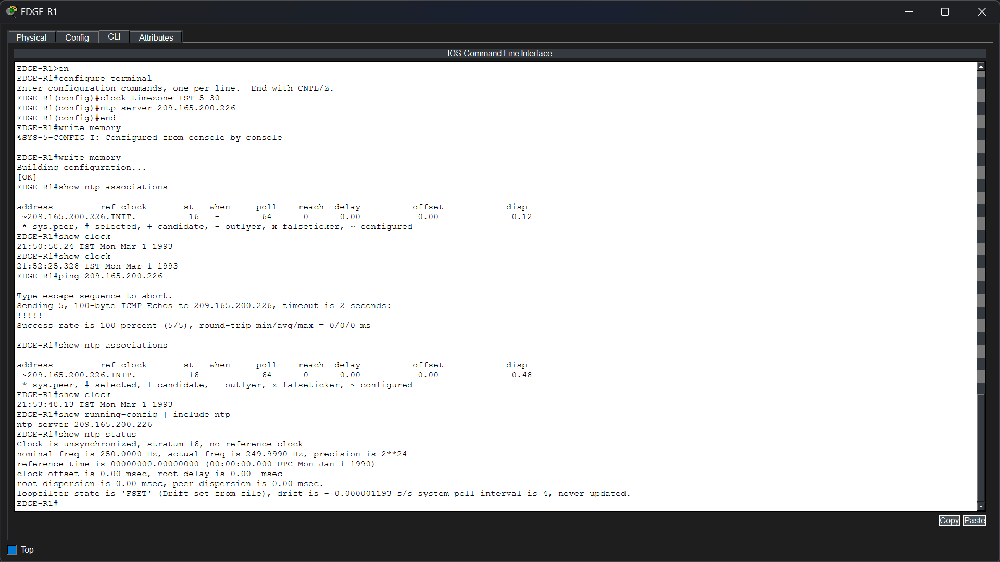
</p>

<p align="center">
  <em>Figure 47 – NTP Verification on EDGE-R1</em>
</p>

<p align="center">
  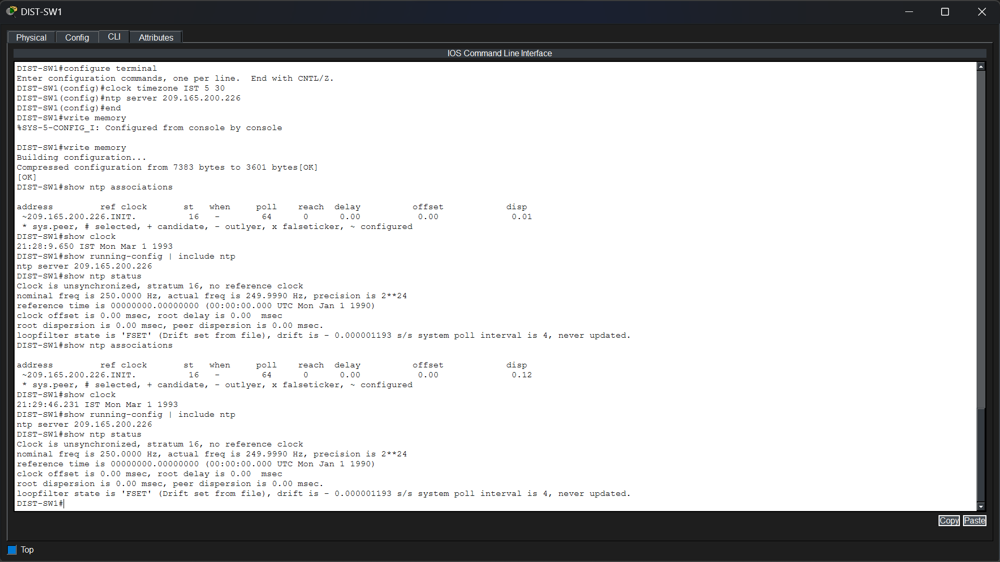
</p>

<p align="center">
  <em>Figure 48 – NTP Verification on DIST-SW1</em>
</p>

<p align="center">
  
</p>

<p align="center">
  <em>Figure 49 – NTP Verification on ACC-SW1</em>
</p>

<p align="center">
  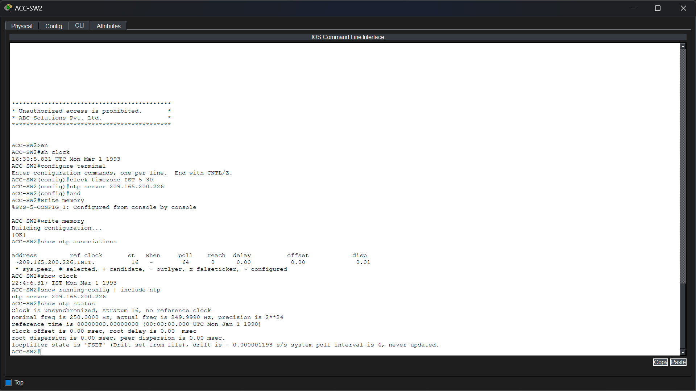
</p>

<p align="center">
  <em>Figure 50 – NTP Verification on ACC-SW2</em>
</p>

<p align="center">
  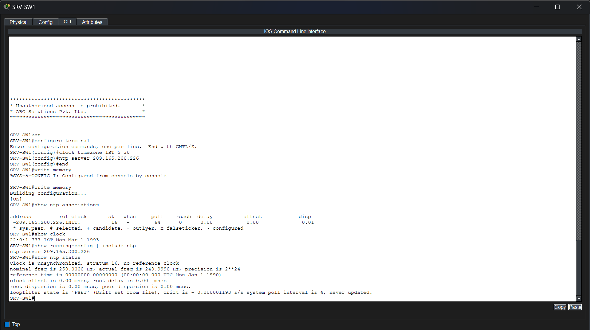
</p>

<p align="center">
  <em>Figure 51 – NTP Verification on SRV-SW1</em>
</p>

---

## ✅ Outcome

Network Time Protocol was successfully implemented across the enterprise infrastructure, providing a centralized time source for routers and switches. This establishes consistent system time throughout the network and lays the foundation for accurate logging, monitoring, and troubleshooting. While full synchronization behavior is limited by Cisco Packet Tracer, the configuration reflects standard enterprise deployment practices.

---

## 📖 Detailed Documentation

➡️ **[View Phase 11 Documentation](phases/phase11-ntp/README.md)**

---

# Phase 12 – Syslog

> With centralized time synchronization in place, the final management service is centralized event logging, allowing administrators to collect and monitor system events from every network device.

## Objective

Implement centralized Syslog to collect, store, and monitor log messages generated by routers and switches throughout the enterprise network. This phase improves network visibility by consolidating system events into a single location for monitoring, troubleshooting, and auditing.

---

## Technologies Implemented

- Syslog
- Remote Logging
- Centralized Log Collection
- Event Monitoring

---

## Implementation Summary

A centralized Syslog server was deployed to receive log messages from all enterprise routers and switches. Each network device was configured to forward system events to the Syslog server, allowing operational messages to be collected and stored in a single location.

Centralized logging provides administrators with improved visibility into network activity and simplifies troubleshooting by eliminating the need to inspect individual devices for operational events.

---

## Key Accomplishments

- Deployed a centralized Syslog server.
- Configured all enterprise network devices to forward log messages.
- Enabled centralized event monitoring.
- Verified successful log delivery from every router and switch.
- Established a centralized logging solution for the enterprise infrastructure.

---

## Verification

The Syslog implementation was verified by confirming:

- Successful Syslog configuration on all enterprise devices.
- Log message generation from routers and switches.
- Successful delivery of log messages to the centralized Syslog server.

<p align="center">
  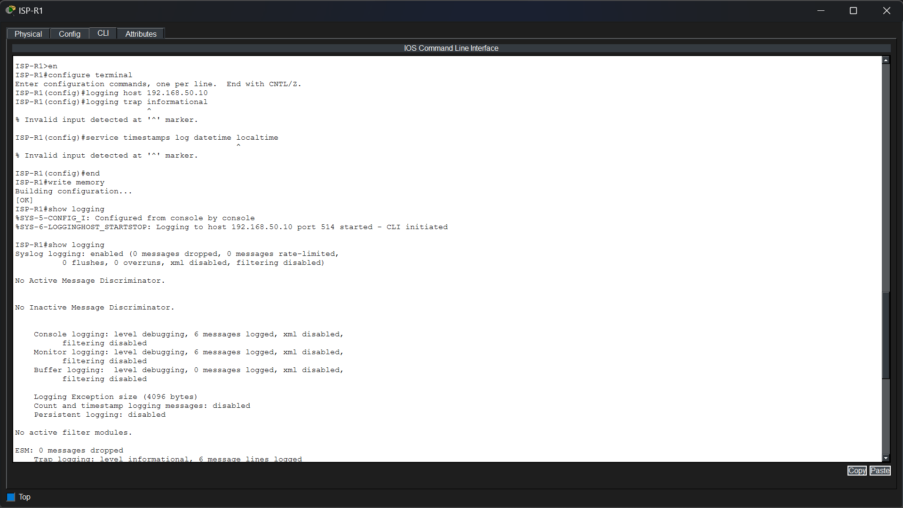
</p>

<p align="center">
  <em>Figure 52 – Syslog Configuration on ISP-R1</em>
</p>

<p align="center">
  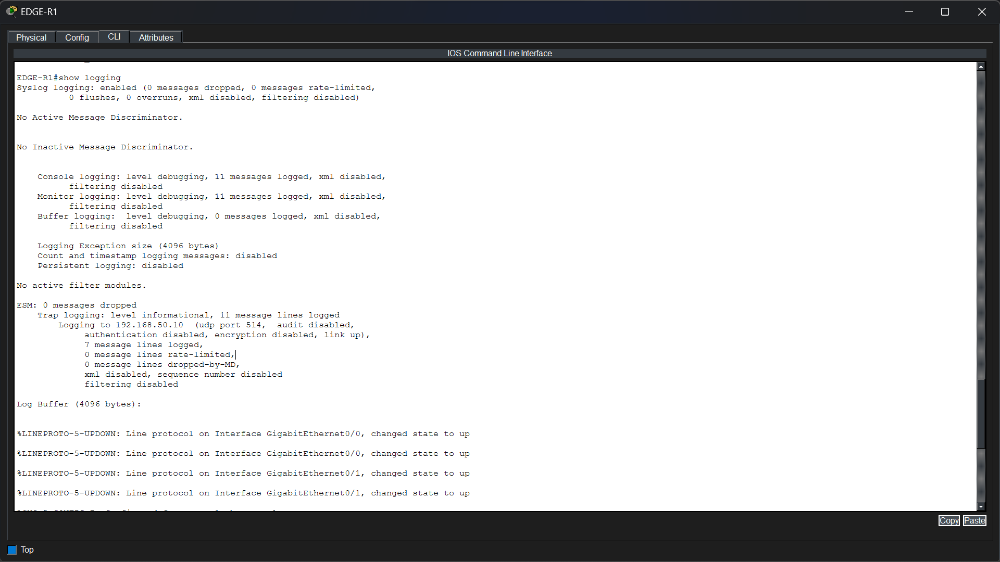
</p>

<p align="center">
  <em>Figure 53 – Syslog Configuration on EDGE-R1</em>
</p>

<p align="center">
  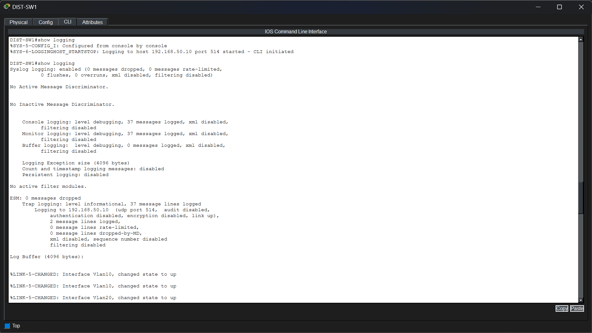
</p>

<p align="center">
  <em>Figure 54 – Syslog Configuration on DIST-SW1</em>
</p>

<p align="center">
  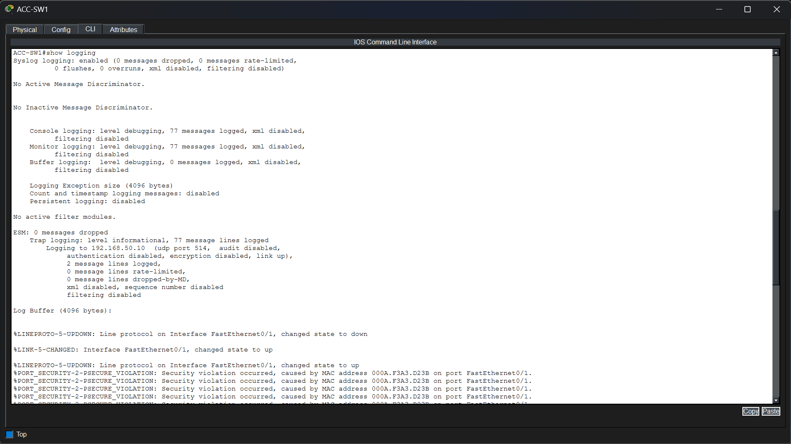
</p>

<p align="center">
  <em>Figure 55 – Syslog Configuration on ACC-SW1</em>
</p>

<p align="center">
  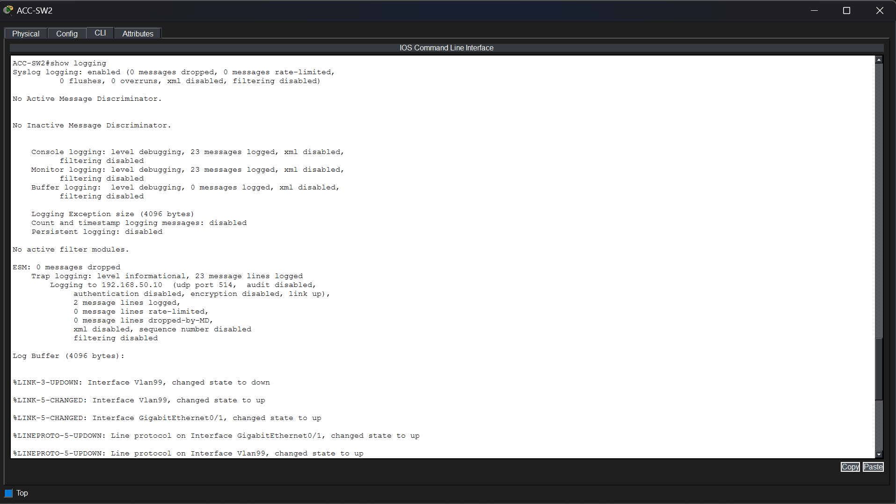
</p>

<p align="center">
  <em>Figure 56 – Syslog Configuration on ACC-SW2</em>
</p>

<p align="center">
  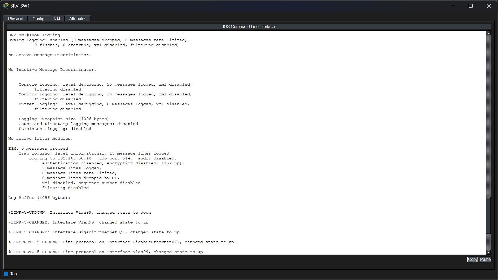
</p>

<p align="center">
  <em>Figure 57 – Syslog Configuration on SRV-SW1</em>
</p>

<p align="center">
  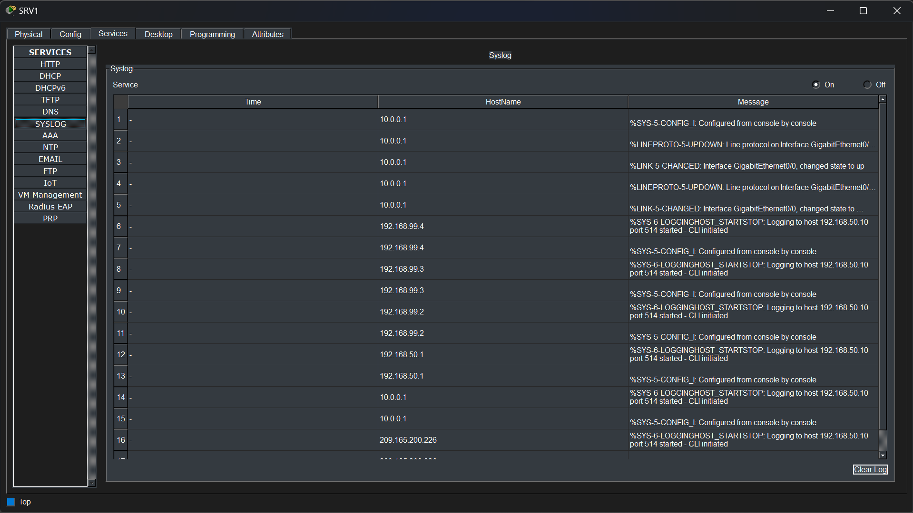
</p>

<p align="center">
  <em>Figure 58 – Centralized Syslog Server Receiving Log Messages</em>
</p>

---

## ✅ Outcome

Centralized Syslog was successfully implemented across the enterprise infrastructure, enabling routers and switches to forward system events to a dedicated logging server. This provides administrators with a centralized platform for monitoring, troubleshooting, and auditing network activity, completing the enterprise network management solution.

---

## 📖 Detailed Documentation

➡️ **[View Phase 12 Documentation](phases/phase12-syslog/README.md)**

---

# Phase 13 – Internet Connectivity & Public Web Server

> With the enterprise infrastructure fully deployed, secured, and centrally managed, the final phase extends connectivity beyond the organization by providing access to a simulated public Internet service.

## Objective

Implement end-to-end Internet connectivity by integrating the enterprise network with a simulated public web server. This phase demonstrates how internal users access external resources through DNS resolution, NAT/PAT, and HTTP services.

---

## Technologies Implemented

- Public DNS
- HTTP Server
- Enterprise DNS Integration
- NAT/PAT
- Internet Connectivity

---

## Implementation Summary

A simulated public web server was deployed to represent an Internet-hosted service outside the enterprise network. Public DNS records were created to resolve the website hostname, while the enterprise DNS server was configured to forward clients to the correct public IP address.

Internal users accessed the website using its domain name rather than its IP address. DNS resolution, Network Address Translation (NAT/PAT), routing, and HTTP services worked together to provide seamless end-to-end connectivity between the enterprise LAN and the simulated Internet.

This phase demonstrates the complete communication path from an internal client to an external network resource.

---

## Key Accomplishments

- Deployed a simulated public web server.
- Configured public DNS records.
- Integrated enterprise DNS with public hostname resolution.
- Verified Internet connectivity through NAT/PAT.
- Successfully accessed an external website using HTTP.

---

## Verification

The Internet connectivity implementation was verified by confirming:

- Successful public DNS configuration.
- Correct enterprise DNS integration.
- Successful DNS name resolution.
- End-to-end Internet connectivity through NAT/PAT.
- Successful HTTP access to the public web server.

<p align="center">
  
</p>

<p align="center">
  <em>Figure 59 – Public DNS Configuration</em>
</p>

<p align="center">
  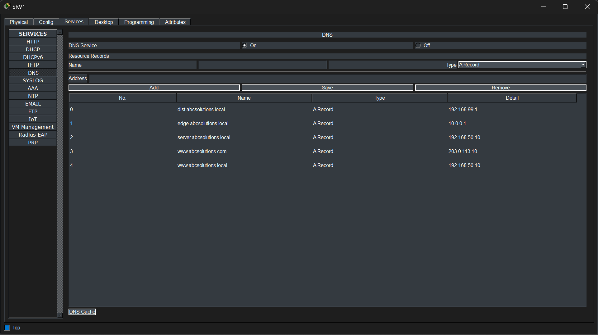
</p>

<p align="center">
  <em>Figure 60 – Enterprise DNS Configuration</em>
</p>

<p align="center">
  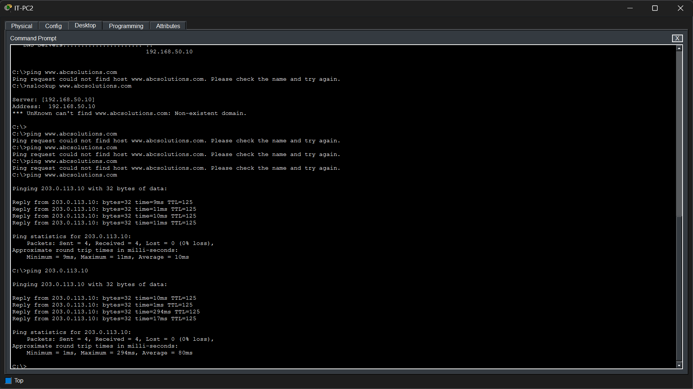
</p>

<p align="center">
  <em>Figure 61 – DNS Resolution Verification</em>
</p>

<p align="center">
  
</p>

<p align="center">
  <em>Figure 62 – Internet Connectivity Verification</em>
</p>

<p align="center">
  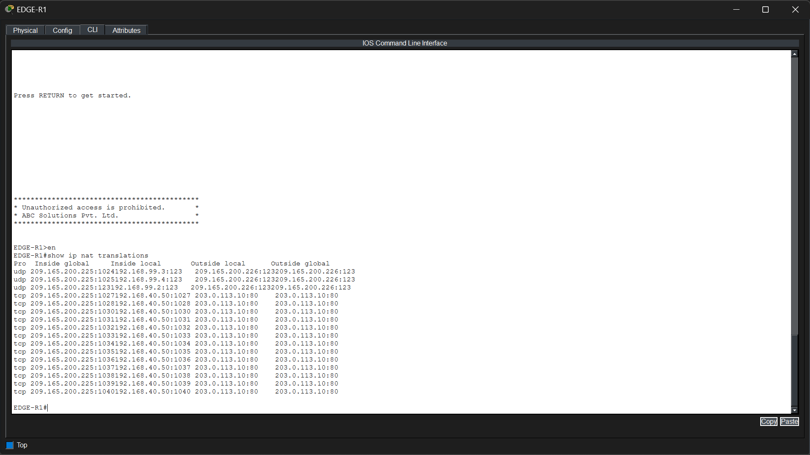
</p>

<p align="center">
  <em>Figure 63 – NAT Translation Verification</em>
</p>

<p align="center">
  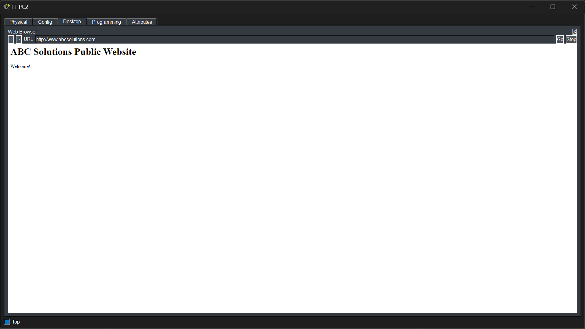
</p>

<p align="center">
  <em>Figure 64 – HTTP Access to the Public Web Server</em>
</p>

---

## ✅ Outcome

The enterprise network successfully achieved end-to-end Internet connectivity. Internal users were able to resolve public domain names, communicate through Network Address Translation, and access a simulated external web server using standard HTTP services. This phase completed the enterprise network implementation by demonstrating secure communication between the internal infrastructure and external resources.

---

## 📖 Detailed Documentation

➡️ **[View Phase 13 Documentation](phases/phase13-internet-connectivity/README.md)**

---

# Skills Demonstrated

This project demonstrates the practical application of enterprise networking concepts through the design, implementation, verification, and documentation of a complete Cisco Packet Tracer enterprise network.

## Network Design

- Enterprise Network Planning
- Hierarchical Network Design
- VLAN Segmentation
- IP Addressing and Subnetting
- Layer 2 and Layer 3 Network Architecture

---

## Routing & Switching

- VLAN Configuration
- IEEE 802.1Q Trunking
- Rapid PVST
- Inter-VLAN Routing
- Static Routing
- Routed Point-to-Point Links

---

## Network Services

- Dynamic Host Configuration Protocol (DHCP)
- DHCP Relay
- Domain Name System (DNS)
- Network Address Translation (NAT/PAT)
- HTTP Services

---

## Network Security

- Secure Shell (SSH)
- Port Security
- DHCP Snooping
- Dynamic ARP Inspection (DAI)

---

## Network Management

- Network Time Protocol (NTP)
- Syslog
- Centralized Device Management
- Infrastructure Monitoring

---

## Verification & Troubleshooting

- Cisco IOS Verification Commands
- Connectivity Testing
- Routing Verification
- NAT Verification
- DNS Resolution Testing
- End-to-End Network Validation

---

## Documentation

- Technical Documentation
- Network Diagrams
- Configuration Documentation
- Verification Documentation
- GitHub Project Organization
- Enterprise Deployment Documentation

---

# Packet Tracer Limitations

This project was developed using **Cisco Packet Tracer**, which provides an excellent platform for learning and demonstrating enterprise networking concepts. However, certain platform limitations should be considered.

- Some enterprise features are simplified or partially implemented.
- Full protocol behavior may differ from real Cisco IOS devices.
- NTP synchronization is limited despite correct configuration.
- Performance and hardware-specific features are not fully emulated.

Despite these limitations, all implemented technologies follow standard Cisco networking concepts and enterprise deployment practices.

---

# Future Improvements

While the current implementation demonstrates a complete enterprise network, the following enhancements could further extend its capabilities:

- Dynamic routing using OSPF or EIGRP
- High availability with HSRP or VRRP
- Access Control Lists (ACLs)
- IPv6 deployment
- SNMP-based network monitoring
- AAA authentication with RADIUS or TACACS+
- VPN connectivity for remote access
- Migration to GNS3 or Cisco CML for advanced enterprise features

---

# Repository Structure

```text
ABC-Solutions-Enterprise-Network/
│
├── README.md
├── p1.pkt
│
├── configs/
│   ├── ISP-R1.txt
│   ├── EDGE-R1.txt
│   ├── DIST-SW1.txt
│   ├── ACC-SW1.txt
│   ├── ACC-SW2.txt
│   └── SRV-SW1.txt
│
├── images/
│   ├── topology/
│   │   └── enterprise_topology.png
│   ├── phase01-layer2-network/
│   ├── phase02-inter-vlan-routing/
│   ├── phase03-routed-link/
│   ├── phase04-dhcp/
│   ├── phase05-dns/
│   ├── phase06-nat/
│   ├── phase07-ssh/
│   ├── phase08-port-security/
│   ├── phase09-dhcp-snooping/
│   ├── phase10-dynamic-arp-inspection/
│   ├── phase11-ntp/
│   ├── phase12-syslog/
│   └── phase13-internet-connectivity/
│
└── phases/
    ├── phase01-layer2-network/
    ├── phase02-inter-vlan-routing/
    ├── phase03-routed-link/
    ├── phase04-dhcp/
    ├── phase05-dns/
    ├── phase06-nat/
    ├── phase07-ssh/
    ├── phase08-port-security/
    ├── phase09-dhcp-snooping/
    ├── phase10-dynamic-arp-inspection/
    ├── phase11-ntp/
    ├── phase12-syslog/
    └── phase13-internet-connectivity/
```

The repository is organized to separate configurations, screenshots, implementation documentation, and the Packet Tracer project, making it easy to navigate and maintain.

---

# Author

**Zidan K**

B.Tech in Computer Science and Engineering

Aspiring Network Engineer | Enterprise Networking | Cloud Networking 

If you found this project interesting, feel free to explore the complete implementation, configurations, and documentation included in this repository.

---

**Thank you for visiting this repository.**