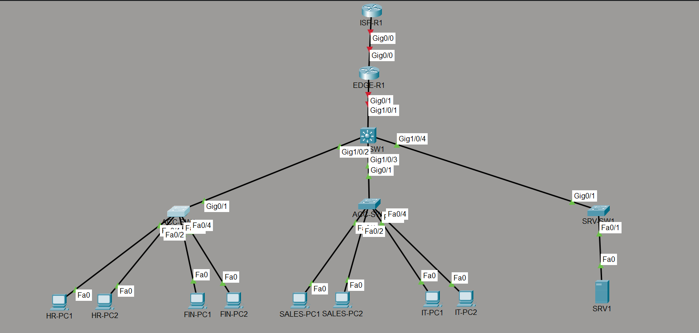
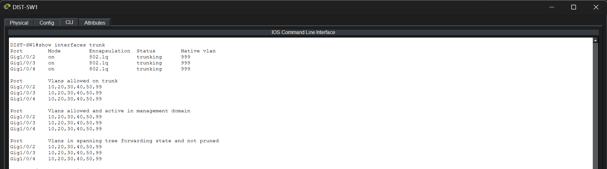
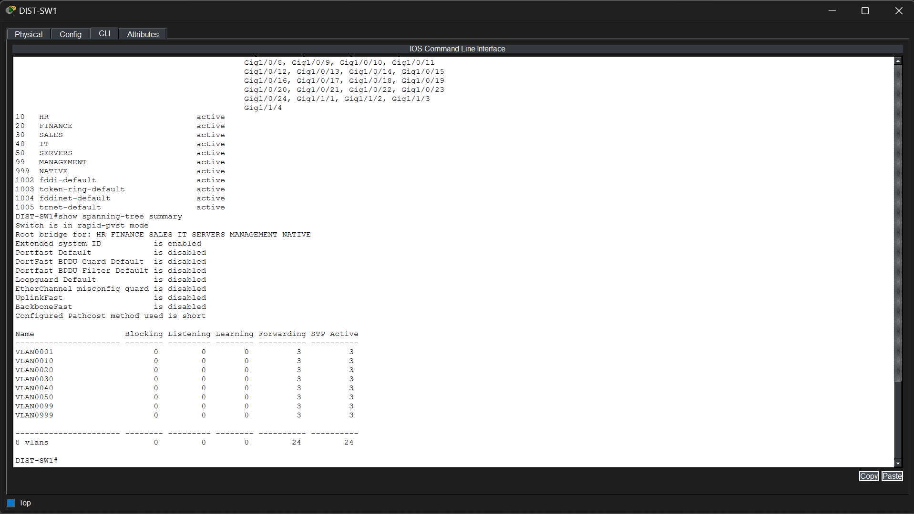

# Phase 1 – Layer 2 Network Configuration

## Objective

Configure the Layer 2 switching infrastructure by implementing VLAN segmentation, IEEE 802.1Q trunking, a dedicated native VLAN, and Rapid PVST to establish the foundation of the enterprise network.

---

## Technologies Implemented

- Virtual Local Area Networks (VLANs)
- IEEE 802.1Q Trunking
- Native VLAN
- Rapid Per-VLAN Spanning Tree (Rapid PVST)

---

## Network Topology

> *Insert the Layer 2 topology image here.*



---

## Implementation

The Layer 2 infrastructure was implemented on the distribution and access switches. The following configurations were applied:

- Created VLANs for each department.
- Configured IEEE 802.1Q trunk links between the distribution switch and access switches.
- Assigned VLAN 999 as the native VLAN on all trunk links.
- Allowed only the required VLANs across trunk links.
- Enabled Rapid PVST to provide loop prevention and faster network convergence.

### VLAN Configuration

| VLAN ID | Department |
| :-----: | ---------- |
| 10 | HR |
| 20 | Finance |
| 30 | Sales |
| 40 | IT |
| 50 | Servers |
| 99 | Management |
| 999 | Native |

---

## Verification

### Trunk Verification

The trunk links were verified using:

```text
show interfaces trunk
```

The verification confirms that:

- IEEE 802.1Q encapsulation is active.
- All trunk links are operational.
- VLAN 999 is configured as the native VLAN.
- Only the required VLANs are allowed and forwarding across the trunk links.



---

### VLAN Verification

The VLAN database was verified using:

```text
show vlan brief
```

The verification confirms that:

- All required VLANs were successfully created.
- Department VLANs are active.
- Management and Native VLANs are present.
- VLAN assignments are correctly configured.


---

### Rapid PVST Verification

Rapid PVST was verified using:

```text
show spanning-tree summary
```

The verification confirms that the switch is operating in Rapid PVST mode, providing fast convergence and loop prevention within the Layer 2 network.



---

## Files Included

- `topology.png`
- `trunk_verification.png`
- `vlan_verification.png`
- `rapid_pvst.png`

---

## Result

The enterprise Layer 2 infrastructure was successfully deployed with VLAN segmentation, secure IEEE 802.1Q trunk links, a dedicated native VLAN, and Rapid PVST enabled for loop prevention. This phase establishes the switching foundation required for Inter-VLAN Routing and the subsequent deployment of network services and security features.