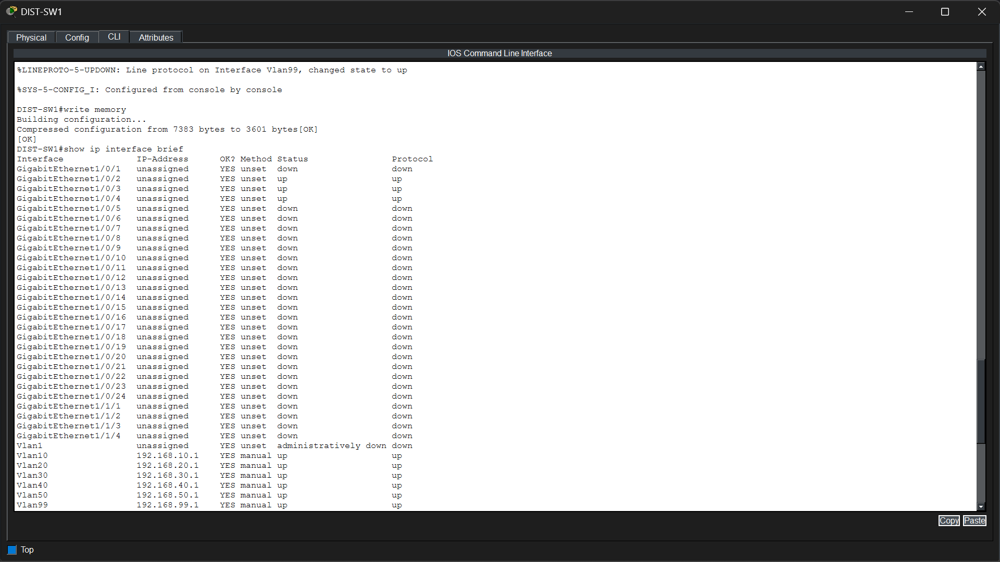

# Phase 2 – Inter-VLAN Routing

## Objective

Enable communication between different VLANs by configuring Switch Virtual Interfaces (SVIs) on the Layer 3 distribution switch. This allows hosts in separate VLANs to communicate while maintaining logical network segmentation.

---

## Technologies Implemented

- Layer 3 Switching
- Switch Virtual Interfaces (SVIs)
- Inter-VLAN Routing
- Connected Routing

---

## Network Topology

> *Insert the Inter-VLAN Routing topology image here.*


---

## Implementation

Inter-VLAN routing was implemented on the distribution switch (DIST-SW1) by configuring a dedicated Switch Virtual Interface (SVI) for each VLAN.

Each SVI serves as the default gateway for its respective VLAN, allowing devices in different departments to communicate through the Layer 3 switch.

### Configured VLAN Interfaces

| VLAN | Department | Gateway |
| :---: | ---------- | ----------- |
| 10 | HR | 192.168.10.1 |
| 20 | Finance | 192.168.20.1 |
| 30 | Sales | 192.168.30.1 |
| 40 | IT | 192.168.40.1 |
| 50 | Servers | 192.168.50.1 |
| 99 | Management | 192.168.99.1 |

---

## Verification

### SVI Status Verification

The configured Switch Virtual Interfaces were verified using:

```text
show ip interface brief
```

The verification confirms that:

- All configured VLAN interfaces are operational.
- Each SVI has the correct gateway IP address.
- VLAN interfaces are in the **up/up** state and ready to route traffic.



---

### Routing Table Verification

The routing table was verified using:

```text
show ip route
```

The verification confirms that:

- All VLAN networks are present as directly connected routes.
- Each SVI has an associated local host route (/32).
- The Layer 3 switch is successfully routing traffic between all configured VLANs.


---

## Files Included

- `topology.png`
- `svi_verification.png`
- `routing_table.png`

---

## Result

Inter-VLAN routing was successfully implemented using Switch Virtual Interfaces (SVIs) on the distribution switch. Each department received a dedicated default gateway, enabling seamless communication between VLANs while maintaining logical network segmentation. This Layer 3 foundation supports the deployment of enterprise network services, Internet connectivity, and security features in the subsequent phases.