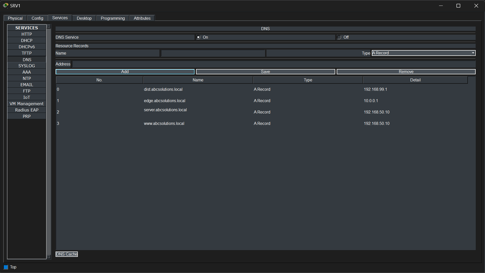
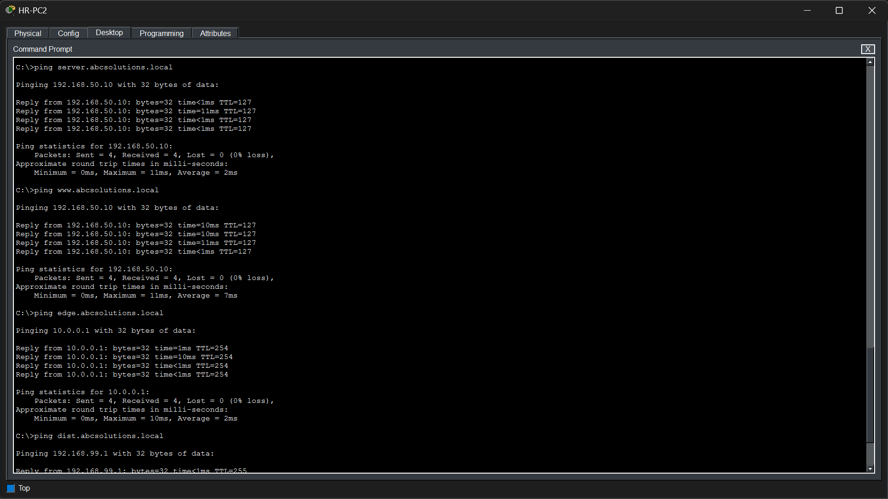

# Phase 5 – DNS Configuration

## Objective

Deploy a centralized Domain Name System (DNS) server to provide hostname resolution across the enterprise network. Configure DNS records for key network devices and services, allowing clients to communicate using fully qualified domain names (FQDNs) instead of IP addresses.

---

## Technologies Implemented

- Domain Name System (DNS)
- A Records
- Centralized Name Resolution
- DHCP-DNS Integration

---

## Network Topology

> *Insert the DNS topology image here.*

---

## Implementation

A centralized DNS server was configured on **SRV1** to provide hostname resolution for enterprise network resources.

The DNS server hosts **A Records** that map hostnames to their corresponding IPv4 addresses.

The DHCP server was also configured to automatically distribute the DNS server address (**192.168.50.10**) to all client devices, allowing hostname resolution without manual configuration.

### Configured DNS Records

| Hostname | IP Address |
| :---------------------- | :----------- |
| dist.abcsolutions.local | 192.168.99.1 |
| edge.abcsolutions.local | 10.0.0.1 |
| server.abcsolutions.local | 192.168.50.10 |
| www.abcsolutions.local | 192.168.50.10 |

---

## Verification

### DNS Server Configuration

The DNS service was verified on **SRV1**.

The verification confirms that:

- DNS service is enabled.
- Enterprise A Records have been configured.
- Hostnames correctly map to their respective IP addresses.

---

### DHCP Integration

The DHCP configuration was verified to ensure that all client devices automatically receive the enterprise DNS server.

The verification confirms that:

- Every DHCP pool distributes **192.168.50.10** as the DNS server.
- Clients do not require manual DNS configuration.

---

### Client DNS Configuration

A DHCP client was verified to confirm automatic DNS configuration.

The verification confirms that the client successfully received:

- IPv4 Address
- Default Gateway
- DNS Server (192.168.50.10)

---

### DNS Resolution Verification

Hostname resolution was verified from a client workstation.

Successful resolution was demonstrated for:

- `server.abcsolutions.local`
- `www.abcsolutions.local`
- `edge.abcsolutions.local`
- `dist.abcsolutions.local`

The ping output shows that each hostname is first resolved to its corresponding IP address before communication begins.

---

## Files Included

- `topology.png`
- `dns_server_configuration.png`
- `dhcp_dns_configuration.png`
- `client_dns_configuration.png`
- `dns_verification_part1.png`
- `dns_verification_part2.png`

---

## Result

A centralized DNS infrastructure was successfully deployed using **SRV1**. Enterprise devices and services can now be accessed using meaningful hostnames instead of IP addresses. Through DHCP integration, all client devices automatically receive the enterprise DNS server, enabling seamless hostname resolution across the network.