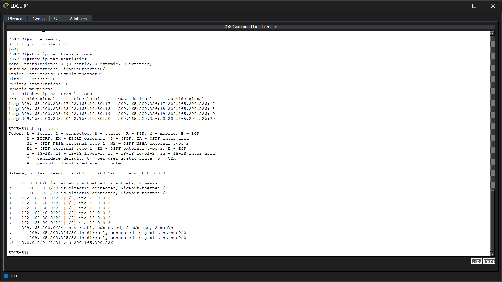

# Phase 9 – Network Address Translation (NAT)

## Objective

Configure Network Address Translation (NAT) on the enterprise edge router to allow devices using private IP addresses to communicate with external networks through a public IP address.

---

## Technologies Implemented

- Static Routing
- Network Address Translation (NAT)
- Port Address Translation (PAT)
- Private-to-Public IPv4 Translation

---

## Network Topology

> *Insert the NAT topology image here.*

---

## Implementation

Network Address Translation (NAT) was configured on **EDGE-R1**.

The internal enterprise network uses private IPv4 addressing, while the WAN connection uses a public IPv4 network.

Traffic originating from internal hosts is translated to the public IP address of the edge router before being forwarded toward the ISP.

The ISP router was configured with a static route pointing back to the enterprise network, allowing return traffic to reach internal devices.

---

## Verification

### EDGE-R1 NAT Verification

The edge router was verified after NAT configuration.

The verification confirms:

- NAT translations are created successfully.
- Inside and outside interfaces are correctly identified.
- Internal routing is present.
- Default route points toward the ISP.

---

### ISP Routing Verification

The ISP router routing table was verified.

The verification confirms that the ISP has a static route back to the enterprise network through the edge router, allowing return traffic from external networks.

---

### Client Connectivity Verification

A client workstation was verified after NAT implementation.

The verification confirms:

- DHCP successfully assigned the enterprise DNS server.
- The client can successfully communicate with external IP addresses through NAT.
- Successful replies demonstrate that private IP traffic is translated to the public IP before leaving the enterprise network.

> **Note:** The first ping to the ISP may time out because ARP resolution occurs before normal communication begins. Subsequent replies are successful, confirming proper connectivity.

---

## Files Included

- `topology.png`
- `edge_nat_verification.png`
- `isp_route_verification.png`
- `client_nat_verification.png`

---

## Result

Network Address Translation (NAT) was successfully deployed on the enterprise edge router. Internal devices can now communicate with external networks while keeping private IPv4 addresses hidden from the public network. The ISP routing configuration ensures return traffic reaches the enterprise network, completing end-to-end connectivity.