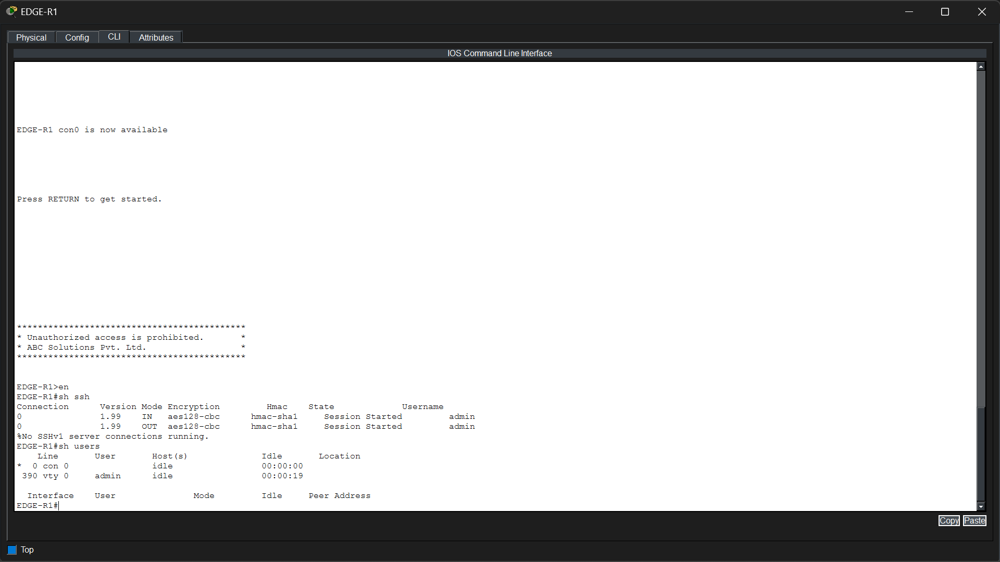
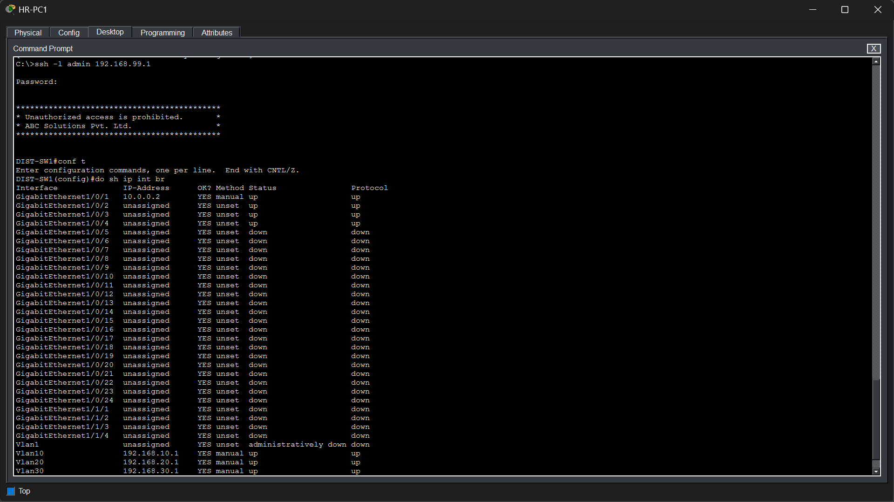
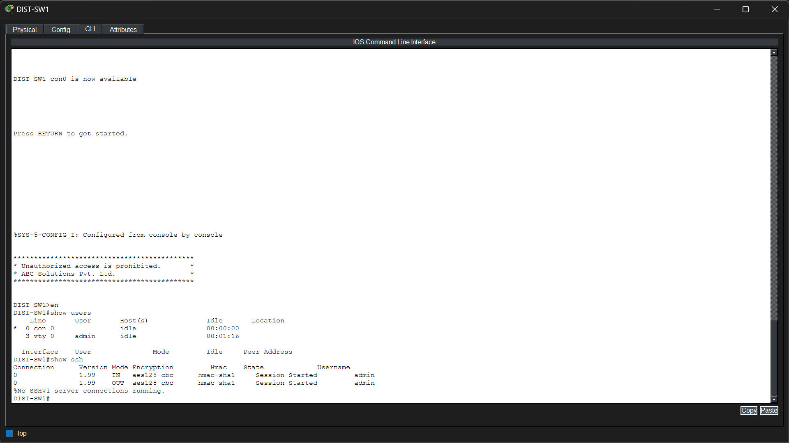
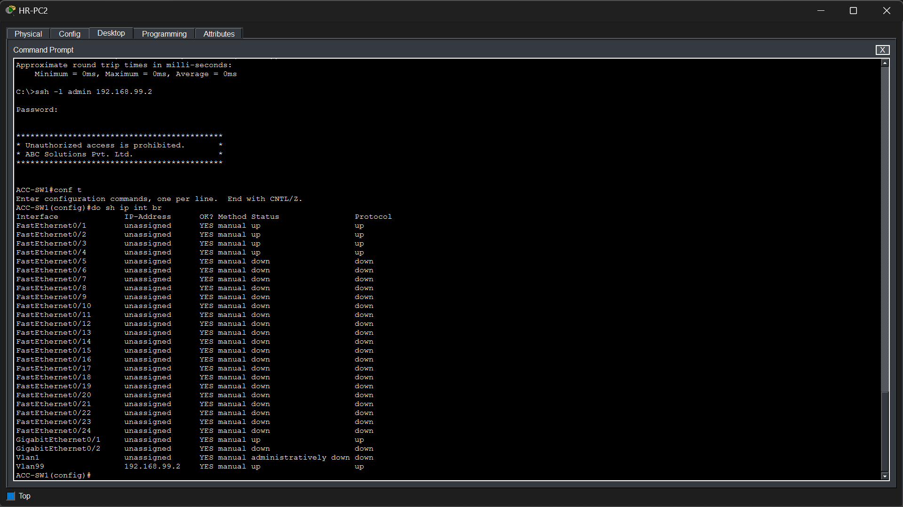
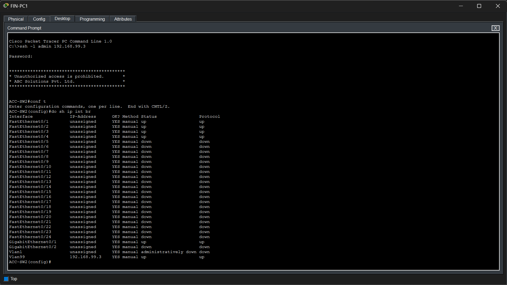

# Phase 10 – Secure Remote Management (SSH)

## Objective

Configure Secure Shell (SSH) Version 2 on all routers and switches to provide secure encrypted remote management and eliminate the use of insecure Telnet access.

---

## Technologies Implemented

- Secure Shell (SSH) Version 2
- Local User Authentication
- RSA Key Generation
- Remote Device Management
- Encrypted CLI Sessions

---

## Network Topology

> *Insert the SSH management topology image here.*

---

## Implementation

SSH Version 2 was configured on all enterprise routers and switches.

Each network device was configured with a local administrator account, RSA encryption keys, SSH Version 2, and VTY lines restricted to SSH access only. A login banner was also configured to display an authorized access warning before user authentication.

Management IP addresses were assigned to the switches through the management VLAN, allowing administrators to securely manage network devices from different VLANs across the enterprise.

---

## Verification

### ISP-R1 SSH Verification

SSH access to **ISP-R1** was verified from **SALES-PC2**.

The verification confirms:

- Successful SSH login
- Router interfaces are operational
- Active SSH session established
- Logged-in administrator verified

---

### EDGE-R1 SSH Verification

SSH access to **EDGE-R1** was verified from **SALES-PC1**.

The verification confirms:

- Successful SSH login
- Router interfaces are operational
- Active SSH session established
- Logged-in administrator verified

---

### DIST-SW1 SSH Verification

SSH access to **DIST-SW1** was verified from **HR-PC1**.

The verification confirms:

- Successful SSH login
- Login banner displayed
- Management interface is operational
- Active SSH session established
- Logged-in administrator verified

---

### ACC-SW1 SSH Verification

SSH access to **ACC-SW1** was verified from **HR-PC2**.

The verification confirms:

- Successful SSH login
- Management VLAN interface is operational
- Active SSH session established
- Logged-in administrator verified

---

### ACC-SW2 SSH Verification

SSH access to **ACC-SW2** was verified from **FIN-PC1**.

The verification confirms:

- Successful SSH login
- Management VLAN interface is operational
- Active SSH session established
- Logged-in administrator verified

---

### SRV-SW1 SSH Verification

SSH access to **SRV-SW1** was verified from **FIN-PC2**.

The verification confirms:

- Successful SSH login
- Management VLAN interface is operational
- Active SSH session established
- Logged-in administrator verified

---

### EDGE-R1 SSH Verification

SSH access to **EDGE-R1** was verified from **SALES-PC1**.

The verification confirms:

- Successful SSH login
- Router interfaces are operational
- Active SSH session established
- Logged-in administrator verified

---

### ISP-R1 SSH Verification

SSH access to **ISP-R1** was verified from **SALES-PC2**.

The verification confirms:

- Successful SSH login
- Router interfaces are operational
- Active SSH session established
- Logged-in administrator verified

---

## Files Included

- `topology.png`
- `dist_ssh_login.png`
- `dist_ssh_verification.png`
- `acc1_ssh_login.png`
- `acc1_ssh_verification.png`
- `acc2_ssh_login.png`
- `acc2_ssh_verification.png`
- `srv_ssh_login.png`
- `srv_ssh_verification.png`
- `edge_ssh_login.png`
- `edge_ssh_verification.png`
- `isp_ssh_login.png`
- `isp_ssh_verification.png`

---

## Result

Secure Shell (SSH) Version 2 was successfully implemented across all enterprise routers and switches. Network administrators can securely manage devices using encrypted remote sessions from multiple VLANs within the enterprise. Verification confirmed successful authentication, active SSH sessions, and proper management connectivity on every device.