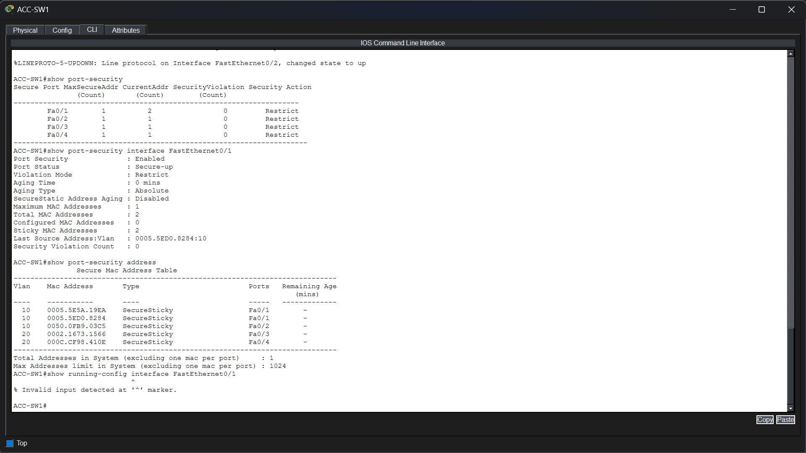
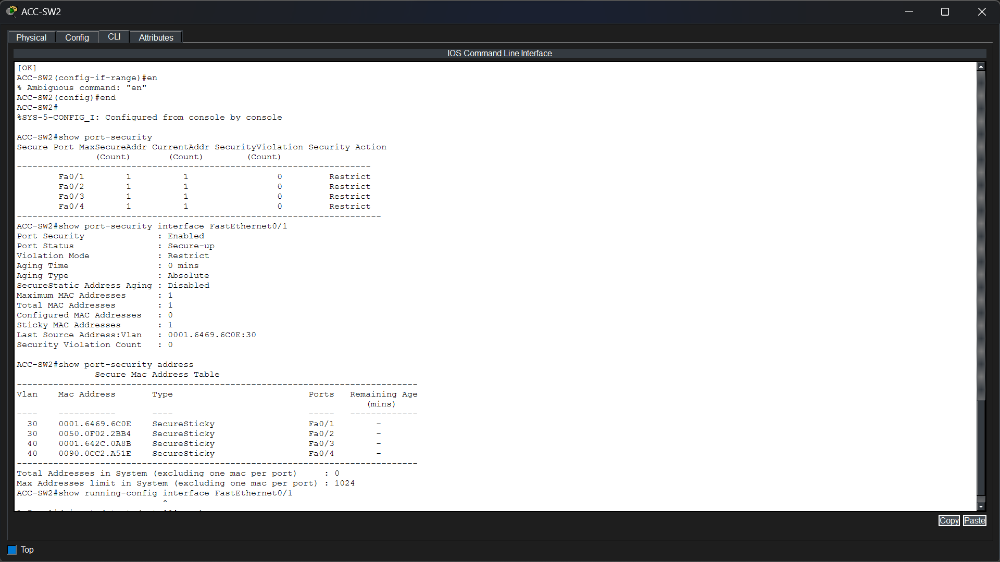
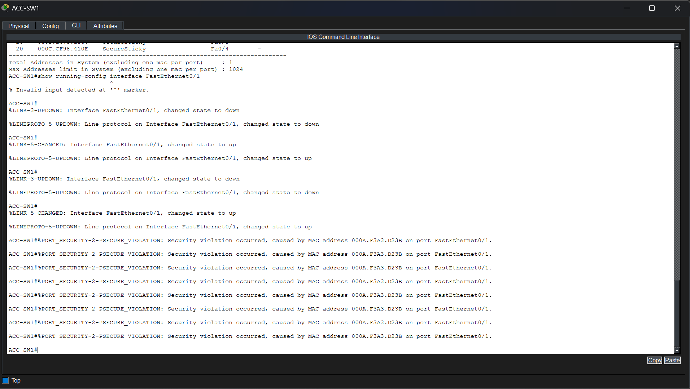

# Phase 11 – Port Security

## Objective

Implement Port Security on the enterprise access switches to restrict unauthorized devices from connecting to the network and protect access ports against MAC address spoofing and rogue devices.

---

## Technologies Implemented

- Layer 2 Security
- Port Security
- Sticky MAC Address Learning
- Secure MAC Address Table
- Restrict Violation Mode

---

## Network Topology

> *Insert the Port Security topology image here.*

---

## Implementation

Port Security was configured on all user-facing access ports of the enterprise access switches.

Each access port was configured to dynamically learn the connected device's MAC address using Sticky MAC learning. Once learned, the MAC addresses were added to the secure MAC address table, allowing only authorized devices to communicate through their assigned switch ports.

The violation mode was configured as **Restrict**, allowing the switch to block frames from unauthorized devices while keeping the interface operational and generating security violation notifications.

---

## Verification

### ACC-SW1 Port Security Verification

Port Security was verified on **ACC-SW1**.

The verification confirms:

- Port Security is enabled on all user access ports.
- All protected interfaces are operating in **Secure-Up** state.
- Violation mode is configured as **Restrict**.
- Sticky MAC learning has successfully learned and secured connected endpoint MAC addresses.
- The secure MAC address table contains authorized devices for both VLAN 10 and VLAN 20.
- No security violations have occurred during normal operation, confirming that only authorized devices are connected.

---

### ACC-SW2 Port Security Verification

Port Security was verified on **ACC-SW2**.

The verification confirms:

- Port Security is enabled on all user access ports.
- All protected interfaces are operating in **Secure-Up** state.
- Restrict mode is active on each secured interface.
- Sticky MAC learning has successfully secured endpoint MAC addresses.
- The secure MAC address table contains authorized devices belonging to VLAN 30 and VLAN 40.
- No violations are present during normal network operation.

---

### Port Security Violation Verification

A Port Security violation was intentionally generated on **ACC-SW1** by connecting an unauthorized device to a secured access port after the legitimate MAC address had already been learned.

The verification confirms:

- The switch immediately detected the unauthorized MAC address.
- Multiple **PSECURE_VIOLATION** log messages were generated.
- The unauthorized MAC address was identified and recorded in the system log.
- The secured interface remained operational because **Restrict** violation mode was configured.
- Traffic from the unauthorized device was blocked while legitimate devices continued to operate normally.
- The successful detection demonstrates that Port Security effectively prevents unauthorized devices from accessing the enterprise network without disrupting service to authorized users.

---

## Files Included

- `topology.png`
- `acc-sw1_port_security.png`
- `acc-sw2_port_security.png`
- `port_security_violation.png`

---

## Result

Port Security was successfully implemented on all enterprise access switches. Authorized endpoint devices were securely learned using Sticky MAC addresses, while unauthorized devices were automatically detected and blocked through Restrict violation mode. The implementation provides an additional Layer 2 security mechanism that helps protect the enterprise network against unauthorized access and MAC address spoofing attacks.