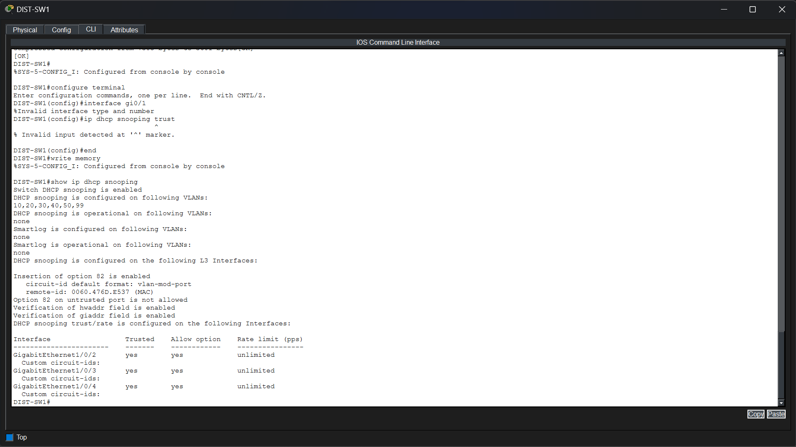
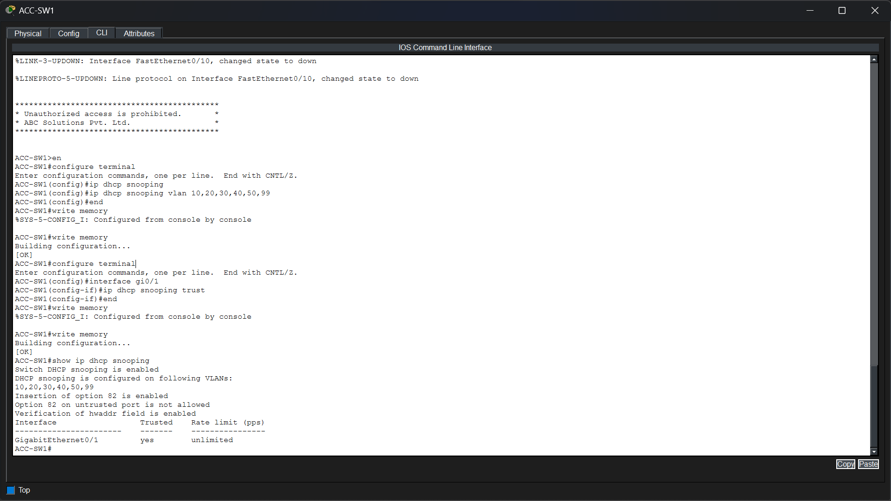
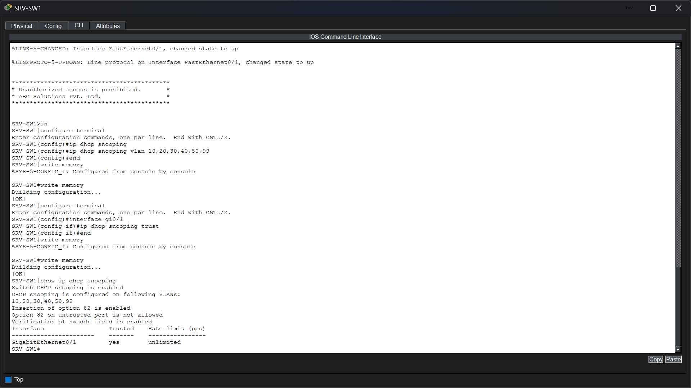

# Phase 9 – DHCP Snooping

## Objective

Implement DHCP Snooping across the enterprise network to prevent rogue DHCP servers from assigning unauthorized IP addresses and to ensure that clients receive IP configuration only from trusted DHCP sources.

---

## Technologies Implemented

- Layer 2 Security
- DHCP Snooping
- Trusted Interfaces
- DHCP Binding Database
- DHCP Option 82

---

## Network Topology

> *Insert the DHCP Snooping topology image here.*

---

## Implementation

DHCP Snooping was enabled on all enterprise VLANs carrying client traffic.

Only interfaces connected toward legitimate DHCP sources and trusted switching infrastructure were configured as **trusted**. All user-facing access ports remained **untrusted**, preventing unauthorized DHCP server responses from reaching clients.

The switches automatically build a DHCP binding database containing valid IP address, MAC address, VLAN, and interface information for clients that obtain addresses through DHCP. This database is later used by additional security mechanisms such as Dynamic ARP Inspection (DAI).

---

## Verification

### DIST-SW1 DHCP Snooping Verification

DHCP Snooping was verified on the distribution switch.

The verification confirms:

- DHCP Snooping is globally enabled.
- DHCP Snooping is active on VLANs **10, 20, 30, 40, 50, and 99**.
- DHCP Option 82 insertion is enabled to provide relay information.
- Hardware address and GIADDR verification are enabled for additional security.
- Only the uplink interfaces connected toward the enterprise switching infrastructure are configured as **trusted**.
- All remaining access interfaces remain untrusted, preventing rogue DHCP servers from distributing unauthorized IP addresses.

---

### ACC-SW1 DHCP Snooping Verification

DHCP Snooping was verified on **ACC-SW1**.

The verification confirms:

- DHCP Snooping is enabled for all enterprise VLANs.
- The uplink interface (**GigabitEthernet0/1**) is configured as the only trusted interface.
- DHCP Option 82 insertion is enabled.
- Hardware address verification is active.
- All user access ports remain untrusted by default, ensuring that only DHCP messages arriving from the trusted uplink are accepted.

---

### ACC-SW2 DHCP Snooping Verification

DHCP Snooping was verified on **ACC-SW2**.

The verification confirms:

- DHCP Snooping is enabled across all enterprise VLANs.
- The uplink interface (**GigabitEthernet0/1**) is configured as the trusted interface.
- DHCP Option 82 insertion is enabled.
- Hardware address verification is active.
- Unauthorized DHCP server responses originating from user access ports would therefore be discarded before reaching enterprise clients.

---

### SRV-SW1 DHCP Snooping Verification

DHCP Snooping was verified on **SRV-SW1**.

The verification confirms:

- DHCP Snooping is enabled on all configured VLANs.
- The uplink interface toward the distribution switch is configured as trusted.
- DHCP Option 82 insertion is enabled.
- Hardware address verification remains active.
- The server access switch accepts DHCP traffic only from the trusted uplink while protecting the server network against rogue DHCP devices connected to local access ports.

---

## Files Included

- `topology.png`
- `dist-sw1_dhcp_snooping.png`
- `acc-sw1_dhcp_snooping.png`
- `acc-sw2_dhcp_snooping.png`
- `srv-sw1_dhcp_snooping.png`

---

## Result

DHCP Snooping was successfully deployed throughout the enterprise network. Trusted uplink interfaces were configured to forward legitimate DHCP traffic, while all client-facing ports remained untrusted to prevent rogue DHCP servers from assigning unauthorized network configurations. The implementation also establishes a secure DHCP binding database, providing the foundation for advanced Layer 2 security features such as Dynamic ARP Inspection (DAI).