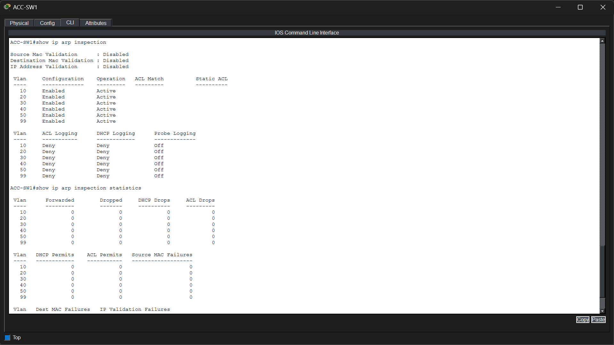
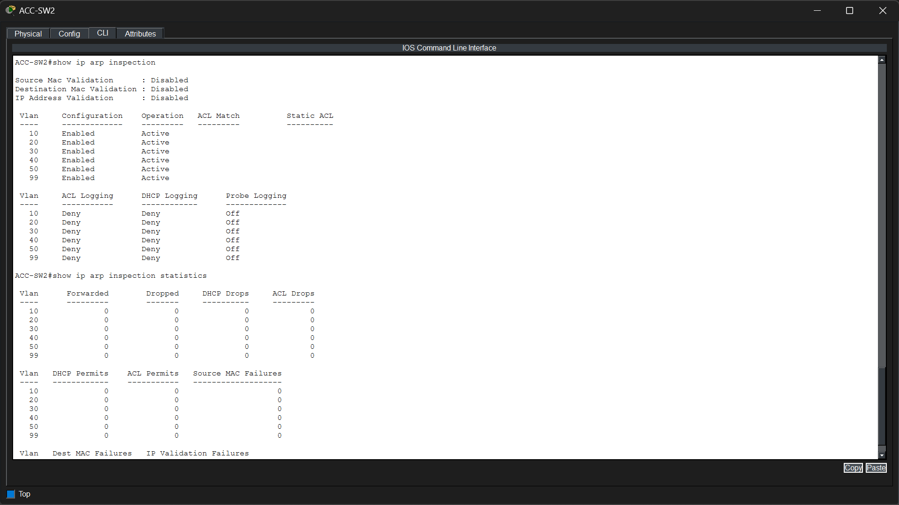

# Phase 10 – Dynamic ARP Inspection (DAI)

## Objective

Implement Dynamic ARP Inspection (DAI) across the enterprise network to protect against ARP spoofing and ARP poisoning attacks by validating ARP packets against the DHCP Snooping binding database.

---

## Technologies Implemented

- Layer 2 Security
- Dynamic ARP Inspection (DAI)
- DHCP Snooping Integration
- Trusted Interfaces
- ARP Packet Validation

---

## Network Topology

> *Insert the Dynamic ARP Inspection topology image here.*

---

## Implementation

Dynamic ARP Inspection (DAI) was enabled on all enterprise VLANs carrying client traffic.

DAI works together with the DHCP Snooping binding database to verify that every ARP packet contains a valid IP-to-MAC address mapping before allowing it onto the network.

Only uplink interfaces connected to trusted switching infrastructure were configured as **trusted**, allowing ARP packets to pass without inspection. All user-facing access ports remained **untrusted**, ensuring that ARP packets generated by end devices are inspected before being forwarded.

This implementation protects the network from ARP spoofing attacks that could otherwise redirect traffic through a malicious device or perform man-in-the-middle attacks.

---

## Verification

### DIST-SW1 Dynamic ARP Inspection Verification

Dynamic ARP Inspection was verified on the distribution switch.

The verification confirms:

- Dynamic ARP Inspection is enabled on VLANs **10, 20, 30, 40, 50, and 99**.
- All configured VLANs are in the **Active** operational state.
- ARP validation is functioning normally with no operational errors.
- Logging is configured for denied ARP packets.
- Statistics show **zero forwarded, dropped, DHCP, or ACL-related drops**, indicating that no invalid ARP traffic has been detected during testing.
- No source MAC or IP validation failures are present, confirming a clean ARP environment.

---

### ACC-SW1 Dynamic ARP Inspection Verification

Dynamic ARP Inspection was verified on **ACC-SW1**.

The verification confirms:

- DAI is enabled across all enterprise VLANs.
- Every protected VLAN is operational and actively enforcing ARP inspection.
- ARP packet logging is enabled for denied traffic.
- No invalid ARP packets have been detected during verification.
- Statistics show zero packet drops, DHCP validation failures, ACL violations, or source MAC failures, demonstrating successful operation after deployment.

---

### ACC-SW2 Dynamic ARP Inspection Verification

Dynamic ARP Inspection was verified on **ACC-SW2**.

The verification confirms:

- DAI is enabled on all enterprise VLANs.
- All configured VLANs are active and operational.
- ARP inspection is actively monitoring traffic received on untrusted access ports.
- Verification statistics indicate zero packet drops, ACL failures, DHCP validation failures, and MAC validation failures.
- The switch is therefore prepared to block malicious ARP packets while allowing legitimate ARP traffic.

---

### SRV-SW1 Dynamic ARP Inspection Verification

Dynamic ARP Inspection was verified on **SRV-SW1**.

The verification confirms:

- DAI is enabled across all configured VLANs.
- Every protected VLAN is active and operating correctly.
- Denied ARP logging is enabled for monitoring purposes.
- Operational statistics show no invalid ARP packets, DHCP validation failures, ACL violations, or MAC validation failures.
- The server access network is therefore protected against unauthorized ARP spoofing attempts while continuing to permit legitimate ARP communication.

---

## Files Included

- `topology.png`
- `dist-sw1_dai.png`
- `acc-sw1_dai.png`
- `acc-sw2_dai.png`
- `srv-sw1_dai.png`

---

## Result

Dynamic ARP Inspection was successfully deployed across the enterprise network. By leveraging the DHCP Snooping binding database, every ARP packet received on untrusted interfaces is validated before being forwarded. Trusted uplink interfaces allow legitimate infrastructure traffic to pass without inspection, while access ports remain protected against ARP spoofing and ARP poisoning attacks. Verification confirms that all switches are operating normally with no validation failures or packet drops, providing an additional layer of security for the enterprise Layer 2 network.