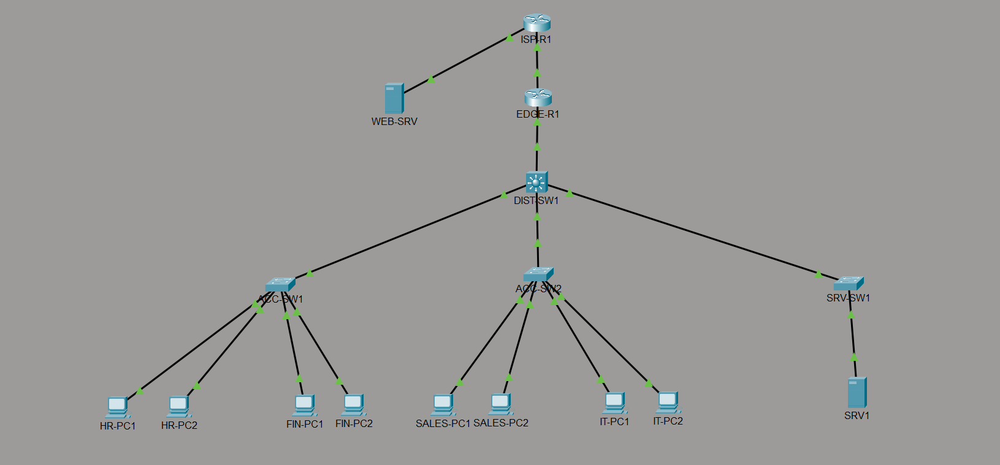
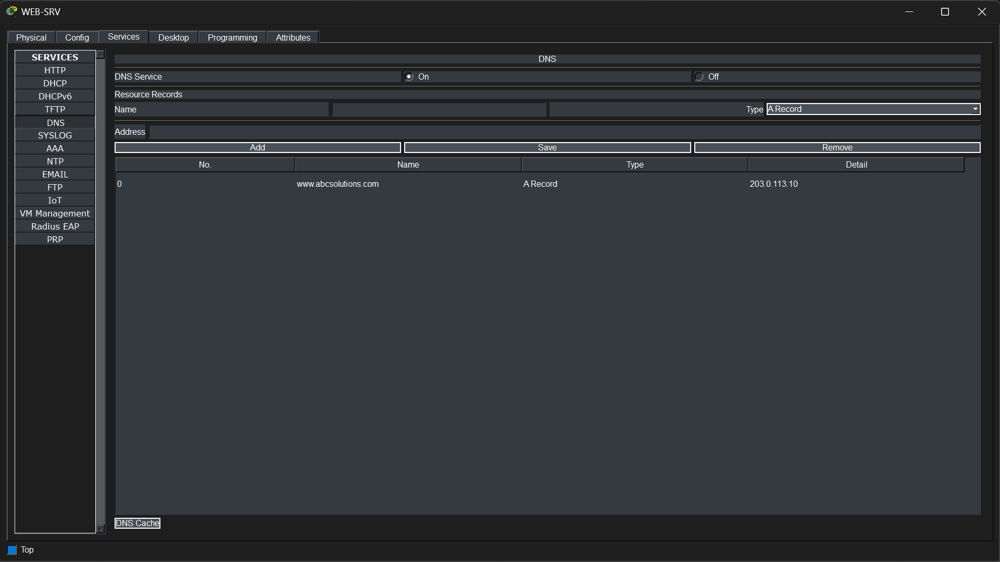

# Phase 13 – Internet Connectivity & Public Web Access

## Objective

Provide enterprise users with secure Internet connectivity and verify end-to-end communication with an external public web server. This phase validates that internal users can resolve a public domain name, access Internet resources through NAT/PAT, and successfully browse a publicly hosted website.

---

## Technologies Implemented

- Static NAT
- PAT (NAT Overload)
- Public DNS Resolution
- HTTP
- Internet Connectivity Verification

---

## Network Topology

> *Insert the Internet connectivity topology image here.*



---

## Implementation

A public web server (**WEB-SRV**) was deployed to simulate an external Internet-hosted website.

The server was assigned the public IP address:

```text
203.0.113.10
```

A public DNS record was created for:

```text
www.abcsolutions.com
```

Enterprise users access the website using its Fully Qualified Domain Name (FQDN), which resolves to the public IP address before traffic is forwarded through the enterprise edge router using NAT/PAT.

This implementation simulates real-world Internet access where internal users browse publicly hosted services outside the enterprise network.

---

## Verification

### Public DNS Server Verification

The public DNS service was verified on the external web server.

The verification confirms:

- DNS service is enabled.
- An A Record exists for **www.abcsolutions.com**.
- The domain resolves to **203.0.113.10**.
- The public DNS service is ready to provide name resolution for Internet clients.



---

### Enterprise DNS Server Verification

The internal DNS server was verified after adding the required DNS records.

The verification confirms:

- Internal enterprise host records are configured.
- A public DNS record for **www.abcsolutions.com** points to **203.0.113.10**.
- Enterprise clients can resolve both internal and external hostnames.


---

### DNS Resolution Verification

Name resolution was verified from an internal workstation.

The verification confirms:

- The hostname **www.abcsolutions.com** successfully resolves to **203.0.113.10**.
- Clients can successfully query the enterprise DNS server.
- Public name resolution is functioning correctly.


---

### Internet Connectivity Verification

Connectivity to the public web server was verified using ICMP.

The verification confirms:

- Internal clients successfully reach **203.0.113.10**.
- Four ICMP Echo Replies were received.
- No packet loss occurred.
- End-to-end Internet connectivity is operational.


---

### NAT Verification

Network Address Translation was verified on **EDGE-R1**.

The verification confirms:

- Dynamic PAT translations are successfully created.
- Internal private addresses are translated to the public address assigned to the edge router.
- Active HTTP sessions are visible in the NAT translation table.
- Internet traffic is correctly translated before leaving the enterprise network.


---

### HTTP Verification

Web access was verified from an internal workstation.

The verification confirms:

- The website is accessed using the Fully Qualified Domain Name:

```text
http://www.abcsolutions.com
```

- DNS resolution completes successfully.
- HTTP communication is established with the public web server.
- The ABC Solutions public website loads successfully.


---

## Files Included

- `topology.png`
- `public_dns.png`
- `enterprise_dns.png`
- `dns_resolution.png`
- `internet_ping.png`
- `nat_verification.png`
- `http_verification.png`

---

## Result

Enterprise Internet connectivity was successfully implemented and verified. Internal users can resolve public domain names, communicate with external Internet resources through NAT/PAT, and access a publicly hosted website using its Fully Qualified Domain Name. The successful DNS resolution, NAT translations, ICMP connectivity, and HTTP access confirm that the enterprise network is fully capable of providing secure Internet access to end users.