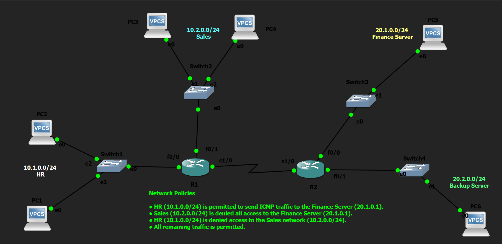

# Extended Numbered ACL Lab

## Objective

Configure Extended Numbered Access Control Lists (ACLs) to implement enterprise security policies by filtering traffic based on source address, destination address, and protocol while understanding proper ACL placement and packet filtering behavior.

---

## Topology

---

## Network Policies

The following security policies were implemented:

- HR (10.1.0.0/24) is permitted to send ICMP traffic to the Finance Server (20.1.0.1).
- Sales (10.2.0.0/24) is denied all access to the Finance Server (20.1.0.1).
- HR (10.1.0.0/24) is denied access to the Sales network (10.2.0.0/24).
- All remaining traffic is permitted.

---

## How it Works

In this lab, OSPF was first configured to establish full network connectivity between all routers and end devices. After verifying successful routing, Extended Numbered ACLs were configured to enforce enterprise security policies.

Unlike Standard ACLs, Extended ACLs examine multiple packet fields including the source IP address, destination IP address, and protocol type. This allows much more granular traffic filtering and enables specific communication to be permitted or denied without affecting unrelated traffic.

The ACLs were placed as close to the source as possible to prevent unwanted traffic from traversing the network before being discarded, following Cisco's recommended design practice for Extended ACLs.

---

## Verification

### Routing Verification

Verified end-to-end routing before applying ACLs.

Commands used:

- `show ip route`
- `show ip ospf neighbor`
- `ping`

### ACL Verification

Verified ACL entries and packet match counters.

Commands used:

- `show access-lists`
- `show running-config`

### Interface Verification

Verified ACL placement and direction.

Commands used:

- `show ip interface`
- `show ip interface brief`

### Connectivity Testing

Verified that all configured security policies were successfully enforced.

Commands used:

- `ping`

---

## Key Concepts Learned

- Extended Numbered ACLs
- Source and Destination Address Filtering
- Protocol-Based Filtering
- Host vs Network Matching
- ACL Processing Order
- Implicit `deny any`
- ACL Placement Best Practices
- Packet Flow Analysis
- ACL Verification

---

## Engineering Observations

This lab demonstrated several important characteristics of Extended ACLs:

- Extended ACLs evaluate the source address, destination address, and protocol before making a forwarding decision.
- Extended ACLs provide significantly finer control than Standard ACLs by allowing traffic to specific hosts or networks while permitting all other communication.
- Extended ACLs should generally be placed as close to the source as possible to prevent unnecessary traffic from crossing the network.
- ACL entries are processed sequentially from top to bottom until the first matching rule is found.
- Every Extended ACL contains an implicit `deny any` at the end of the access list.

---

## Troubleshooting Experience

During implementation and testing, the following tasks were performed:

- Verified end-to-end routing before applying security policies.
- Confirmed ACL placement and traffic direction using interface verification commands.
- Traced packet flow to understand how Extended ACLs affect traffic forwarding.
- Verified ACL operation using connectivity tests and ACL match counters.
- Confirmed that only the intended traffic was filtered while all remaining communication continued normally.

---

## Skills Learned

- Extended Numbered ACL Configuration
- Enterprise Traffic Filtering
- Source and Destination Matching
- Protocol-Based Access Control
- ACL Placement
- OSPF Verification
- Packet Flow Analysis
- ACL Troubleshooting
- Network Security Fundamentals

---

## Devices Used

- 2 × Cisco 2691 Routers
- 4 × Ethernet Switches
- 6 × VPCS Hosts

---

## Files Included

- `extended-numbered-acl.pkt`
- `R1-config.txt`
- `R2-config.txt`
- `PC1-config.txt`
- `PC2-config.txt`
- `PC3-config.txt`
- `PC4-config.txt`
- `PC5-config.txt`
- `PC6-config.txt`
- `R1-config.png`
- `R2-config.png`
- `PC1-config.png`
- `PC2-config.png`
- `PC3-config.png`
- `PC4-config.png`
- `PC5-config.png`
- `PC6-config.png`
- `topology.png`