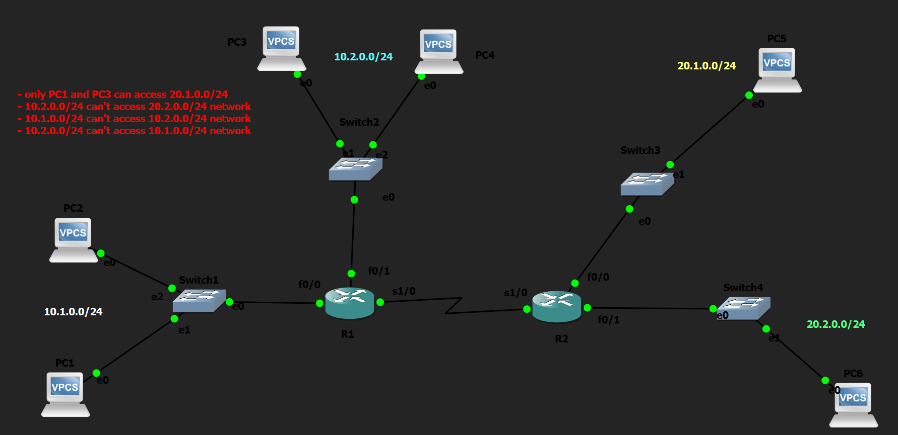

# Standard Named ACL Lab

## Objective

Configure Standard Named Access Control Lists (ACLs) to enforce network security policies based on source IP addresses while improving configuration readability, maintainability, and documentation through descriptive ACL names.

---

## Topology

---

## Network Policies

The following security policies were implemented:

- Only **PC1** and **PC3** can access the **20.1.0.0/24** network.
- The **10.2.0.0/24** network cannot access the **20.2.0.0/24** network.
- The **10.1.0.0/24** network cannot access the **10.2.0.0/24** network.
- All remaining traffic is permitted.

---

## How it Works

In this lab, OSPF was first configured to provide full connectivity between all networks. After verifying successful routing, Standard Named ACLs were created to enforce the required security policies.

Unlike Numbered ACLs, Named ACLs use descriptive names, making configurations easier to understand and maintain. Since Standard ACLs examine only the source IP address, they were placed as close to the destination network as possible to minimize unintended traffic filtering. The ACLs were then applied to the appropriate router interfaces using the `ip access-group` command.

---

## Verification

### Routing Verification

Verified end-to-end routing before applying ACLs.

Commands used:

- `show ip route`
- `show ip ospf neighbor`
- `ping`

### ACL Verification

Verified ACL entries and packet matches.

Commands used:

- `show access-lists`
- `show running-config`

### Interface Verification

Verified ACL placement and direction.

Commands used:

- `show ip interface`
- `show ip interface brief`

### Connectivity Testing

Verified that the configured security policies were successfully enforced.

Commands used:

- `ping`

---

## Key Concepts Learned

- Standard Named ACLs
- Named vs Numbered ACLs
- Source-Based Packet Filtering
- ACL Processing Order
- Implicit `deny any`
- Host vs Network Matching
- Inbound vs Outbound ACLs
- Standard ACL Placement
- ACL Verification

---

## Engineering Observations

This lab demonstrated several important characteristics of Standard Named ACLs:

- Named ACLs provide the same functionality as Numbered ACLs while improving readability and maintainability.
- Standard ACLs filter traffic using only the source IP address.
- Every Standard ACL ends with an implicit `deny any`, even when it is not explicitly configured.
- ACLs are processed sequentially from top to bottom until the first matching entry is found.
- Proper ACL placement is critical because Standard ACLs cannot evaluate destination IP addresses.

---

## Troubleshooting Experience

During implementation and testing, the following tasks were performed:

- Verified routing before implementing security policies.
- Confirmed ACL placement and traffic direction using interface verification commands.
- Traced packet flow to determine where packets were being filtered.
- Verified connectivity before and after ACL implementation.
- Confirmed that the required security policies were successfully enforced.

---

## Skills Learned

- Standard Named ACL Configuration
- ACL Design
- ACL Placement Best Practices
- Source-Based Access Control
- OSPF Verification
- Packet Flow Analysis
- Network Troubleshooting
- Network Security Fundamentals

---

## Devices Used

- 2 × Cisco 2691 Routers
- 4 × Ethernet Switches
- 6 × VPCS Hosts

---

## Files Included

- `standard-named-acl.pkt`
- `R1-config.txt`
- `R2-config.txt`
- `PC1-config.txt`
- `PC2-config.txt`
- `PC3-config.txt`
- `PC4-config.txt`
- `PC5-config.txt`
- `PC6-config.txt`
- `R1-config.png`
- `R2-config.png`
- `PC1-config.png`
- `PC2-config.png`
- `PC3-config.png`
- `PC4-config.png`
- `PC5-config.png`
- `PC6-config.png`
- `topology.png`