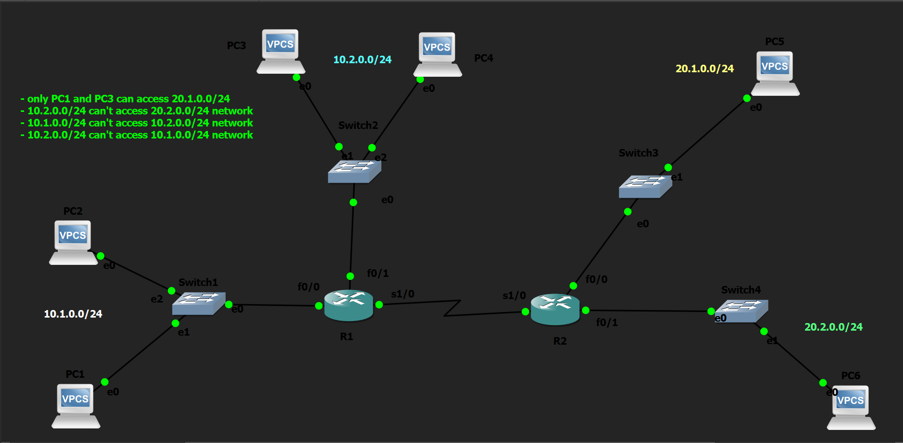

# Standard Numbered ACL Lab

## Objective

Configure Standard Numbered Access Control Lists (ACLs) to enforce network security policies based on source IP addresses while understanding proper ACL placement, packet flow, and the limitations of Standard ACLs.

---

## Topology

---

## Network Policies

The following security policies were implemented:

- Only **PC1** and **PC3** can access the **20.1.0.0/24** network.
- The **10.2.0.0/24** network cannot access the **20.2.0.0/24** network.
- The **10.1.0.0/24** network cannot access the **10.2.0.0/24** network.
- The **10.2.0.0/24** network cannot access the **10.1.0.0/24** network.

---

## How it Works

In this lab, OSPF was first configured to provide full connectivity between all networks. After verifying successful routing, Standard Numbered ACLs were created to restrict traffic based solely on the source IP address.

Since Standard ACLs do not examine destination addresses, they were placed as close to the destination network as possible to minimize unintended traffic filtering. ACLs were then applied to the appropriate router interfaces in the correct direction using the `ip access-group` command.

The configured ACLs successfully enforced the required security policies while demonstrating the behavior and limitations of source-based packet filtering.

---

## Verification

### Routing Verification

Verified end-to-end routing before applying ACLs.

Commands used:

- `show ip route`
- `show ip ospf neighbor`
- `ping`

### ACL Verification

Verified ACL entries and packet matches.

Commands used:

- `show access-lists`
- `show running-config`

### Interface Verification

Verified ACL placement and direction.

Commands used:

- `show ip interface`
- `show ip interface brief`

### Connectivity Testing

Verified that the configured security policies were successfully enforced using ICMP connectivity tests.

Commands used:

- `ping`

---

## Key Concepts Learned

- Standard Numbered ACLs
- Source-Based Packet Filtering
- ACL Wildcard Masks
- Host vs Network Matching
- Implicit `deny any`
- ACL Processing Order
- Inbound vs Outbound ACLs
- Standard ACL Placement
- Packet Flow Analysis
- ACL Verification

---

## Engineering Observations

This lab provided several important insights into Standard ACL behavior:

- Standard ACLs examine only the **source IP address**.
- Every Standard ACL ends with an **implicit `deny any`**, even if it is not explicitly configured.
- ACLs are **stateless**; every packet is evaluated independently.
- ICMP Echo Requests and Echo Replies are separate packets and may be filtered differently depending on ACL placement.
- Correct ACL placement is critical because Standard ACLs cannot distinguish between different destination networks or hosts.
- Packet flow analysis is often required to understand why traffic is permitted or denied.

---

## Troubleshooting Experience

During implementation and testing, the following issues were encountered and resolved:

- Incorrect default gateway configuration prevented end-to-end connectivity.
- ACL direction (`in` vs `out`) was verified using interface commands.
- Packet flow was traced hop-by-hop to determine where traffic was being filtered.
- ICMP request and reply paths were analyzed independently to understand ACL behavior.
- Routing was verified before troubleshooting ACL-related issues.

---

## Skills Learned

- Standard Numbered ACL Configuration
- ACL Design and Implementation
- ACL Placement Best Practices
- Wildcard Mask Configuration
- OSPF Verification
- Packet Flow Analysis
- Network Troubleshooting
- Router Interface Verification
- Network Security Fundamentals

---

## Devices Used

- 2 × Cisco 2691 Routers
- 4 × Ethernet Switches
- 6 × VPCS Hosts

---

## Files Included

- `standard-numbered-acl.pkt`
- `R1-config.txt`
- `R2-config.txt`
- `PC1-config.txt`
- `PC2-config.txt`
- `PC3-config.txt`
- `PC4-config.txt`
- `PC5-config.txt`
- `PC6-config.txt`
- `R1-config.png`
- `R2-config.png`
- `PC1-config.png`
- `PC2-config.png`
- `PC3-config.png`
- `PC4-config.png`
- `PC5-config.png`
- `PC6-config.png`
- `topology.png`