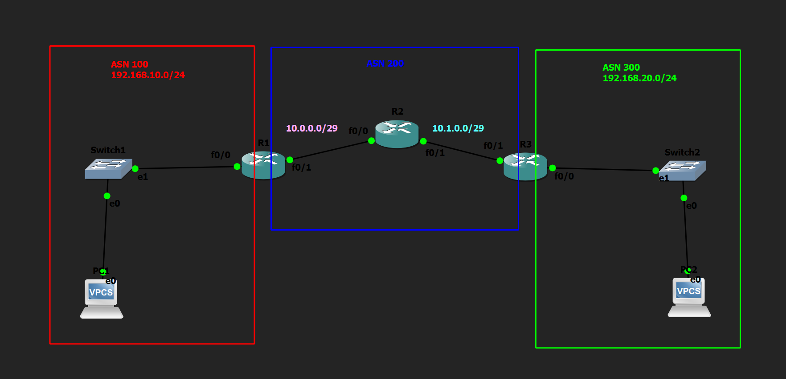

# Basic eBGP Configuration Lab

## Objective

Configure External Border Gateway Protocol (eBGP) between multiple Autonomous Systems (AS) to exchange routing information and verify end-to-end connectivity across different autonomous systems.

---

## Topology

---

## How it Works

In this lab, three routers were configured as separate Autonomous Systems (AS100, AS200, and AS300). eBGP neighbor relationships were manually established using the `neighbor` command and each router advertised its local networks using the `network` statement. Loopback interfaces were also configured and advertised to simulate router identifiers and internal networks. After the BGP sessions were established, routing information was exchanged between all autonomous systems, allowing end-to-end communication between hosts located in different ASes.

---

## Verification

### Interface Status

Verified interface status and IP addressing using:

- `show ip interface brief`

### BGP Neighbor Relationships

Verified successful BGP neighbor establishment using:

- `show ip bgp summary`

### BGP Routing Table

Verified advertised and learned BGP routes using:

- `show ip bgp`

### Routing Table

Verified BGP-learned routes using:

- `show ip route`

### Connectivity Test

Verified successful communication between end devices using:

- `ping`

---

## Skills Learned

- Basic eBGP Configuration
- Autonomous System (AS) Configuration
- BGP Neighbor Relationships
- Network Advertisement
- Loopback Interface Configuration
- BGP Route Verification
- End-to-End Connectivity Verification

---

## Devices Used

- 3 × Cisco 2691 Routers
- 2 × Ethernet Switches
- 2 × VPCS Hosts

---

## Files Included

- `Basic eBGP Configuration.gns3`
- `R1-config.txt`
- `R2-config.txt`
- `R3-config.txt`
- `PC1-config.txt`
- `PC2-config.txt`
- `screenshots/R1-config.png`
- `screenshots/R2-config.png`
- `screenshots/R3-config.png`
- `screenshots/PC1-config.png`
- `screenshots/PC2-config.png`
- `screenshots/topology.png`