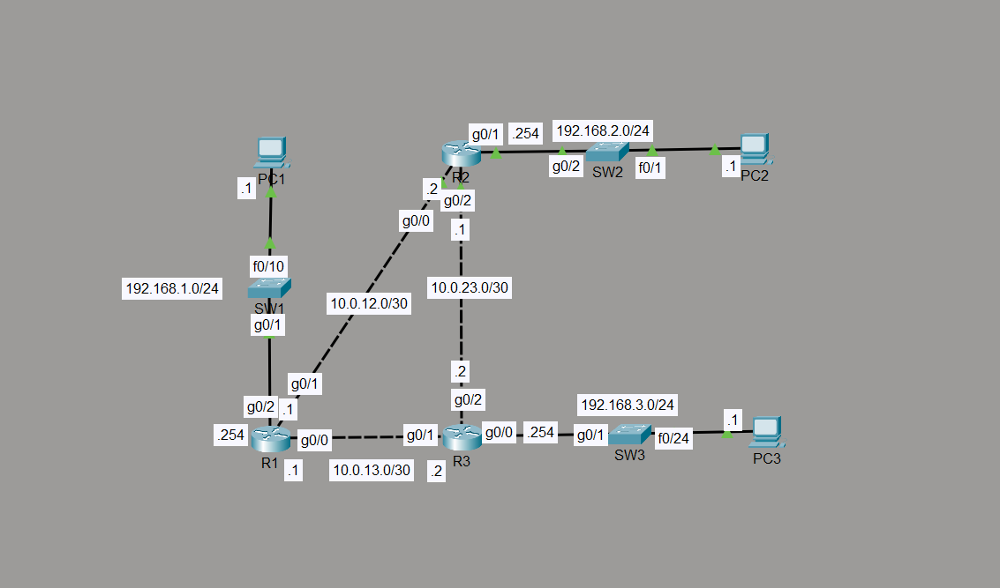

# Network Discovery using CDP & LLDP

## Objective

Configure, verify, and compare Cisco Discovery Protocol (CDP) and Link Layer Discovery Protocol (LLDP) for automatic neighbor discovery within an enterprise network.

This lab demonstrates how network devices exchange information about directly connected neighbors to simplify network documentation, troubleshooting, and infrastructure management.

---

# Topology



---

# Network Addressing

## LAN Networks

| Network | Default Gateway |
|----------|-----------------|
| 192.168.1.0/24 | 192.168.1.254 |
| 192.168.2.0/24 | 192.168.2.254 |
| 192.168.3.0/24 | 192.168.3.254 |

## WAN Networks

| Link | Network |
|------|---------|
| R1 ↔ R2 | 10.0.12.0/30 |
| R2 ↔ R3 | 10.0.23.0/30 |
| R1 ↔ R3 | 10.0.13.0/30 |

---

# Network Policies

- CDP enabled for Cisco-to-Cisco neighbor discovery.
- LLDP configured for vendor-neutral neighbor discovery.
- Discovery information exchanged only between directly connected devices.
- Infrastructure links participate in discovery.
- End devices do not participate in CDP or LLDP advertisements.

---

# How it Works

Network discovery protocols periodically advertise device information to directly connected neighbors.

Each router and switch exchanges information including:

- Hostname
- Device type
- Platform
- Local interface
- Remote interface
- Management IP address
- Software version
- Device capabilities

This information allows administrators to identify neighboring devices without manually tracing cables.

---

# Configuration

## CDP

Configured and verified on all Cisco routers and switches.

Configuration included:

```cisco
cdp run
```

Interface-level testing included enabling and disabling CDP on selected interfaces.

---

## LLDP

Configured on all routers and switches.

Configuration included:

```cisco
lldp run

interface <interface>

lldp transmit
lldp receive
```

Verified successful LLDP neighbor discovery across directly connected links.

---

# Verification

## CDP

Verification commands

```cisco
show cdp neighbors
show cdp entry *
show cdp interface
```

Verified:

- Neighbor discovery
- Local interfaces
- Remote interfaces
- Platform information
- IOS version
- Device capabilities
- Holdtime

---

## LLDP

Verification commands

```cisco
show lldp neighbors
show lldp neighbors detail
```

Verified:

- Neighbor discovery
- Local interfaces
- Remote interfaces
- System name
- System description
- Chassis ID
- Port ID
- Device capabilities

---

# CDP vs LLDP

| Feature | CDP | LLDP |
|----------|-----|------|
| Standard | Cisco Proprietary | IEEE 802.1AB |
| Vendor Support | Cisco Only | Multi-Vendor |
| Layer | Layer 2 | Layer 2 |
| Discovery | Automatic | Automatic |
| Enterprise Usage | Cisco Networks | Mixed Vendor Networks |

---

# Key Concepts Learned

- Cisco Discovery Protocol (CDP)
- Link Layer Discovery Protocol (LLDP)
- Layer 2 Neighbor Discovery
- Infrastructure Discovery
- Device Advertisement
- Neighbor Tables
- Holdtime
- Interface Discovery
- Enterprise Network Documentation

---

# Engineering Observations

Network discovery protocols significantly reduce troubleshooting time by automatically identifying directly connected devices and the interfaces connecting them.

CDP is commonly deployed within Cisco-only environments, while LLDP provides the same functionality across multi-vendor networks. Both protocols are valuable during network deployment, infrastructure documentation, device replacement, and fault isolation.

Because discovery protocols advertise information such as hostnames, software versions, and platform details, they are often disabled on user-facing interfaces while remaining enabled on infrastructure links.

---

# Troubleshooting Experience

### Issue

Understanding the relationship between local interfaces and neighboring interfaces during CDP and LLDP verification.

### Cause

Neighbor tables display both the local interface and the remote interface, which can initially be confusing when interpreting topology relationships.

### Resolution

Verified neighbor information using:

- show cdp neighbors
- show cdp entry *
- show cdp interface
- show lldp neighbors
- show lldp neighbors detail

Cross-referenced interface information with the physical topology to validate all discovered neighbors.

### Verification

Successfully verified:

- Router-to-router discovery
- Router-to-switch discovery
- Interface mapping
- Platform identification
- Device capabilities
- Neighbor relationships

---

# Skills Learned

- Configure Cisco Discovery Protocol
- Configure Link Layer Discovery Protocol
- Verify neighbor relationships
- Interpret discovery tables
- Identify local and remote interfaces
- Compare CDP and LLDP
- Document network topology
- Troubleshoot physical connectivity using discovery protocols

---

# Devices Used

- Cisco 2911 Routers
- Cisco Catalyst 2960 Switches
- PCs
- Cisco Packet Tracer

---

# Files Included

- topology.png
- R1-config.txt
- R2-config.txt
- R3-config.txt
- SW1-config.txt
- SW2-config.txt
- SW3-config.txt
- PC1-config.txt
- PC2-config.txt
- PC3-config.txt
- CDP & LLDP.pkt
- README.md