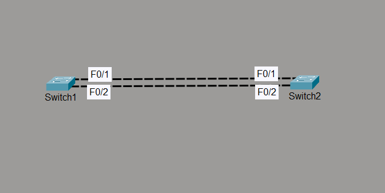

# EtherChannel - Static (Mode On)

## Objective

The objective of this lab is to configure a static Layer 2 EtherChannel between two Cisco switches, verify successful bundling of multiple physical interfaces into a single logical Port-Channel, and observe how STP treats the EtherChannel as one logical link instead of multiple individual links.

---

## Topology



---

## Devices Used

- 2 × Cisco 2960 Switches
- Cisco Packet Tracer

---

## Configuration

### SW1

```cisco
enable
configure terminal

interface range fa0/1-2
 channel-group 1 mode on

interface port-channel 1
 switchport mode trunk

end
```

---

### SW2

```cisco
enable
configure terminal

interface range fa0/1-2
 channel-group 1 mode on

interface port-channel 1
 switchport mode trunk

end
```

---

## Verification Commands

```cisco
show etherchannel summary

show spanning-tree

show interfaces port-channel 1

show running-config interface port-channel 1
```

---

## Verification

### Verify EtherChannel Formation

Confirmed that Port-Channel 1 was successfully created and operational.

```
Po1(SU)
```

- **S** = Layer 2 EtherChannel
- **U** = Port-Channel is operational and in use

---

### Verify Member Interfaces

Confirmed that both FastEthernet interfaces were successfully bundled into the Port-Channel.

```
Fa0/1(P)
Fa0/2(P)
```

- **P** = Interface is successfully bundled into the EtherChannel.

---

### Verify STP Operation

Verified that STP no longer viewed FastEthernet0/1 and FastEthernet0/2 as separate links.

Instead, STP recognized only the logical Port-Channel interface.

Example:

```
Interface        Role Sts Cost
--------------------------------
Po1              Desg FWD
```

This confirms that STP treats the EtherChannel as a single logical connection.

---

## EtherChannel Behavior

### Without EtherChannel

```
SW1
 │
 ├──────── Fa0/1 (Forwarding)
 │
 └──────── Fa0/2 (Blocking by STP)
 │
SW2
```

Result:

- One forwarding path
- One blocked path
- Wasted bandwidth

---

### With EtherChannel

```
        Port-Channel 1

SW1 ====================== SW2
      /               \
   Fa0/1             Fa0/2
```

Result:

- STP sees one logical link
- Both physical links remain active
- Increased bandwidth
- Redundant connectivity

---

## Engineering Observations

- EtherChannel combines multiple physical interfaces into a single logical interface called a **Port-Channel**.
- STP operates on the Port-Channel rather than the individual member interfaces.
- Static EtherChannel (`mode on`) performs no negotiation; both ends must be manually configured.
- Member interfaces must have matching Layer 2 characteristics, including speed, duplex, switchport mode, native VLAN, and allowed VLANs.
- Channel-group numbers are locally significant and do not need to match on both switches.
- If one member link fails, the Port-Channel remains operational using the remaining active links.

---

## Advantages of EtherChannel

- Increases available bandwidth.
- Eliminates STP blocking of redundant links.
- Provides link redundancy.
- Offers automatic failover if a member link fails.
- Simplifies network management by presenting multiple physical links as one logical interface.

---

## Practical Use Case

Enterprise networks commonly use EtherChannel between switches to increase throughput while maintaining redundancy.

Instead of STP blocking redundant links, EtherChannel allows multiple physical links to actively forward traffic, improving bandwidth utilization and providing seamless failover during link failures.

---

## Outcome

Successfully configured and verified a static Layer 2 EtherChannel between two Cisco switches. Confirmed successful interface bundling, Port-Channel creation, STP recognition of the logical interface, and simultaneous utilization of both physical links for improved bandwidth and redundancy.