# Evercrest Technologies – Enterprise Redundant Campus Network


---

## Project Overview

This project simulates the enterprise campus network of **Evercrest Technologies**, a medium-sized organization requiring a resilient, secure, and highly available network infrastructure.

The network was designed using Cisco Packet Tracer and follows a hierarchical campus architecture with redundant distribution switches to eliminate single points of failure. Enterprise technologies such as VLANs, Rapid PVST+, EtherChannel, OSPF, HSRP, DHCP, DNS, NAT, ACLs, Port Security, DHCP Snooping, Dynamic ARP Inspection (DAI), NTP, and Syslog were integrated to create a scalable and fault-tolerant environment.

The project is implemented in six structured phases, progressing from the Layer 2 foundation to enterprise services, security, network management, and finally redundancy validation through failover testing.

---

## Project Objectives

- Build a scalable enterprise campus network using Cisco Packet Tracer.
- Implement redundant Layer 2 and Layer 3 infrastructure.
- Provide secure communication between network segments.
- Deploy centralized enterprise network services.
- Secure the network using multiple Layer 2 and Layer 3 security technologies.
- Validate network resilience through real-world failover scenarios.

---

## Enterprise Network Topology

<p align="center">
  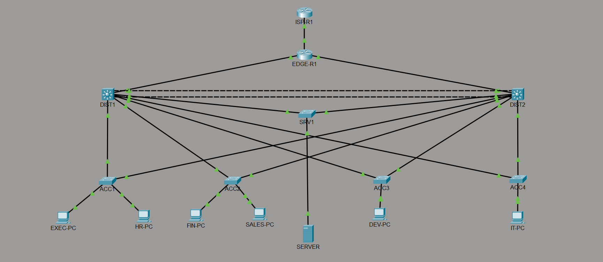
</p>

---

## Technologies Implemented

| Category | Technologies |
|----------|--------------|
| **Layer 2** | VLANs, IEEE 802.1Q Trunking, EtherChannel (LACP), Rapid PVST+ |
| **Layer 3** | SVIs, Inter-VLAN Routing, OSPF, HSRP |
| **Enterprise Services** | DHCP, DNS, NAT/PAT |
| **Security** | SSH, Standard ACL, Extended ACL, Port Security, DHCP Snooping, Dynamic ARP Inspection |
| **Network Management** | NTP, Syslog |
| **High Availability** | HSRP Failover, EtherChannel Link Recovery, OSPF Link Failure Validation |

---

## Repository Structure

```text
Evercrest-Technologies-Enterprise-Network/
│
├── configs/
├── screenshots/
│   ├── Topology/
│   ├── Phase1/
│   ├── Phase2/
│   ├── Phase3/
│   ├── Phase4/
│   ├── Phase5/
│   └── Phase6/
│
├── Evercrest-Technologies.pkt
└── README.md
```

---

# Implementation

The enterprise network was developed through six implementation phases. Each phase introduces a new set of technologies, followed by verification screenshots that demonstrate successful deployment and operation.

---
## Phase 1 – Layer 2 Infrastructure

### Objective

Build the enterprise Layer 2 infrastructure by implementing VLAN segmentation, secure trunk links, Rapid PVST+, and EtherChannel to provide a resilient and scalable switching environment.

### Implementation

The enterprise campus network was built upon a robust Layer 2 foundation. Department-specific VLANs were created to logically separate user traffic, while Management and Native VLANs were introduced to improve administration and trunk security. IEEE 802.1Q trunk links were configured to transport VLAN traffic between switches, Rapid PVST+ was deployed to prevent Layer 2 loops with optimized root bridge placement, and EtherChannel (LACP) was implemented to provide increased bandwidth and link redundancy between the distribution switches.

### Verification

#### VLAN Configuration

Departmental VLANs were successfully created and assigned across the enterprise switches.

<p align="center">
    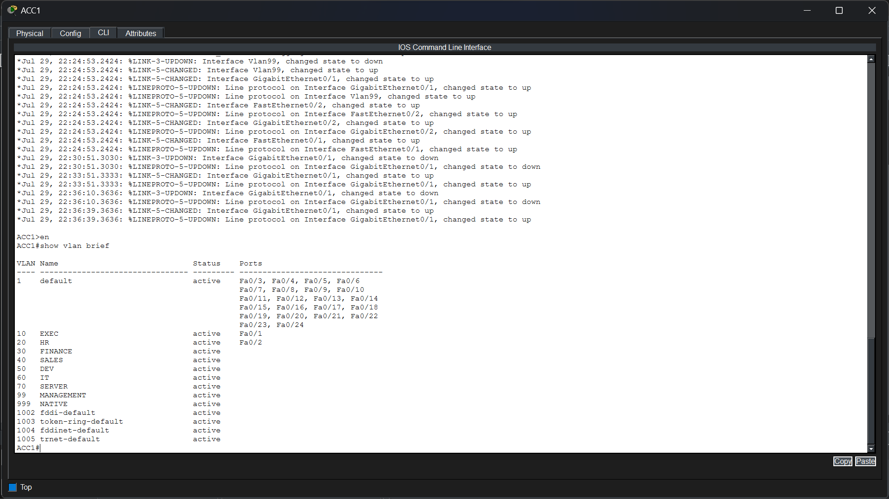
</p>

---

#### IEEE 802.1Q Trunk Links

Trunk links were configured to transport multiple VLANs between switching devices while maintaining VLAN isolation.

<p align="center">
    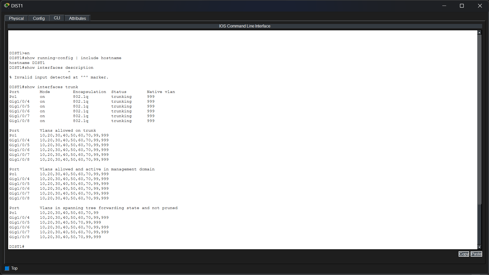
</p>

---

#### EtherChannel

EtherChannel (LACP) was configured to aggregate multiple physical links into a single logical connection, improving bandwidth and providing link redundancy.

<p align="center">
    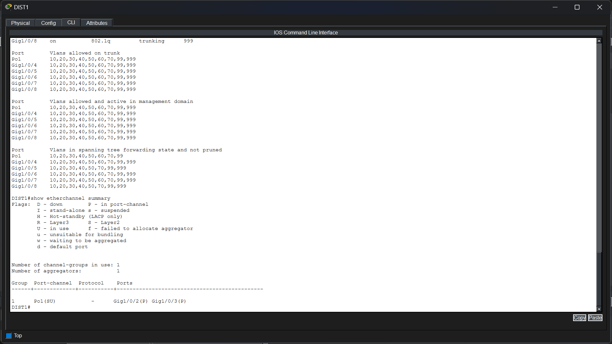
</p>

---

#### Rapid PVST+

Rapid PVST+ was configured with optimized root bridge placement to ensure a loop-free topology and fast convergence.

<p align="center">
    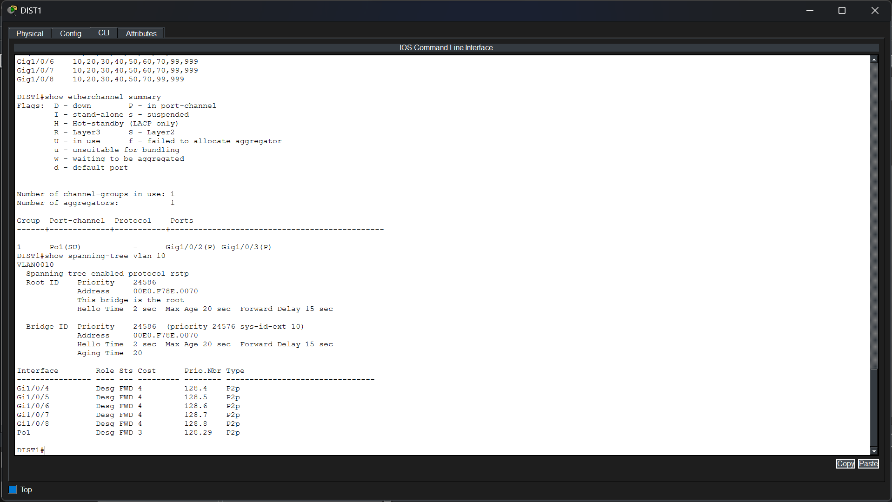
</p>

<p align="center">
    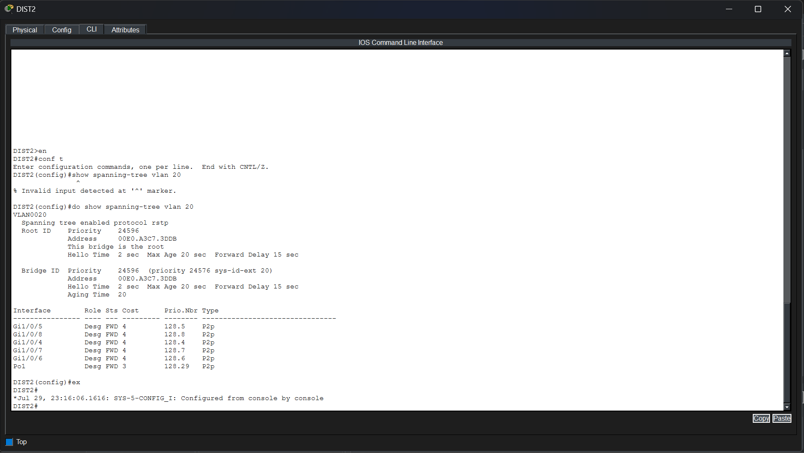
</p>

### Result

A resilient Layer 2 infrastructure was successfully established, providing VLAN segmentation, redundant switching paths, and a scalable foundation for the enterprise network.

---
## Phase 2 – Layer 3 Infrastructure

### Objective

Deploy the enterprise Layer 3 infrastructure by implementing inter-VLAN routing, gateway redundancy, and dynamic routing to enable reliable communication throughout the campus network.

### Implementation

Following the completion of the Layer 2 infrastructure, Switch Virtual Interfaces (SVIs) were configured to provide inter-VLAN routing across all departmental networks. HSRP was then implemented to eliminate the default gateway as a single point of failure by providing redundant virtual gateways. Finally, OSPF was deployed to dynamically exchange routing information between the distribution layer and edge router, ensuring efficient route propagation and rapid convergence throughout the enterprise.

### Verification

#### Switch Virtual Interfaces (SVIs)

SVIs were configured for each VLAN to provide Layer 3 connectivity between network segments.

<p align="center">
    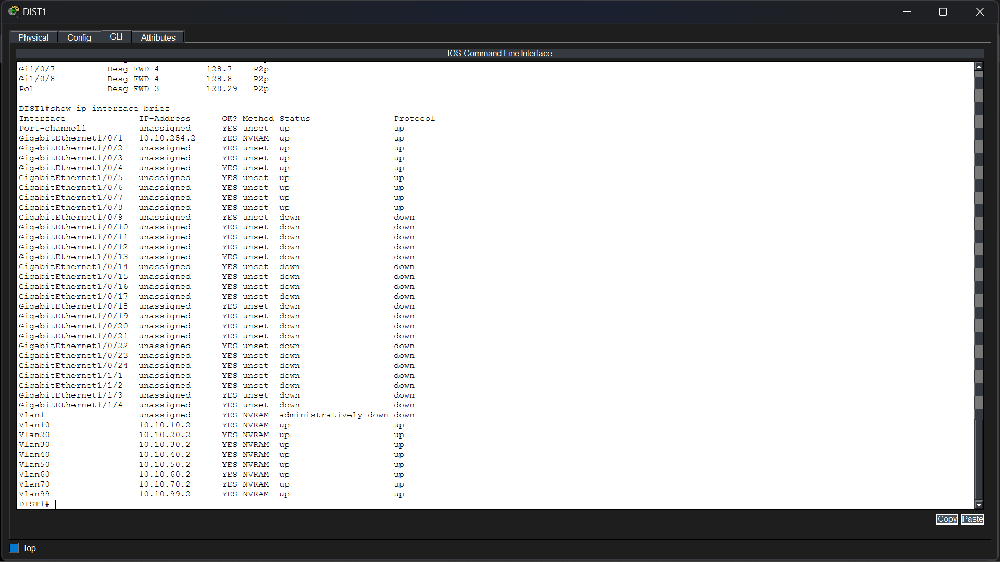
</p>

---

#### Hot Standby Router Protocol (HSRP)

HSRP was configured to provide redundant default gateways and maintain uninterrupted connectivity during gateway failures.

<p align="center">
    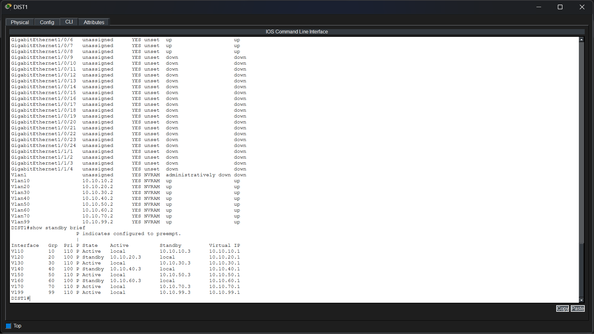
</p>

---

#### Open Shortest Path First (OSPF)

OSPF dynamically exchanged routing information between routing devices, ensuring efficient route learning throughout the enterprise network.

<p align="center">
    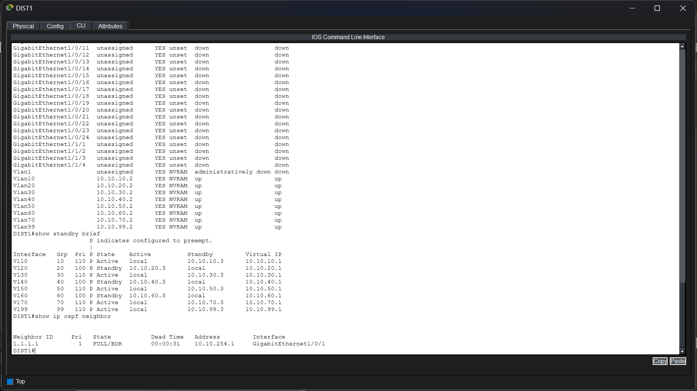
</p>

<p align="center">
    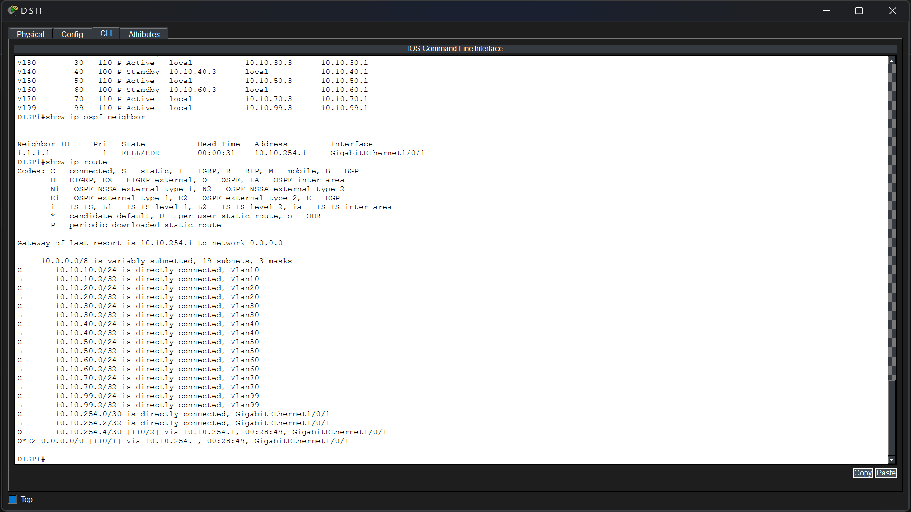
</p>

---

#### End-to-End Connectivity

Successful Internet connectivity confirmed the correct operation of the Layer 3 routing infrastructure.

<p align="center">
    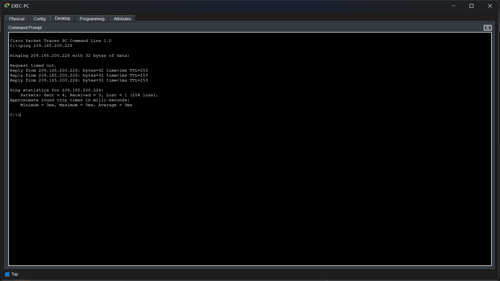
</p>

### Result

A highly available Layer 3 infrastructure was successfully deployed, providing reliable inter-VLAN communication, gateway redundancy, and dynamic routing throughout the enterprise network.

---
## Phase 3 – Enterprise Network Services

### Objective

Deploy centralized enterprise services to automate IP address management, provide hostname resolution, and enable secure Internet connectivity for internal users.

### Implementation

Enterprise network services were centralized to simplify administration and improve scalability. DHCP was configured to automatically assign IP addressing information to client devices, DNS was deployed to provide hostname resolution for internal resources, and NAT/PAT was implemented on the edge router to allow internal devices using private IP addresses to communicate with external networks through a public address.

### Verification

#### Dynamic Host Configuration Protocol (DHCP)

DHCP successfully assigned IP addresses and network parameters to client devices across multiple VLANs.

<p align="center">
    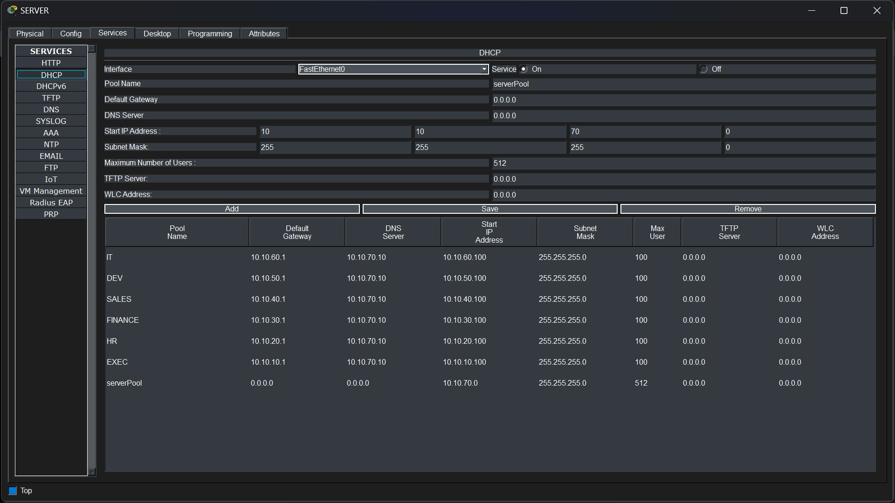
</p>

---

#### Domain Name System (DNS)

DNS successfully resolved hostnames, allowing users to access network resources using domain names instead of IP addresses.

<p align="center">
    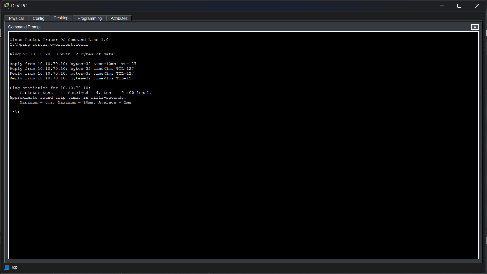
</p>

---

#### Network Address Translation (NAT/PAT)

NAT/PAT translated private IP addresses into a public address, enabling Internet connectivity while conserving public IPv4 addresses.

<p align="center">
    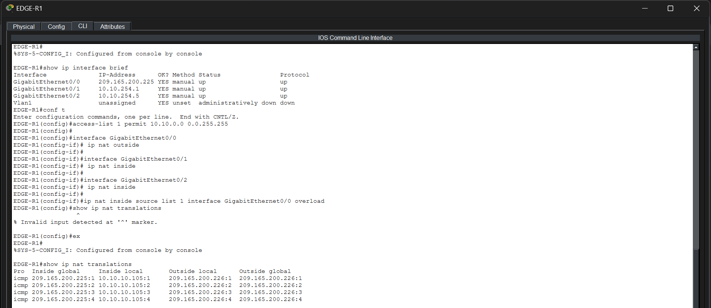
</p>

<p align="center">
    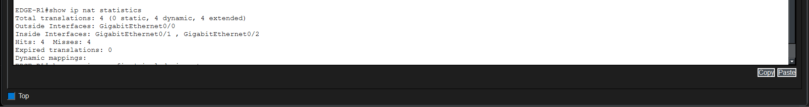
</p>

### Result

Centralized enterprise services were successfully deployed, providing automated IP address management, reliable hostname resolution, and secure Internet connectivity for internal network users.

---
## Phase 4 – Enterprise Network Security

### Objective

Secure the enterprise network by implementing encrypted remote management, access control policies, and Layer 2 security mechanisms to protect network devices and resources from unauthorized access and common network attacks.

### Implementation

The security phase focused on protecting both the network infrastructure and enterprise resources through multiple layers of defense. Secure remote administration was established using SSH, while Standard and Extended Access Control Lists (ACLs) were deployed to restrict management access and enforce departmental communication policies. At the access layer, Port Security prevented unauthorized devices from connecting to the network, while DHCP Snooping and Dynamic ARP Inspection (DAI) protected against rogue DHCP servers and ARP spoofing attacks. Together, these technologies significantly strengthened the overall security posture of the enterprise network.

### Verification

#### SSH Configuration & Verification

SSH was configured to provide encrypted remote access to network devices. VTY lines were secured to allow only authenticated management sessions, replacing insecure remote administration methods.

<p align="center">
    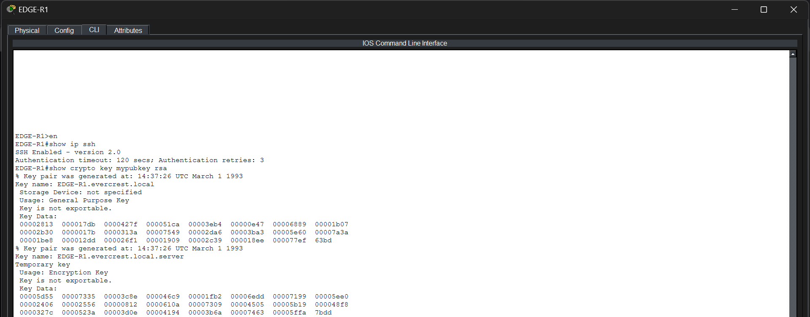
</p>

<p align="center">
    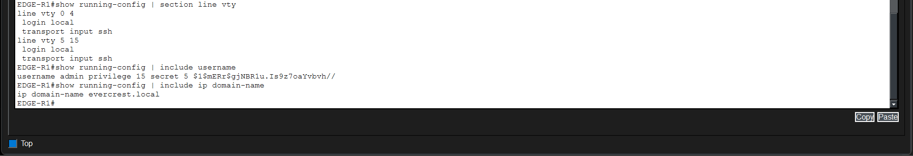
</p>

<p align="center">
    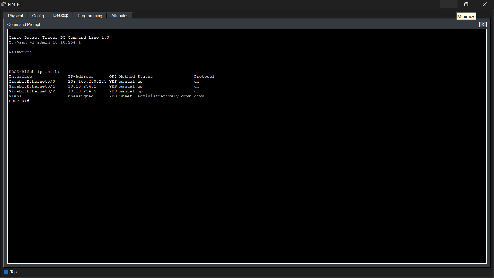
</p>

---

#### Standard Access Control Lists (ACLs)

Standard ACLs were implemented to restrict management access to network devices by permitting only authorized hosts. Verification confirms that VTY access is successfully controlled through the configured Standard ACL.

<p align="center">
    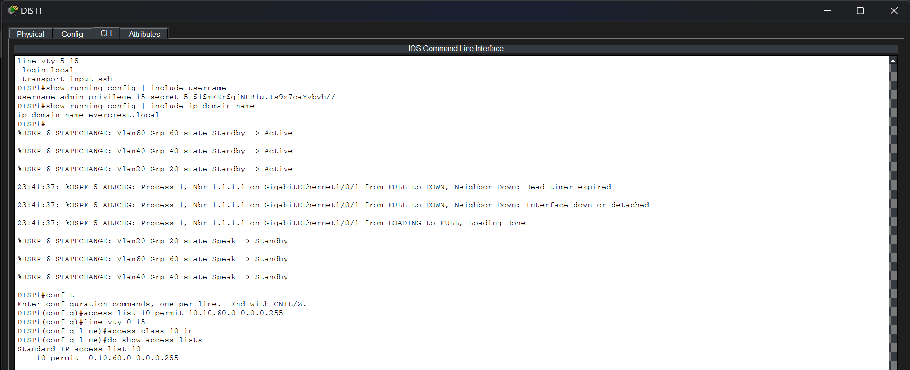
</p>

<p align="center">
    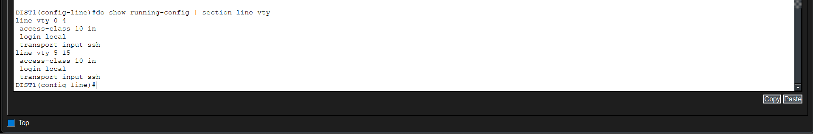
</p>

---

#### Extended Access Control Lists (ACLs)

Extended ACLs were configured to regulate communication between departments and enterprise resources. Verification confirms that HR, Finance, and Sales users are denied access to protected server resources, while Executive users retain the required permissions.

<p align="center">
    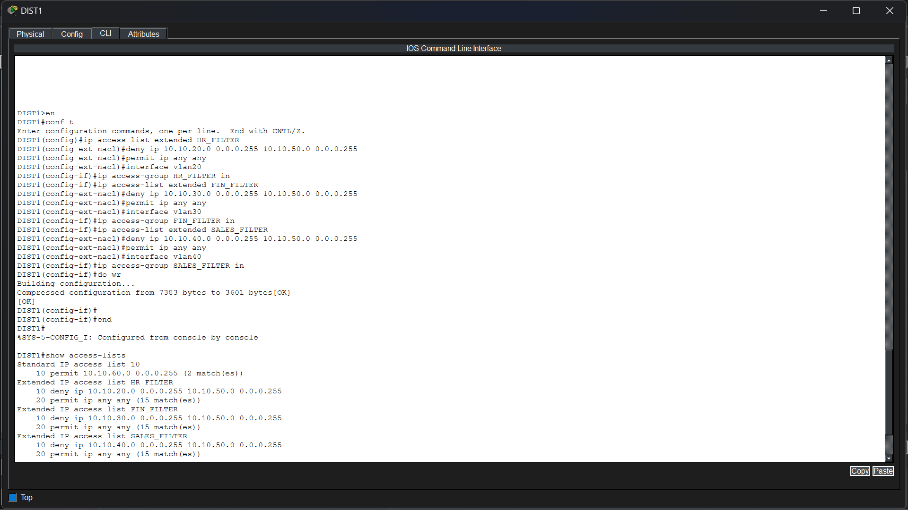
</p>

<p align="center">
    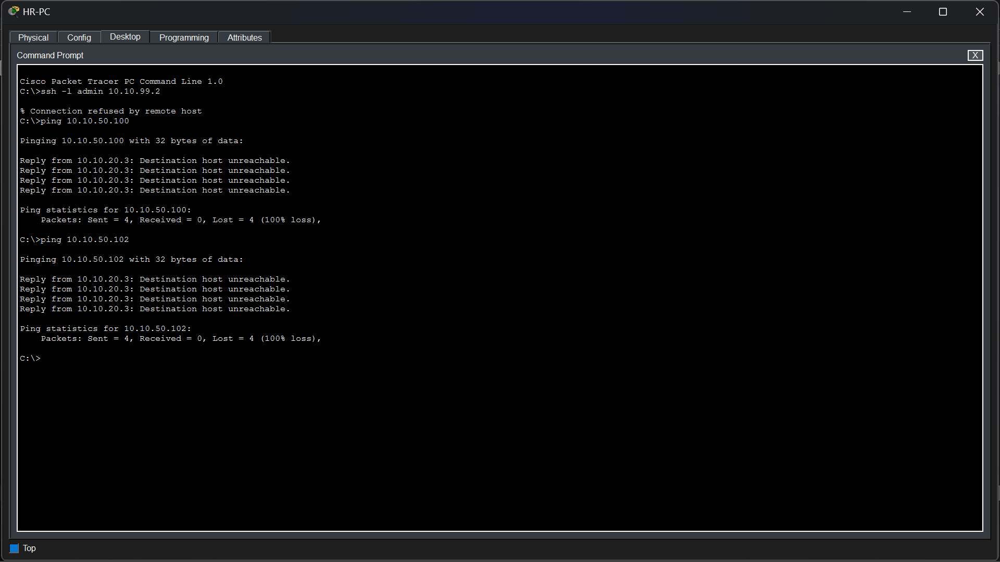
</p>

<p align="center">
    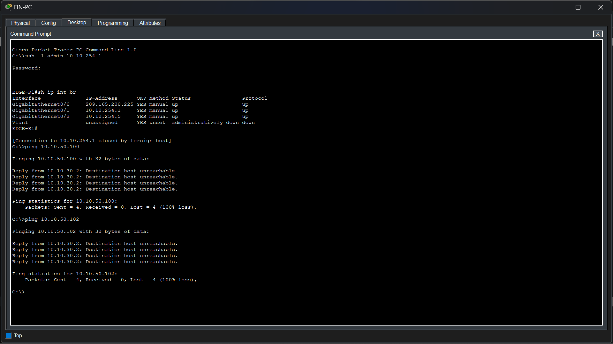
</p>

<p align="center">
    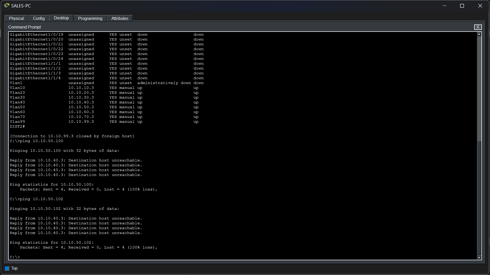
</p>

<p align="center">
    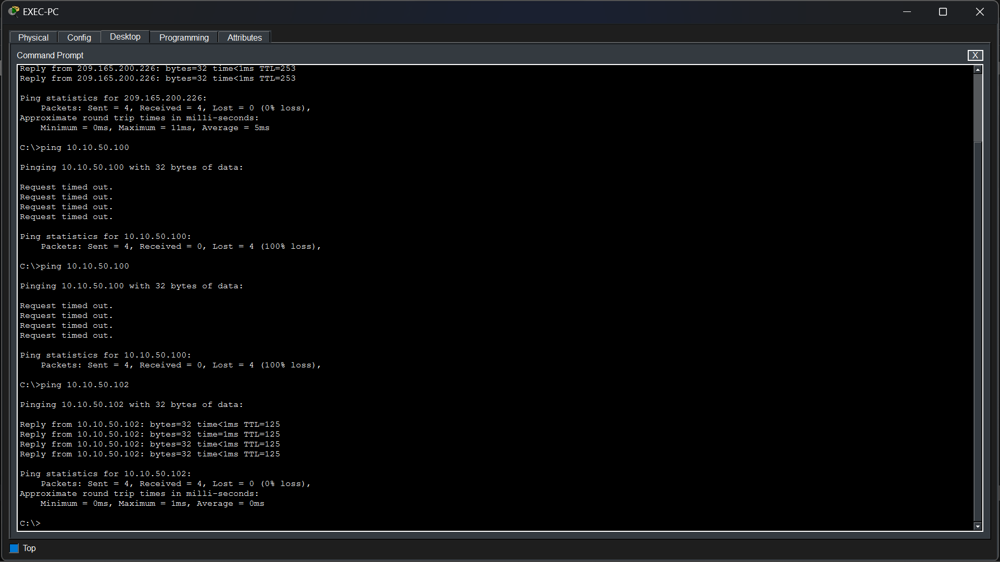
</p>

---

#### Port Security

Port Security was enabled on access switch interfaces to restrict unauthorized devices by limiting the number of permitted MAC addresses on each port.

<p align="center">
    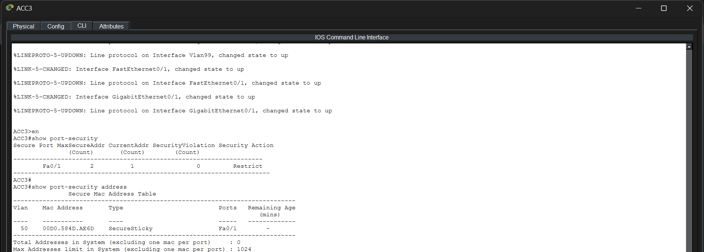
</p>

<p align="center">
    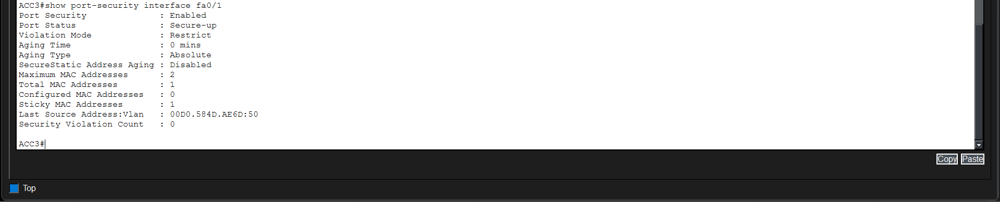
</p>

---

#### DHCP Snooping

DHCP Snooping was configured to protect the network from rogue DHCP servers by building a trusted DHCP binding database and allowing DHCP responses only from trusted interfaces.

<p align="center">
    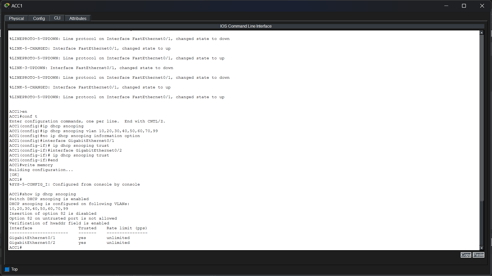
</p>

<p align="center">
    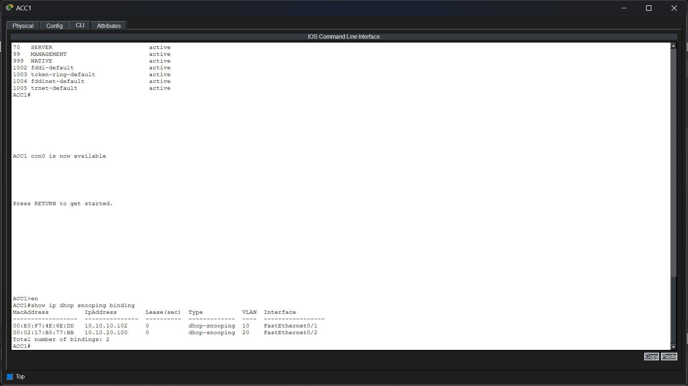
</p>

---

#### Dynamic ARP Inspection (DAI)

Dynamic ARP Inspection (DAI) was implemented to validate ARP packets against the DHCP Snooping binding database, preventing ARP spoofing and protecting end devices from man-in-the-middle attacks.

<p align="center">
    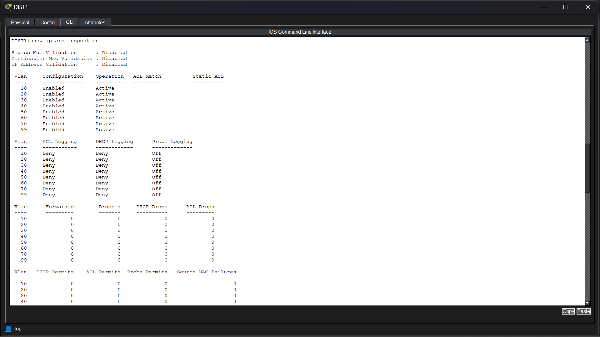
</p>

<p align="center">
    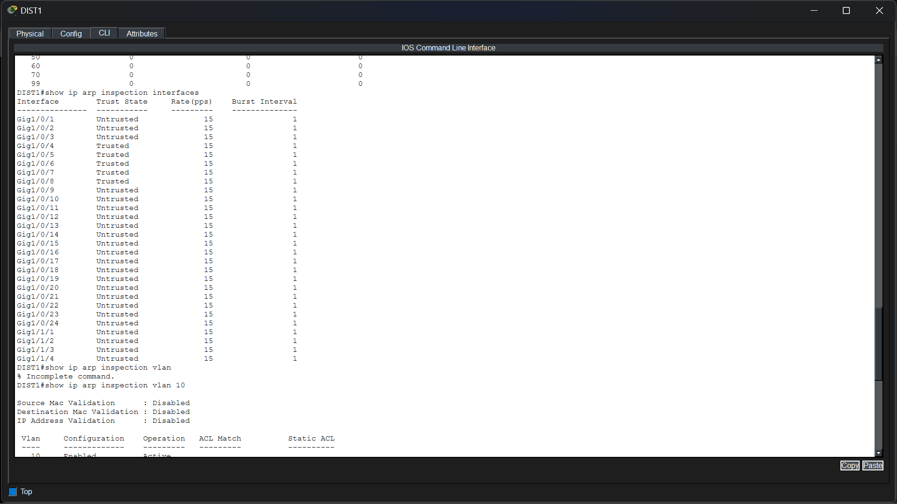
</p>

### Result

A comprehensive, multi-layered security framework was successfully deployed across the enterprise network. Secure remote management, access control policies, endpoint protection, DHCP validation, and ARP inspection collectively enhanced the confidentiality, integrity, and availability of enterprise resources.

---
## Phase 5 – Network Management & Monitoring

### Objective

Implement centralized network management services by configuring Network Time Protocol (NTP) for time synchronization and Syslog for centralized event logging to improve network administration and troubleshooting.

### Implementation

To ensure consistent timestamps across all network devices, Network Time Protocol (NTP) was configured using a centralized NTP server. This provided synchronized system clocks throughout the enterprise network, improving log accuracy and simplifying troubleshooting.

Centralized logging was then implemented using Syslog. Network devices were configured to forward system events and status messages to a dedicated Syslog server, enabling administrators to monitor network activity, detect faults, and maintain a centralized record of important events.

### Verification

#### Network Time Protocol (NTP)

NTP was successfully configured to synchronize the clocks of all network devices with the centralized NTP server, ensuring consistent timestamps across the enterprise.

<p align="center">
    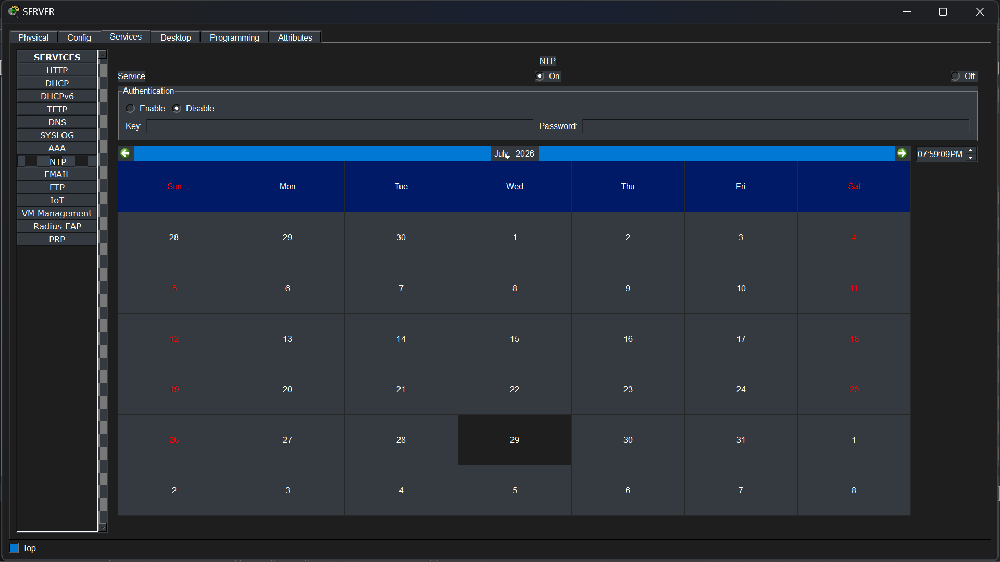
</p>

<p align="center">
    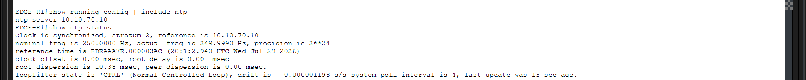
</p>

<p align="center">
    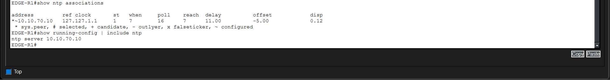
</p>

---

#### Syslog

Syslog was configured to collect and centralize log messages generated by network devices, providing administrators with a unified view of network events for monitoring and troubleshooting.

<p align="center">
    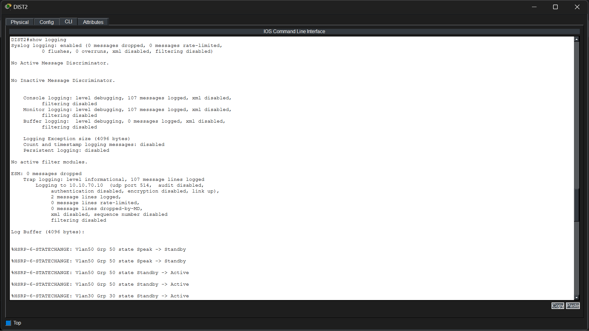
</p>

<p align="center">
    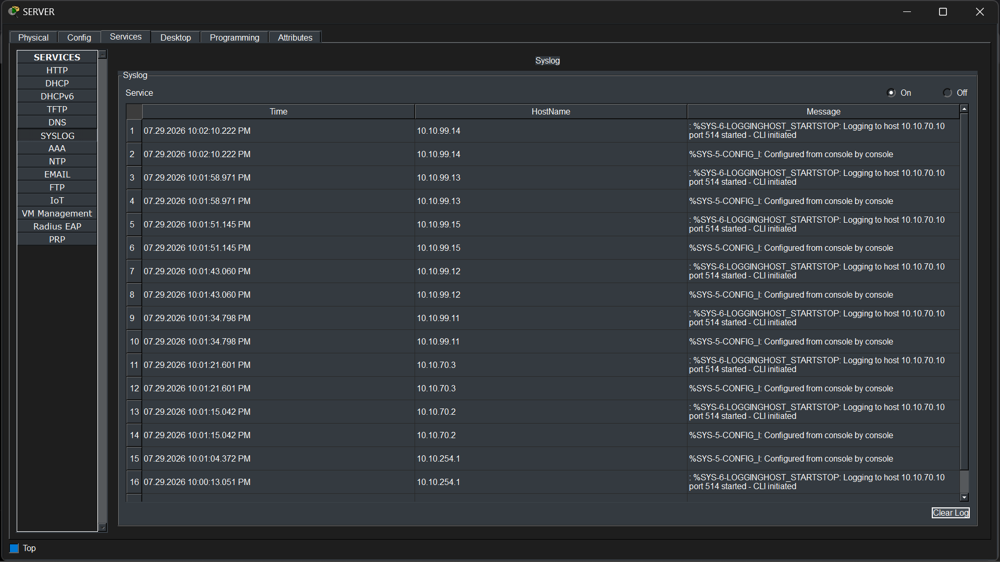
</p>

### Result

Centralized network management services were successfully deployed. NTP provided accurate time synchronization across all network devices, while Syslog enabled centralized event logging, improving network monitoring, troubleshooting, and operational visibility.

---
## Phase 6 – High Availability & Failover Validation

### Objective

Validate the resilience of the enterprise network by simulating real-world failure scenarios and verifying that gateway redundancy, link redundancy, and dynamic routing maintain uninterrupted network connectivity.

### Implementation

The final phase focused on validating the enterprise network's high availability capabilities through controlled failover testing. HSRP was tested by simulating an active gateway failure and verifying automatic failover to the standby gateway. EtherChannel redundancy was validated by disconnecting a member link while ensuring uninterrupted traffic flow across the remaining links. Finally, OSPF convergence was tested by simulating a routing link failure and confirming that alternate routes were dynamically selected to maintain network connectivity.

### Verification

#### HSRP Failover

HSRP failover was successfully validated by simulating the failure of the active gateway. The standby router assumed the Active role automatically, allowing client devices to maintain uninterrupted network connectivity.

<p align="center">
    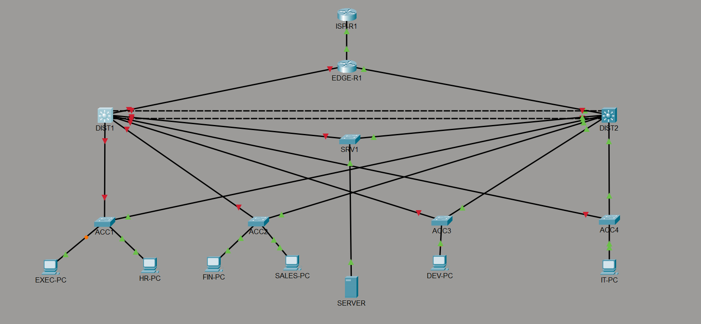
</p>

<p align="center">
    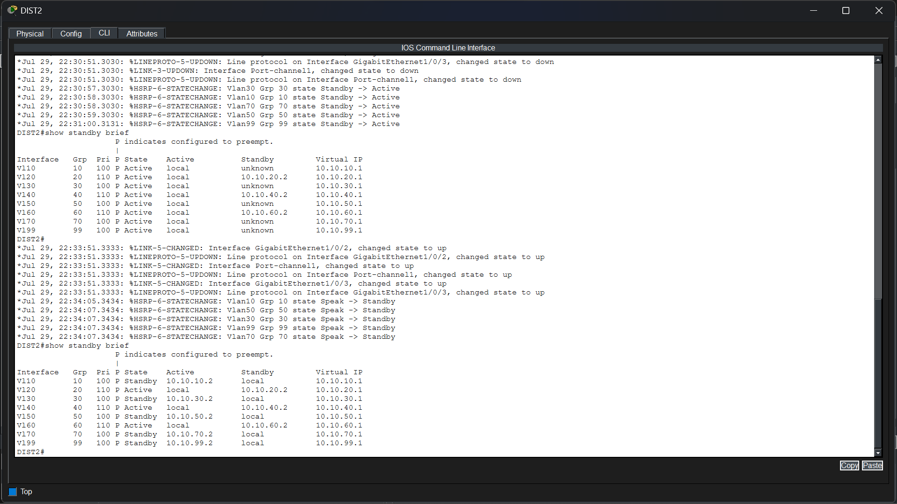
</p>

<p align="center">
    
</p>

---

#### EtherChannel Link Failure

EtherChannel redundancy was verified by disconnecting one of the bundled physical links. Traffic continued to flow through the remaining active links without disrupting network connectivity.

<p align="center">
    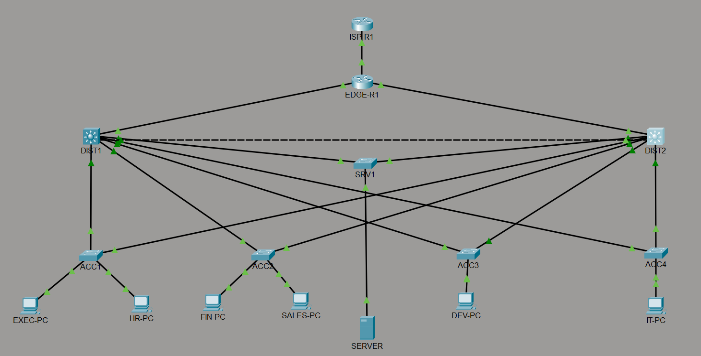
</p>

<p align="center">
    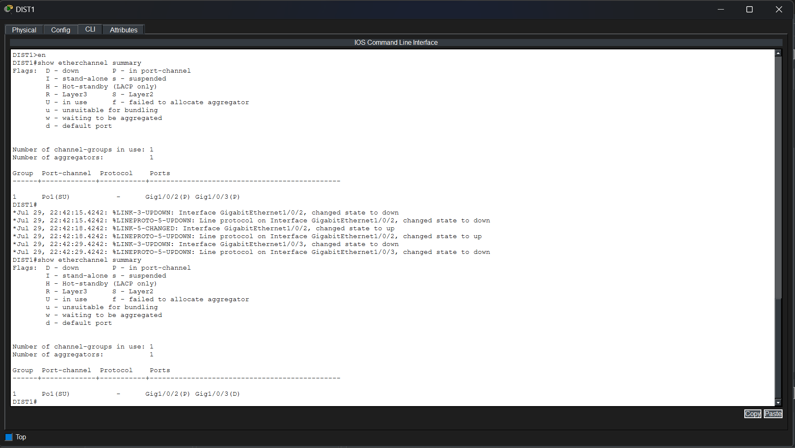
</p>

<p align="center">
    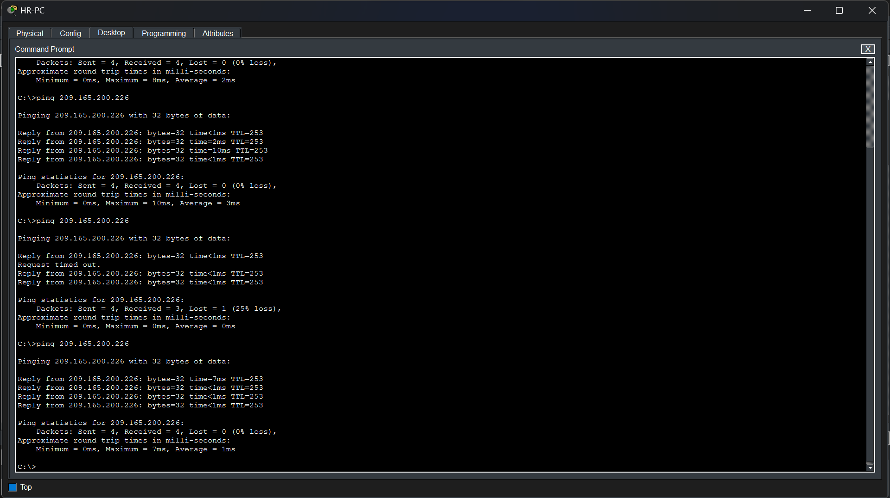
</p>

---

#### OSPF Link Failure

OSPF convergence was validated by simulating a routing link failure. Neighbor relationships were automatically re-established, routing tables were updated dynamically, and network connectivity was successfully maintained through alternate paths.

<p align="center">
    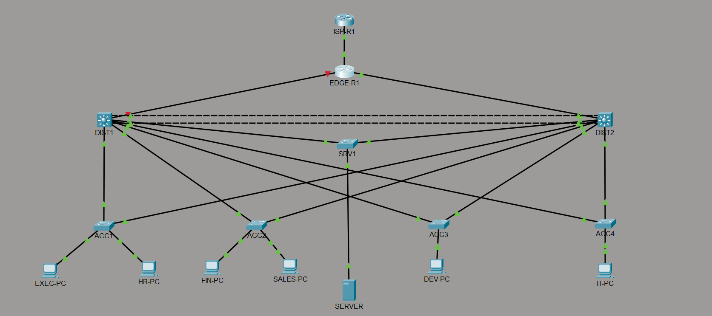
</p>

<p align="center">
    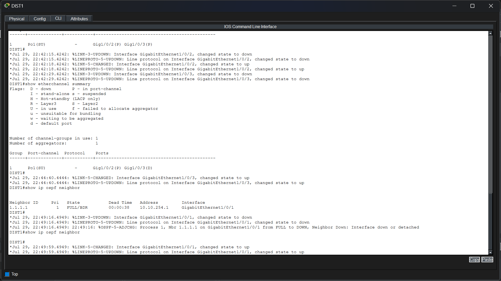
</p>

<p align="center">
    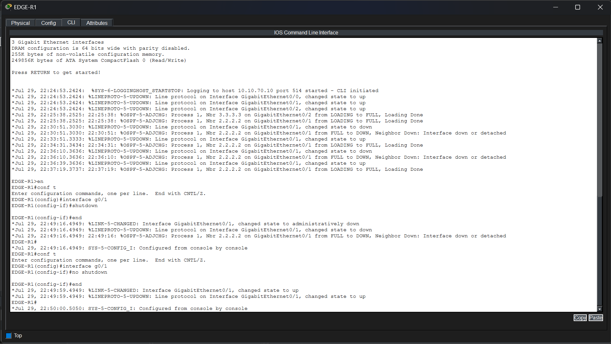
</p>

### Result

The enterprise network successfully demonstrated high availability under simulated failure conditions. HSRP provided seamless gateway redundancy, EtherChannel maintained connectivity during physical link failures, and OSPF dynamically reconverged following routing failures. These validation tests confirmed that the network can continue operating reliably even when critical infrastructure components become unavailable.

---
## Conclusion

The **Evercrest Technologies Enterprise Network** successfully demonstrates the design, implementation, and validation of a resilient enterprise campus network using Cisco Packet Tracer. Built through a structured six-phase approach, the project progresses from establishing a robust Layer 2 foundation to implementing Layer 3 routing, enterprise network services, comprehensive security, centralized management, and high availability validation.

Throughout the project, enterprise technologies including VLANs, Rapid PVST+, EtherChannel, HSRP, OSPF, DHCP, DNS, NAT/PAT, SSH, Access Control Lists (ACLs), Port Security, DHCP Snooping, Dynamic ARP Inspection (DAI), NTP, and Syslog were integrated to create a scalable, secure, and fault-tolerant network infrastructure.

The final validation phase confirmed the network's ability to maintain uninterrupted connectivity during simulated gateway, link, and routing failures, demonstrating the effectiveness of the implemented redundancy mechanisms.

This project serves as a comprehensive CCNA-level enterprise networking implementation, showcasing practical skills in network design, deployment, security, management, and high availability while following industry best practices.

---
## Repository Structure

```text
Evercrest-Technologies-Enterprise-Network/
│
├── configs/
│   ├── ACC-SW1.txt
│   ├── ACC-SW2.txt
│   ├── DIST-SW1.txt
│   ├── DIST-SW2.txt
│   ├── EDGE-R1.txt
│   ├── ISP-R1.txt
│   ├── SRV-SW1.txt
│   └── Server_Config.txt
│
├── screenshots/
│   ├── Topology/
│   ├── Phase1/
│   ├── Phase2/
│   ├── Phase3/
│   ├── Phase4/
│   ├── Phase5/
│   └── Phase6/
│
├── Evercrest-Technologies.pkt
├── README.md
└── LICENSE
```
---
## License

This project is licensed under the MIT License. See the [LICENSE](LICENSE) file for more information.

---
## Author

**Zidan K**

- GitHub: https://github.com/z10an/CCNA-Labs
- LinkedIn: https://www.linkedin.com/in/zi0an/