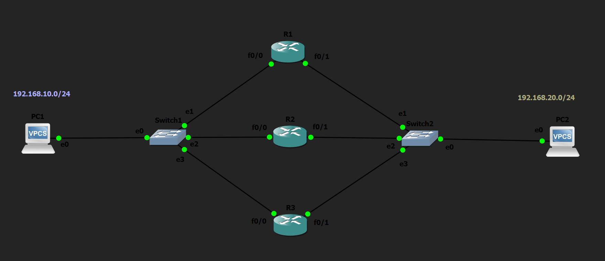

# VRRP (Virtual Router Redundancy Protocol) Lab

## Objective

Configure Virtual Router Redundancy Protocol (VRRP) to provide default gateway redundancy across two LANs. Verify Master/Backup election, Virtual IP operation, failover, and automatic recovery using preemption.

---

## Topology

---

## Network Addressing

### Left LAN

| Device | IP Address |
|---------|------------|
| PC1 | 192.168.10.10/24 |
| R1 Fa0/0 | 192.168.10.1 |
| R2 Fa0/0 | 192.168.10.2 |
| R3 Fa0/0 | 192.168.10.3 |
| **Virtual Gateway** | **192.168.10.5** |

### Right LAN

| Device | IP Address |
|---------|------------|
| PC2 | 192.168.20.10/24 |
| R1 Fa0/1 | 192.168.20.1 |
| R2 Fa0/1 | 192.168.20.2 |
| R3 Fa0/1 | 192.168.20.3 |
| **Virtual Gateway** | **192.168.20.5** |

---

## Network Policies

The following VRRP configuration was implemented:

- Three routers participate in each VRRP group.
- The router with the highest priority becomes the Master router.
- Remaining routers operate as Backup routers.
- Hosts use the Virtual IP as their default gateway.
- Automatic failover occurs if the Master router becomes unavailable.
- Preemption allows the highest-priority router to reclaim the Master role after recovery.

---

## How it Works

VRRP is a First Hop Redundancy Protocol (FHRP) that provides gateway redundancy by creating a Virtual IP address shared among multiple routers.

Hosts configure the Virtual IP as their default gateway rather than the physical IP address of any router.

Routers participating in the same VRRP group exchange advertisement messages to determine which router should become the Master. The Master router owns the Virtual IP and Virtual MAC and forwards traffic on behalf of all hosts.

If the Master router fails, one of the Backup routers automatically assumes ownership of the Virtual IP and Virtual MAC, allowing hosts to continue communicating without changing their default gateway or ARP cache.

When the original higher-priority router returns, preemption allows it to automatically resume the Master role.

---

## Verification

### VRRP Status

Verified VRRP operation using:

- `show vrrp`
- `show vrrp brief`

### Interface Verification

Verified interface status using:

- `show ip interface brief`

### Configuration Verification

Verified VRRP configuration using:

- `show running-config`

### Connectivity Testing

Verified successful failover using:

- `ping`

---

## Key Concepts Learned

- Virtual Router Redundancy Protocol (VRRP)
- First Hop Redundancy Protocol (FHRP)
- Master Router
- Backup Router
- Virtual IP Address
- Virtual MAC Address
- VRRP Priority
- VRRP Preemption
- Advertisement Messages
- Gateway Redundancy

---

## Engineering Observations

This lab demonstrated several important VRRP characteristics:

- Hosts always communicate through the Virtual IP rather than a physical router.
- The Virtual MAC remains unchanged during failover.
- Router priority determines which router becomes Master.
- Multiple Backup routers can participate in the same VRRP group.
- VRRP is an open standard and supports interoperability between different networking vendors.
- Gateway redundancy minimizes service interruption during router failures.

---

## Troubleshooting Experience

During implementation and testing, the following tasks were performed:

- Verified all routers were configured within the same VRRP group.
- Confirmed matching Virtual IP addresses across participating routers.
- Verified Master and Backup elections using VRRP show commands.
- Tested failover by shutting down the Master router interface.
- Verified automatic Master recovery using preemption.
- Confirmed uninterrupted host connectivity during failover.

---

## Skills Learned

- VRRP Configuration
- Gateway Redundancy
- First Hop Redundancy Protocols
- Master/Backup Election
- Failover Testing
- High Availability Configuration
- Network Resiliency
- Enterprise Gateway Design

---

## Devices Used

- 3 × Cisco Routers
- 2 × Ethernet Switches
- 2 × VPCS Hosts

---

## Files Included

- `vrrp-basic-lab.gns3`
- `R1-config.txt`
- `R2-config.txt`
- `R3-config.txt`
- `PC1-config.txt`
- `PC2-config.txt`
- `R1-config.png`
- `R2-config.png`
- `R3-config.png`
- `PC1-config.png`
- `PC2-config.png`
- `topology.png`