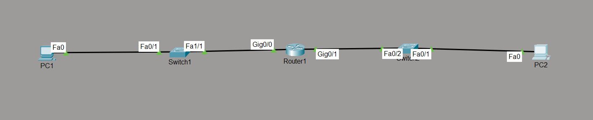

# IPv6 Addressing Lab

## Objective

Configure basic IPv6 addressing on a Cisco router and end devices. Verify Global Unicast addressing, automatic Link-Local address generation, and end-to-end IPv6 connectivity within directly connected networks.

---

## Topology

---

## Network Addressing

### LAN 1

| Device | IPv6 Address |
|---------|--------------|
| R1 G0/0 | 2001:DB8:1:1::1/64 |
| PC1 | 2001:DB8:1:1::10/64 |
| Default Gateway | 2001:DB8:1:1::1 |

### LAN 2

| Device | IPv6 Address |
|---------|--------------|
| R1 G0/1 | 2001:DB8:2:2::1/64 |
| PC2 | 2001:DB8:2:2::10/64 |
| Default Gateway | 2001:DB8:2:2::1 |

---

## Network Policies

The following IPv6 configuration was implemented:

- Enabled IPv6 routing on the router.
- Assigned Global Unicast IPv6 addresses to router interfaces.
- Configured IPv6 addresses and default gateways on end devices.
- Verified automatic Link-Local address generation.
- Tested end-to-end connectivity.

---

## How it Works

IPv6 uses 128-bit addresses to uniquely identify devices on a network.

Each router interface is assigned a Global Unicast address and automatically generates a Link-Local address (FE80::/10). Hosts communicate with their default gateway using the router's Global Unicast address.

Unlike IPv4, IPv6 does not use ARP. Instead, it uses Neighbor Discovery Protocol (NDP) for address resolution and neighbor discovery.

---

## Verification

### Interface Status

- `show ipv6 interface brief`

### Detailed Interface Information

- `show ipv6 interface`

### IPv6 Routing Table

- `show ipv6 route`

### Neighbor Discovery

- `show ipv6 neighbors`

### Connectivity Testing

- `ping`

---

## Key Concepts Learned

- IPv6 Addressing
- Global Unicast Address
- Link-Local Address
- Prefix Length (/64)
- IPv6 Unicast Routing
- Neighbor Discovery Protocol (NDP)
- IPv6 Verification Commands

---

## Engineering Observations

This lab demonstrated several important IPv6 concepts:

- Every IPv6-enabled interface automatically generates a Link-Local address.
- IPv6 commonly uses a /64 prefix for LANs.
- The `ipv6 unicast-routing` command enables IPv6 packet forwarding.
- Neighbor Discovery Protocol replaces ARP in IPv6 networks.
- IPv6 addresses use hexadecimal notation with address compression.

---

## Troubleshooting Experience

During implementation and testing:

- Verified Global Unicast addressing.
- Confirmed automatic Link-Local address generation.
- Corrected missing `/64` prefix length on end devices.
- Verified successful IPv6 connectivity.

---

## Skills Learned

- IPv6 Configuration
- IPv6 Address Planning
- Neighbor Discovery
- IPv6 Verification
- Cisco IOS IPv6 Configuration

---

## Devices Used

- 1 × Cisco Router
- 2 × Cisco Switches
- 2 × PCs

---

## Files Included

- `ipv6-addressing.pkt`
- `R1-config.txt`
- `PC1-config.txt`
- `PC2-config.txt`
- `R1-config.png`
- `PC1-config.png`
- `PC2-config.png`
- `topology.png`