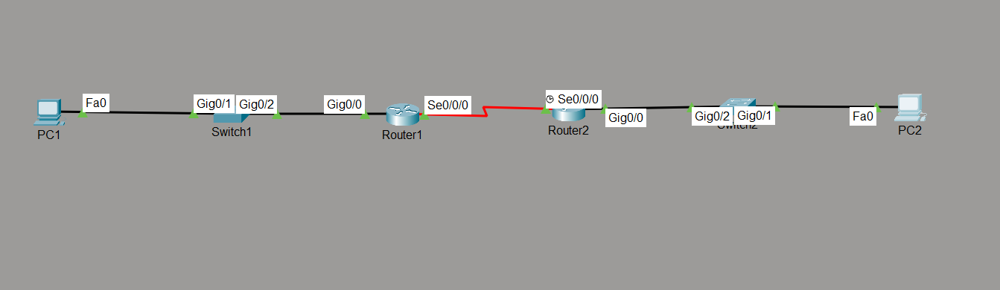

# IPv6 Static Routing Lab

## Objective

Configure IPv6 static routes between two routers and verify end-to-end communication between separate IPv6 networks.

---

## Topology

---

## Network Addressing

### LAN 1

| Device | IPv6 Address |
|---------|--------------|
| PC1 | 2001:DB8:1:1::10/64 |
| R1 G0/0 | 2001:DB8:1:1::1/64 |

### WAN Link

| Device | IPv6 Address |
|---------|--------------|
| R1 S0/0/0 | 2001:DB8:12:12::1/64 |
| R2 S0/0/0 | 2001:DB8:12:12::2/64 |

### LAN 2

| Device | IPv6 Address |
|---------|--------------|
| R2 G0/0 | 2001:DB8:2:2::1/64 |
| PC2 | 2001:DB8:2:2::10/64 |

---

## Network Policies

The following configuration was implemented:

- Enabled IPv6 routing on both routers.
- Configured Global Unicast addresses on all interfaces.
- Configured IPv6 static routes.
- Verified end-to-end connectivity between remote IPv6 networks.

---

## How it Works

Each router knows its directly connected IPv6 networks through connected routes.

To communicate with remote networks, static routes were configured using the IPv6 next-hop address.

When a packet arrives destined for a remote network, the router consults its IPv6 routing table and forwards the packet to the configured next-hop router until it reaches the destination network.

---

## Verification

### IPv6 Interface Status

- `show ipv6 interface brief`

### IPv6 Routing Table

- `show ipv6 route`

### Connectivity Testing

- `ping`

### Route Verification

- `tracert`

---

## Key Concepts Learned

- IPv6 Static Routing
- Connected Routes
- Local Routes
- Static Routes
- Next-Hop Address
- IPv6 Routing Table
- Prefix Length

---

## Engineering Observations

This lab demonstrated several important IPv6 routing concepts:

- Static routes are manually configured for remote networks.
- Connected and Local routes are automatically added to the routing table.
- IPv6 routing uses prefix lengths instead of subnet masks.
- IPv6 forwarding requires the `ipv6 unicast-routing` command.
- Successful communication depends on routes existing in both directions.

---

## Troubleshooting Experience

During implementation and testing:

- Verified interface addressing.
- Confirmed IPv6 routing was enabled.
- Verified static routes on both routers.
- Corrected missing `/64` prefix on PC IPv6 configuration.
- Successfully verified end-to-end connectivity.

---

## Skills Learned

- IPv6 Static Routing
- Route Verification
- IPv6 Troubleshooting
- Cisco IOS IPv6 Routing
- Network Connectivity Testing

---

## Devices Used

- 2 × Cisco Routers
- 2 × Cisco Switches
- 2 × PCs

---

## Files Included

- `ipv6-static-routing.pkt`
- `R1-config.txt`
- `R2-config.txt`
- `PC1-config.txt`
- `PC2-config.txt`
- `R1-config.png`
- `R2-config.png`
- `PC1-config.png`
- `PC2-config.png`
- `topology.png`