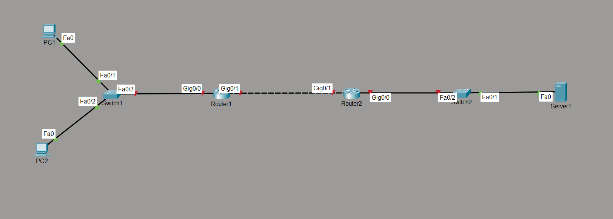

# Static NAT Lab

## Objective

Configure Static Network Address Translation (Static NAT) to establish a permanent one-to-one mapping between a private IP address and a public IP address while understanding how packets are translated between internal and external networks.

---

## Topology

---

## Network Policies

The following NAT policy was implemented:

- PC1 (192.168.10.10) is permanently mapped to a public IP address.
- PC2 communicates using its private IP address without NAT translation.
- Internal hosts can communicate with the external network through the edge router.

---

## How it Works

In this lab, the edge router was configured to perform Static NAT by creating a permanent one-to-one mapping between an inside local address and an inside global address. The inside and outside interfaces were identified using the `ip nat inside` and `ip nat outside` commands. When traffic from the mapped internal host reached the edge router, the source IP address was translated to its assigned public address before leaving the network. Return traffic destined for the public address was translated back to the original private address and forwarded to the internal host.

---

## Verification

### NAT Translation Table

Verified active NAT mappings using:

- `show ip nat translations`

### NAT Statistics

Verified translation statistics using:

- `show ip nat statistics`

### Interface Verification

Verified interface configuration using:

- `show ip interface brief`

### Connectivity Test

Verified successful communication between the internal host and external server using:

- `ping`

---

## Key Concepts Learned

- Static NAT
- One-to-One Address Translation
- Inside Local Address
- Inside Global Address
- Outside Local Address
- Outside Global Address
- NAT Inside Interface
- NAT Outside Interface

---

## Engineering Observations

This lab demonstrated several important characteristics of Static NAT:

- Static NAT creates a permanent mapping between one private address and one public address.
- Translation occurs only when traffic crosses the NAT boundary.
- The NAT router rewrites packet headers while preserving end-to-end communication.
- Static NAT is commonly used for servers that must always be reachable using the same public IP address.

---

## Troubleshooting Experience

During implementation and testing, the following tasks were performed:

- Verified inside and outside interface assignments.
- Confirmed default routing before testing NAT.
- Verified translation entries using NAT show commands.
- Tested connectivity before and after translation.

---

## Skills Learned

- Static NAT Configuration
- NAT Verification
- Packet Translation
- NAT Troubleshooting
- Edge Router Configuration
- Enterprise Network Fundamentals

---

## Devices Used

- 2 × Cisco Routers
- 2 × Ethernet Switches
- 2 × PCs
- 1 × Server

---

## Files Included

- `static-nat.pkt`
- `R1-config.txt`
- `R2-config.txt`
- `PC1-config.txt`
- `PC2-config.txt`
- `Server-config.txt`
- `R1-config.png`
- `R2-config.png`
- `PC1-config.png`
- `PC2-config.png`
- `Server-config.png`
- `topology.png`