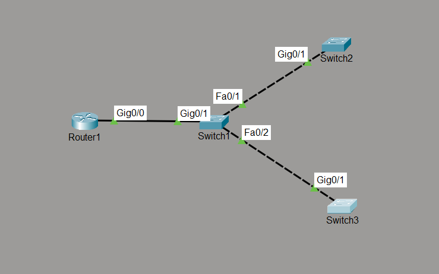

# Network Time Protocol (NTP)

## Objective

Design and implement a centralized Network Time Protocol (NTP) infrastructure in a small enterprise network where a Cisco router functions as the NTP Master and multiple Cisco switches synchronize their system clocks automatically.

This lab demonstrates how centralized time synchronization improves log accuracy, network monitoring, troubleshooting, and overall network management.

---

# Topology



---

# Network Addressing

| Device | Interface | IP Address | Role |
|----------|-----------|---------------|----------------|
| R1 | G0/0 | 192.168.1.1/24 | NTP Master |
| Core-SW | VLAN 1 | 192.168.1.2/24 | NTP Client |
| SW1 | VLAN 1 | 192.168.1.3/24 | NTP Client |
| SW2 | VLAN 1 | 192.168.1.4/24 | NTP Client |

Default Gateway (All Switches)

```
192.168.1.1
```

---

# Network Policies

- R1 acts as the authoritative NTP server for the network.
- All switches synchronize their clocks with R1.
- Every switch uses the router as its only NTP server.
- Management traffic is exchanged over the management VLAN.
- Time synchronization is verified before deployment.

---

# How it Works

1. The router's system clock is manually configured.
2. R1 is configured as the NTP Master.
3. Every switch is configured to use R1 as its NTP server.
4. The switches periodically request the current time from the router.
5. Once synchronized, all devices maintain consistent timestamps for network events.

---

# Verification

## Router

```
show clock
show ntp status
```

Verified:

- Router operating as NTP Master
- Clock synchronized
- Stratum 8

---

## Switches

```
show ntp status
show ntp associations
show clock
```

Verified:

- Clock synchronized
- Reference server: 192.168.1.1
- Successful NTP association established
- Low clock offset
- Reachability to NTP server confirmed

---

# Key Concepts Learned

- Network Time Protocol (NTP)
- NTP Master
- NTP Client
- Stratum Levels
- Time Synchronization
- Clock Offset
- Reference Clock
- NTP Associations
- Network Time Distribution

---

# Engineering Observations

Time synchronization is a fundamental requirement in enterprise networks. Accurate timestamps allow network engineers to correlate events across multiple devices during troubleshooting and security investigations.

Services such as Syslog, SNMP, AAA, and security monitoring rely on synchronized clocks to produce reliable logs and event timelines.

Rather than manually configuring the time on every device, a centralized NTP server ensures consistency and simplifies network management.

---

# Troubleshooting Experience

### Issue

Initially, a dual-subnet topology was used where each switch connected directly to separate router interfaces.

### Cause

Packet Tracer demonstrated inconsistent NTP behavior across the two management networks despite correct configuration.

### Resolution

The topology was redesigned using a single management subnet with one router and multiple switches connected through a Layer 2 switch. This reflects a more typical enterprise deployment and resulted in successful synchronization across all NTP clients.

### Verification

- All switches synchronized successfully.
- Router operated as the NTP Master.
- NTP associations were established successfully.
- All devices referenced the same NTP source.

---

# Skills Learned

- Configure a Cisco router as an NTP Master
- Configure Cisco switches as NTP clients
- Verify NTP synchronization
- Interpret NTP status information
- Analyze NTP associations
- Validate clock synchronization
- Design centralized time synchronization for enterprise networks
- Troubleshoot NTP synchronization issues

---

# Devices Used

- Cisco 2911 Router
- Cisco Catalyst 2960 Switches
- Cisco Packet Tracer

---

# Files Included

- topology.png
- NTP.pkt
- README.md