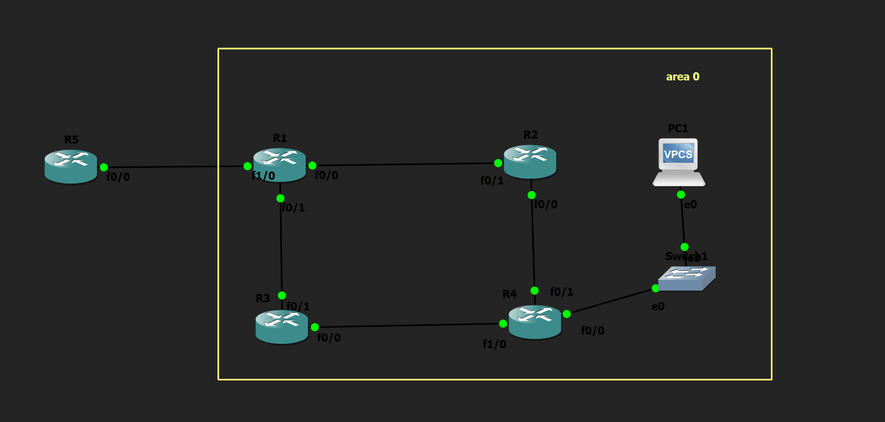

# OSPF Reference Bandwidth Lab

## Objective

Configure the OSPF reference bandwidth to understand how interface costs are calculated and how they affect path selection.

---

## Topology

---

## How it Works

In this lab, the OSPF reference bandwidth was modified using the `auto-cost reference-bandwidth` command. By increasing the reference bandwidth, OSPF automatically recalculated the cost of all participating interfaces. This demonstrates how OSPF metrics can be adjusted to accurately represent higher-speed links in modern networks while maintaining consistent path calculations across the OSPF domain.

---

## Verification

### Interface Cost

Verified the updated OSPF interface costs using:

- `show ip ospf interface brief`
- `show ip ospf interface`

### Routing Table

Verified that routes were still reachable after the cost recalculation using:

- `show ip route`

---

## Skills Learned

- OSPF Cost Calculation
- Reference Bandwidth Configuration
- Interface Metric Verification
- OSPF Interface Analysis

---

## Devices Used

- 4 × Cisco 2691 Routers
- 1 × ISP Router
- 1 × Ethernet Switch
- 1 × VPCS Host

---

## Files Included

- `OSPF Reference Bandwidth.gns3`
- `R1-config.txt`
- `R2-config.txt`
- `R3-config.txt`
- `R4-config.txt`
- `R1-config.png`
- `R2-config.png`
- `R3-config.png`
- `R4-config.png`
- `topology.png`
