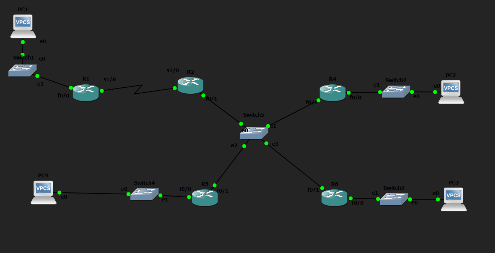

# OSPF DR and BDR Election Lab

## Objective

Observe the OSPF Designated Router (DR) and Backup Designated Router (BDR) election process on a broadcast network and influence the election using interface priorities.

---

## Topology

---

## How it Works

In this lab, multiple routers were connected to a shared Ethernet network, allowing OSPF to perform a DR and BDR election. Initially, the default election process was observed using the default interface priority. The OSPF interface priority was then modified using the `ip ospf priority` command to influence future elections. The OSPF process was restarted to trigger a new election, and the resulting DR, BDR, and DROTHER roles were verified. This lab also demonstrated that OSPF DR elections are non-preemptive, meaning an existing DR is not replaced simply because a router with a higher priority joins the network.

---

## Verification

### OSPF Neighbors

Verified the elected DR, BDR, and DROTHER routers using:

- `show ip ospf neighbor`

### Interface State

Verified the OSPF interface state using:

- `show ip ospf interface`

### Connectivity Test

Verified that OSPF neighbor relationships and routing remained operational after the election.

---

## Skills Learned

- DR Election
- BDR Election
- DROTHER Routers
- OSPF Interface Priority
- Broadcast Network Behavior
- Non-Preemptive DR Election
- OSPF Neighbor Verification

---

## Devices Used

- 5 × Cisco 2691 Routers
- 1 × Ethernet Switch

---

## Files Included

- `OSPF-DR-BDR-Election.gns3`
- `R1-config.txt`
- `R2-config.txt`
- `R4-config.txt`
- `R5-config.txt`
- `R6-config.txt`
- `PC1-config.txt`
- `PC2-config.txt`
- `PC3-config.txt`
- `PC4-config.txt`
- `topology.png`
- `R1-config.png`
- `R2-config.png`
- `R4-config.png`
- `R5-config.png`
- `R6-config.png`
- `PC1-config.png`
- `PC2-config.png`
- `PC3-config.png`
- `PC4-config.png`
