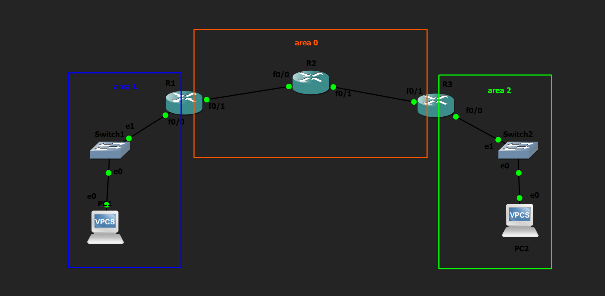

# Multi-Area OSPF Lab

## Objective

Configure Multi-Area OSPF by creating multiple OSPF areas connected through Area Border Routers (ABRs). Verify inter-area routing, OSPF neighbor relationships, and routing table entries.

---

## Topology

---

## How it Works

In this lab, a hierarchical OSPF network was configured using three OSPF areas:

- Area 1
- Area 0 (Backbone Area)
- Area 2

Routers connecting multiple areas were configured as Area Border Routers (ABRs). Each router interface was assigned to the appropriate OSPF area using network statements. Passive interfaces were configured on LAN-facing interfaces to prevent unnecessary OSPF neighbor formation while still advertising connected networks.

After neighbor relationships were established, routers exchanged routing information between different OSPF areas through the ABRs. The routing tables were then verified to confirm successful inter-area route propagation.

---

## OSPF Areas

### Area 1

- User LAN
- Internal Router

### Area 0

- Backbone Area
- Connects all other OSPF areas

### Area 2

- User LAN
- Internal Router

---

## Verification

### OSPF Neighbors

Verified successful neighbor relationships using:

- `show ip ospf neighbor`

### OSPF Interface Information

Verified interface participation and assigned areas using:

- `show ip ospf interface brief`

### Routing Table

Verified OSPF routes using:

- `show ip route`

Special attention was given to **Inter-Area (O IA)** routes, confirming successful communication between different OSPF areas.

### OSPF Database

Verified LSAs exchanged between routers using:

- `show ip ospf database`

### Connectivity Test

Verified end-to-end communication using ping between hosts located in different OSPF areas.

---

## Skills Learned

- Multi-Area OSPF
- OSPF Backbone Area (Area 0)
- Area Border Router (ABR)
- Inter-Area Routing
- O IA Routes
- Hierarchical OSPF Design
- OSPF Neighbor Verification
- OSPF Database Verification

---

## Devices Used

- 3 × Cisco 2691 Routers
- 2 × Ethernet Switches
- 2 × VPCS Hosts

---

## Files Included

- `Multi-Area-OSPF.gns3`
- `R1-config.txt`
- `R2-config.txt`
- `R3-config.txt`
- `PC1-config.txt`
- `PC2-config.txt`
- `R1-config.png`
- `R2-config.png`
- `R3-config.png`
- `PC1-config.png`
- `PC2-config.png`
- `topology.png`

