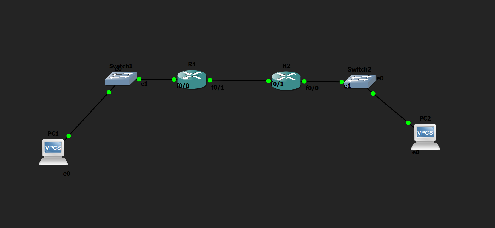

# Static Routing Lab

## Objective

Configure static routes between two routers to enable communication between two different LANs using manual routing.

---

## Topology

---

## How it Works

In this lab, static routes were configured to enable communication between two different networks. First, I manually configured the IP addresses of all PCs and router interfaces. Then, I configured static routes on both routers using the ip route <destination-network> <subnet-mask> <next-hop> command. This allowed Router 1 to reach the network connected to Router 2 and vice versa. Finally, I verified the configuration by successfully pinging from PC1 to PC2 and from PC2 to PC1, confirming that the static routes were configured correctly.

---

## Verification

### Routing Table

Verified that the static routes were successfully added using:

- `show ip route`

### Connectivity Test

Verified end-to-end connectivity by successfully pinging from:

- PC1 → PC2
- PC2 → PC1

---

## Skills Learned

- Static Routing
- IPv4 Addressing
- Interface Configuration
- Routing Table Verification
- Basic Network Troubleshooting

---

## Devices Used

- 2 × Cisco 2691 Routers
- 2 × Ethernet Switches
- 2 × VPCS Hosts

---

## Files Included

- `Static-Routing.gns3`
- `R1.txt`
- `R2.txt`
- `images/topology.png`
- `images/show-ip-route-r1.png`
- `images/show-ip-route-r2.png`
- `images/ping-success.png`
