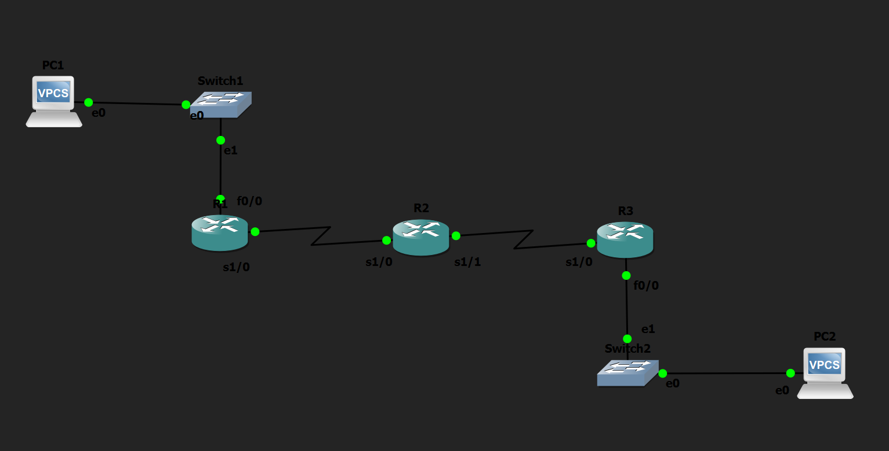

# RIP v2 Basic Configuration Lab

## Objective

Configure RIP version 2 to enable dynamic routing between multiple routers and allow automatic exchange of routing information between different networks.

---

## Topology

---

## How it Works

In this lab, I configured RIP version 2 to enable dynamic routing between three routers. First, I manually configured the IP addresses of all PCs and router interfaces. Then, I enabled RIP on each router using the `router rip` command, configured `version 2`, disabled automatic route summarization using `no auto-summary`, and advertised the directly connected networks using the `network` command. After the routers exchanged routing updates, they automatically learned the remote networks without requiring any static routes. Finally, I verified the learned routes using the routing table and confirmed successful end-to-end connectivity between the PCs.

---

## Verification

### Routing Table

Verified that remote networks were dynamically learned using:

- `show ip route`

### RIP Configuration

Verified the RIP configuration and advertised networks using:

- `show ip protocols`

### Connectivity Test

Verified end-to-end connectivity by successfully pinging from:

- PC1 → PC2
- PC2 → PC1

---

## Skills Learned

- RIP Version 2
- Dynamic Routing
- Route Advertisement
- Route Learning
- IPv4 Addressing
- Interface Configuration
- Routing Table Verification
- Basic Network Troubleshooting

---

## Devices Used

- 3 × Cisco 2691 Routers
- 2 × Ethernet Switches
- 2 × VPCS Hosts

---

## Files Included

- `RIP v2 Basic.gns3`
- `PC1-config.txt`
- `PC2-config.txt`
- `R1-config.txt`
- `R2-config.txt`
- `R3-config.txt`
- `topology.png`
- `PC1-config.png`
- `PC2-config.png`
- `R1-config.png`
- `R2-config.png`
- `R3-config.png`