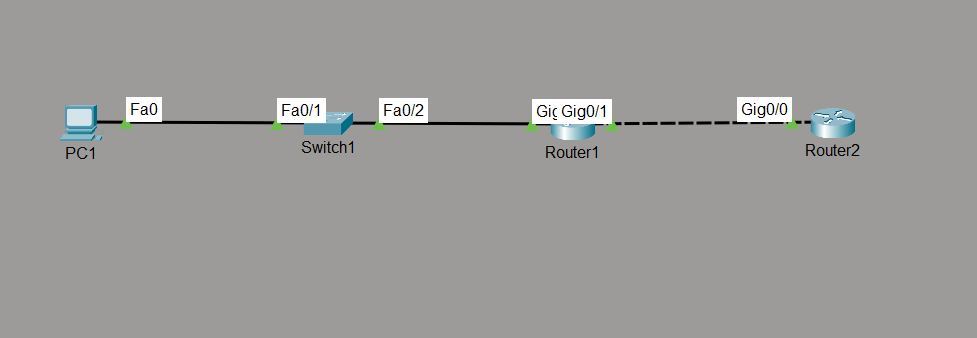

# SSH (Secure Shell) Lab

## Objective

Configure SSH Version 2 on Cisco routers to provide secure remote management over an encrypted connection. Verify successful SSH login using local authentication and demonstrate secure administration of network devices.

---

## Topology

---

## Network Addressing

| Device | Interface | IP Address |
|---------|-----------|------------|
| PC1 | NIC | 192.168.10.x |
| R1 | G0/0 | 192.168.10.1/24 |
| R1 | G0/1 | 192.168.20.1/24 |
| R2 | G0/0 | 192.168.20.2/24 |

---

## Network Policies

The following SSH configuration was implemented:

- SSH Version 2 enabled on both routers.
- Local user database configured for authentication.
- RSA public/private key pair generated.
- VTY lines configured to accept only SSH connections.
- Local authentication enabled using `login local`.
- Static routing configured to allow SSH connectivity between networks.

---

## How it Works

Secure Shell (SSH) is a secure remote management protocol used to administer network devices over an encrypted connection.

Unlike Telnet, SSH encrypts all management traffic, including usernames, passwords, and configuration commands, protecting them from interception.

Before SSH can be enabled on a Cisco router, the device must have:

- A hostname
- A domain name
- RSA encryption keys
- A local username
- SSH Version 2 enabled
- VTY lines configured for SSH access

Once configured, administrators can remotely access and manage the router securely from any host with IP connectivity.

---

## Verification

### SSH Status

Verified SSH operation using:

- `show ip ssh`
- `show ssh`

### Interface Verification

Verified interface status using:

- `show ip interface brief`

### Configuration Verification

Verified SSH configuration using:

- `show running-config`

### Connectivity Testing

Verified successful SSH login from the PC to:

- R1
- R2

Verified remote management by executing IOS commands after successful authentication.

---

## Key Concepts Learned

- Secure Shell (SSH)
- RSA Key Generation
- SSH Version 2
- Local User Authentication
- VTY Configuration
- Remote Device Management
- Encrypted Management Sessions

---

## Engineering Observations

This lab demonstrated several important SSH characteristics:

- SSH requires both a hostname and domain name before RSA keys can be generated.
- RSA keys provide the cryptographic foundation required for SSH communication.
- SSH Version 2 provides stronger security than SSH Version 1.
- Local authentication allows devices to validate users without requiring an external authentication server.
- Configuring `transport input ssh` prevents insecure Telnet access.
- SSH encrypts all management traffic, protecting credentials and configuration data.

---

## Troubleshooting Experience

During implementation and testing, the following tasks were performed:

- Configured hostnames before generating RSA keys.
- Configured domain names required for SSH.
- Corrected the `transport input ssh` command syntax.
- Verified SSH Version 2 operation.
- Configured static routing to provide end-to-end SSH connectivity.
- Successfully authenticated using local usernames.
- Verified remote administration through SSH.

---

## Skills Learned

- SSH Configuration
- Secure Remote Administration
- RSA Key Generation
- Local Authentication
- VTY Line Configuration
- SSH Verification
- Remote Router Management

---

## Devices Used

- 2 × Cisco Routers
- 1 × Cisco Switch
- 1 × PC

---

## Files Included

- `ssh-lab.pkt`
- `R1-config.txt`
- `R2-config.txt`
- `PC1-config.txt`
- `R1-config.png`
- `R2-config.png`
- `PC1-config.png`
- `topology.png`