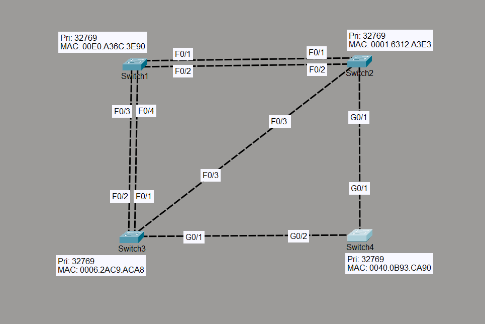

# STP Root Bridge Election

## Objective

The objective of this lab is to understand how Spanning Tree Protocol (STP) automatically elects a Root Bridge and assigns port roles to create a loop-free Layer 2 topology. No manual STP configuration was performed, allowing the switches to elect the Root Bridge based on the default Bridge ID (Priority + MAC Address).

---

## Topology



- 4 Cisco Layer 2 Switches
- Multiple redundant FastEthernet and GigabitEthernet links
- VLAN 1 (Default)

---

## Devices Used

- 4 × Cisco 2960 Switches
- Cisco Packet Tracer

---

## Configuration

No STP configuration was required.

Only hostnames were configured.

```cisco
hostname SW1
hostname SW2
hostname SW3
hostname SW4
```

Cisco switches run PVST+ by default, so STP begins operating automatically once the topology is connected.

---

## STP Election Results

### Root Bridge

| Switch | Result |
|---------|--------|
| SW2 | Root Bridge |

### Root Costs

| Switch | Root Cost |
|---------|----------:|
| SW2 | 0 |
| SW4 | 4 |
| SW3 | 8 |
| SW1 | 19 |

---

## Port Roles

### SW1

| Interface | Role |
|-----------|------|
| Fa0/1 | Root Port |
| Fa0/2 | Alternate |
| Fa0/3 | Alternate |
| Fa0/4 | Alternate |

---

### SW2 (Root Bridge)

| Interface | Role |
|-----------|------|
| Fa0/1 | Designated |
| Fa0/2 | Designated |
| Fa0/3 | Designated |
| Gi0/1 | Designated |

---

### SW3

| Interface | Role |
|-----------|------|
| Fa0/1 | Designated |
| Fa0/2 | Designated |
| Fa0/3 | Alternate |
| Gi0/1 | Root Port |

---

### SW4

| Interface | Role |
|-----------|------|
| Gi0/1 | Root Port |
| Gi0/2 | Designated |

---

## Verification Commands

```cisco
show spanning-tree
show spanning-tree root
show spanning-tree interface fa0/1
show spanning-tree interface gi0/1
```

---

## Verification

### Verify Root Bridge

```cisco
show spanning-tree
```

Confirmed SW2 was automatically elected as the Root Bridge.

---

### Verify Root Ports

Confirmed each non-root switch selected a single Root Port.

- SW1 → Fa0/1
- SW3 → Gi0/1
- SW4 → Gi0/1

---

### Verify Designated Ports

Confirmed every network segment had exactly one Designated Port responsible for forwarding traffic toward that segment.

---

### Verify Alternate Ports

Confirmed redundant links were placed into the Alternate (Blocking) state to eliminate Layer 2 loops.

---

### Verify Path Cost Selection

Observed that SW3 selected its GigabitEthernet interface as the Root Port because the total path cost through SW4 (4 + 4 = 8) was lower than the direct FastEthernet path to the Root Bridge (19).

---

## Engineering Observations

- STP automatically elected the Root Bridge using the lowest Bridge ID.
- Every non-root switch selected exactly one Root Port.
- Every network segment elected one Designated Port.
- Redundant paths were safely blocked using Alternate Ports.
- STP selected the path with the lowest cumulative cost rather than the physically shortest path.
- GigabitEthernet links were preferred over FastEthernet links because of their lower STP path cost.
- The topology remained loop-free without requiring any manual STP configuration.

---

## Outcome

Successfully verified the complete STP Root Bridge election process, including automatic Root Bridge selection, Root Port election, Designated Port election, Alternate Port selection, and path-cost calculation using the default PVST+ configuration.