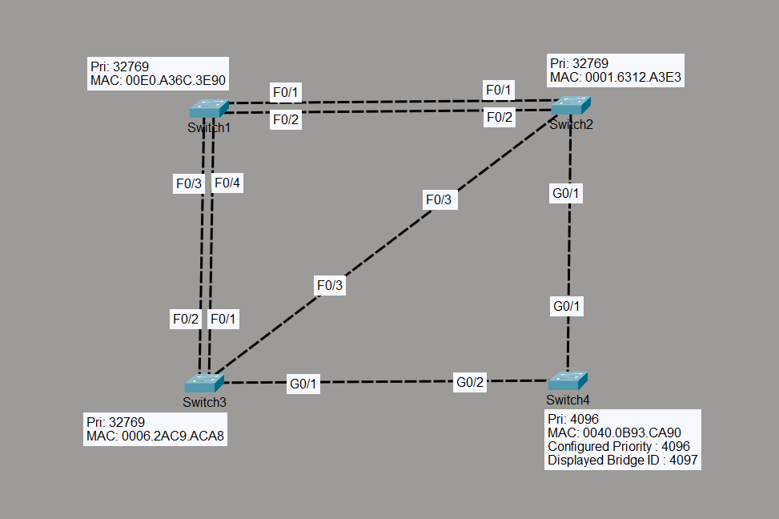

# STP Root Bridge Manipulation

## Objective

The objective of this lab is to manually elect a new Root Bridge by changing the bridge priority and observe how Spanning Tree Protocol (STP) recalculates the topology. This demonstrates how changing a single switch's priority affects Root Port, Designated Port, Alternate Port, and Root Cost throughout the network.

---

## Topology



- 4 Cisco Layer 2 Switches
- Multiple redundant FastEthernet and GigabitEthernet links
- VLAN 1 (Default)

---

## Devices Used

- 4 × Cisco 2960 Switches
- Cisco Packet Tracer

---

## Configuration

### SW4

```cisco
enable
configure terminal

spanning-tree vlan 1 priority 4096

end
```

No configuration changes were made on the remaining switches.

---

## STP Election Results

### New Root Bridge

| Switch | Result |
|---------|--------|
| SW4 | Root Bridge |

---

### Root Costs

| Switch | Root Cost |
|---------|----------:|
| SW4 | 0 |
| SW2 | 4 |
| SW3 | 4 |
| SW1 | 23 |

---

## Port Roles

### SW1

| Interface | Role |
|-----------|------|
| Fa0/1 | Root Port |
| Fa0/2 | Alternate |
| Fa0/3 | Alternate |
| Fa0/4 | Alternate |

---

### SW2

| Interface | Role |
|-----------|------|
| Gi0/1 | Root Port |
| Fa0/1 | Designated |
| Fa0/2 | Designated |
| Fa0/3 | Designated |

---

### SW3

| Interface | Role |
|-----------|------|
| Gi0/1 | Root Port |
| Fa0/1 | Designated |
| Fa0/2 | Designated |
| Fa0/3 | Alternate |

---

### SW4 (Root Bridge)

| Interface | Role |
|-----------|------|
| Gi0/1 | Designated |
| Gi0/2 | Designated |

---

## Verification Commands

```cisco
show spanning-tree

show spanning-tree root

show spanning-tree interface fa0/1

show spanning-tree interface gi0/1
```

---

## Verification

### Verify New Root Bridge

Confirmed that SW4 became the Root Bridge after lowering its bridge priority from the default value to 4096.

---

### Verify Root Port Recalculation

Confirmed that STP recalculated the best path toward the new Root Bridge.

- SW1 → Fa0/1
- SW2 → Gi0/1
- SW3 → Gi0/1

---

### Verify Designated Ports

Confirmed that each network segment elected one Designated Port based on the lowest Root Path Cost.

---

### Verify Alternate Ports

Confirmed that redundant links were moved to the Alternate (Blocking) state, maintaining a loop-free topology.

---

### Verify Path Cost Selection

Observed that STP selected paths with the lowest cumulative interface cost rather than the physically shortest path.

---

## Comparison with Lab 1

| Feature | Lab 1 | Lab 2 |
|---------|--------|--------|
| Root Bridge | SW2 | SW4 |
| Root Cost (SW1) | 19 | 23 |
| Root Cost (SW3) | 8 | 4 |
| Root Cost (SW2) | 0 | 4 |
| Root Cost (SW4) | 4 | 0 |

---

## Engineering Observations

- Lowering the bridge priority immediately caused SW4 to become the Root Bridge.
- STP automatically recalculated the entire Layer 2 topology without manual intervention.
- Root Ports changed on all non-root switches based on the new shortest path.
- Designated Ports were re-elected on every LAN segment.
- Alternate Ports continued to prevent Layer 2 loops.
- The topology converged automatically after the Root Bridge changed.

---

## Outcome

Successfully demonstrated manual Root Bridge election by modifying the bridge priority. Verified STP convergence, Root Port re-election, Designated Port re-election, Alternate Port selection, and updated Root Path Costs across the entire Layer 2 topology.