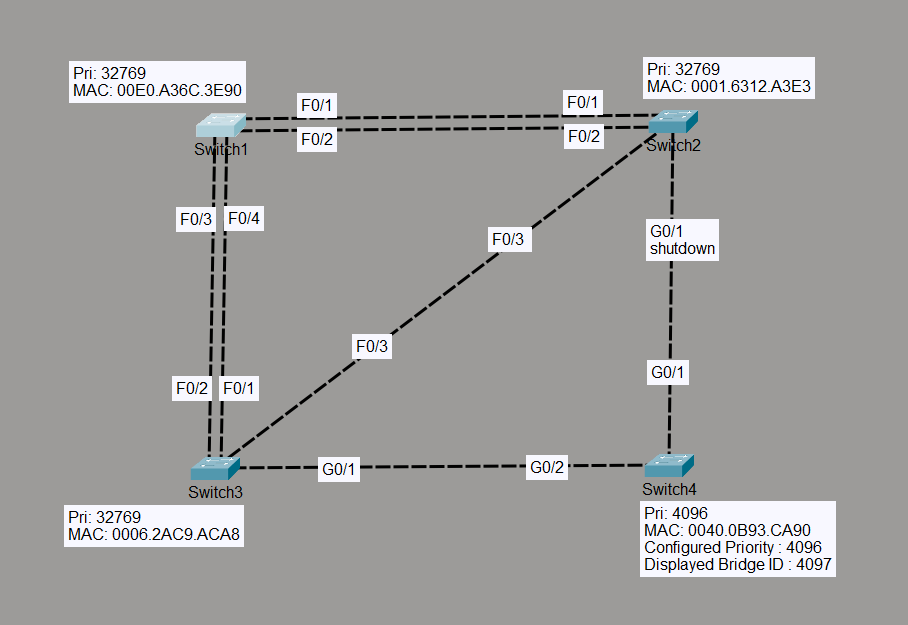

# STP Convergence (Link Failure)

## Objective

The objective of this lab is to observe how Spanning Tree Protocol (STP) converges after a forwarding link fails. The lab demonstrates how STP detects a topology change, recalculates the best path to the Root Bridge, activates a previously blocked backup link, and restores a loop-free topology without manual intervention.

---

## Topology



- 4 Cisco Layer 2 Switches
- Multiple redundant FastEthernet and GigabitEthernet links
- VLAN 1 (Default)

---

## Devices Used

- 4 × Cisco 2960 Switches
- Cisco Packet Tracer

---

## Initial Configuration

The topology from **Lab 2 (Root Bridge Manipulation)** was reused.

- SW4 configured as the Root Bridge.
- All remaining switches retained their default bridge priority.

---

## Failure Simulation

### SW2

```cisco
enable
configure terminal

interface g0/1
shutdown
```

The GigabitEthernet link between **SW2 and the Root Bridge (SW4)** was intentionally disabled to simulate a link failure.

---

## STP Behavior

After the forwarding link failed, STP automatically:

- Detected the topology change.
- Recalculated the shortest path to the Root Bridge.
- Elected a new Root Port on SW2.
- Activated the previously blocked backup link.
- Restored Layer 2 connectivity without creating a switching loop.

---

## Topology Before Failure

| Switch | Root Cost | Root Port |
|---------|----------:|-----------|
| SW4 | 0 | — |
| SW2 | 4 | Gi0/1 |
| SW3 | 4 | Gi0/1 |
| SW1 | 23 | Fa0/1 |

---

## Topology After Convergence

| Switch | Root Cost | Root Port |
|---------|----------:|-----------|
| SW4 | 0 | — |
| SW3 | 4 | Gi0/1 |
| SW2 | 23 | Fa0/3 |
| SW1 | 23 | Fa0/4 |

---

## Port Role Changes

### Before Failure

| Interface | Role |
|-----------|------|
| SW2 Gi0/1 | Root Port |
| SW2 Fa0/3 | Designated |
| SW3 Fa0/3 | Alternate |

---

### After Convergence

| Interface | New Role |
|-----------|----------|
| SW2 Gi0/1 | Down |
| SW2 Fa0/3 | Root Port |
| SW3 Fa0/3 | Designated |

---

## STP Convergence Process

The blocked backup link transitioned through the following STP states:

```text
Blocking
↓
Listening
↓
Learning
↓
Forwarding
```

During convergence, the port was observed entering the **Learning** state before finally transitioning to **Forwarding**.

---

## Verification Commands

```cisco
show spanning-tree

show spanning-tree root

show spanning-tree interface fa0/3

show spanning-tree interface g0/1
```

---

## Verification

### Verify Root Bridge

Confirmed that SW4 remained the Root Bridge throughout the convergence process.

---

### Verify Link Failure

Confirmed that SW2 GigabitEthernet0/1 was administratively shut down.

---

### Verify Root Port Re-election

Confirmed that SW2 automatically selected FastEthernet0/3 as its new Root Port after losing its original path to the Root Bridge.

---

### Verify Designated Port Re-election

Confirmed that SW3 FastEthernet0/3 became the Designated Port because its Root Path Cost was lower than SW2's.

---

### Verify Root Cost Recalculation

Observed that SW2's Root Cost changed from **4** to **23**, reflecting the new path through SW3.

---

### Verify STP State Transitions

Observed the backup port transition through Listening and Learning before reaching the Forwarding state, demonstrating successful STP convergence.

---

## Engineering Observations

- STP automatically detected the failed forwarding link.
- The Root Bridge remained unchanged.
- Root Path Costs were recalculated automatically.
- SW2 elected a new Root Port without manual configuration.
- A previously blocked Alternate Port became active to restore connectivity.
- Network loops were prevented throughout the convergence process.
- Connectivity was restored using the redundant path without administrator intervention.

---

## Outcome

Successfully demonstrated STP convergence following a link failure. Verified automatic Root Port re-election, Designated Port re-election, Root Cost recalculation, STP state transitions, and seamless failover to a redundant path while maintaining a loop-free Layer 2 topology.