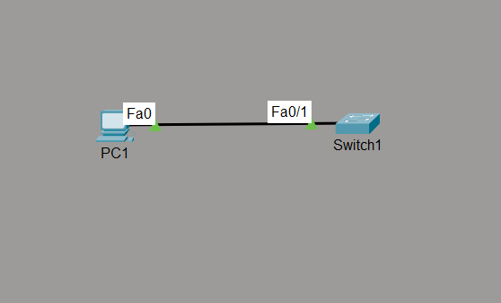

# STP PortFast

## Objective

The objective of this lab is to configure PortFast on an access port and verify that the port immediately transitions to the Forwarding state, eliminating the normal STP startup delay for end devices while keeping STP enabled.

---

## Topology



---

## Devices Used

- 1 × Cisco 2960 Switch
- 1 × PC
- Cisco Packet Tracer

---

## Configuration

### SW1

```cisco
enable
configure terminal

hostname SW1

interface fa0/1
 switchport mode access
 spanning-tree portfast

end
```

---

## Verification Commands

```cisco
show spanning-tree interface fa0/1

show spanning-tree interface fa0/1 detail

show spanning-tree summary

show running-config interface fa0/1
```

---

## Verification

### Verify PortFast Configuration

Confirmed that PortFast was successfully enabled on interface FastEthernet0/1.

---

### Verify Interface Mode

Confirmed that the interface was configured as an Access Port before enabling PortFast.

---

### Verify Immediate Forwarding

Disconnected and reconnected the Ethernet cable to verify that the interface immediately transitioned to the Forwarding state without passing through the normal STP startup delay.

---

### Verify STP Operation

Confirmed that enabling PortFast did **not** disable STP. The switch continued participating in STP and would still process Bridge Protocol Data Units (BPDUs) if received.

---

## STP Behavior

### Normal STP

```text
Blocking
↓
Listening
↓
Learning
↓
Forwarding
```

---

### With PortFast

```text
Forwarding
```

The port immediately enters the Forwarding state upon link activation.

---

## Engineering Observations

- PortFast is designed for ports connected to end devices such as PCs, printers, IP phones, and servers.
- PortFast significantly reduces the time required for end devices to gain network connectivity after link establishment.
- PortFast does **not** disable STP; it only bypasses the Listening and Learning states during interface startup.
- PortFast should **never** be enabled on switch-to-switch links because immediate forwarding could allow temporary Layer 2 loops before STP converges.
- Cisco recommends enabling PortFast only on access ports connected to a single end device.

---

## Practical Use Case

Without PortFast, a client requesting an IP address via DHCP may experience delays because the switch port remains in Listening and Learning before forwarding traffic.

With PortFast enabled, the client can immediately send DHCP Discover messages and obtain network connectivity without waiting for STP timers.

---

## Outcome

Successfully configured and verified PortFast on an access port. Confirmed immediate transition to the Forwarding state while maintaining STP functionality, demonstrating how PortFast improves end-device connectivity without compromising network stability.