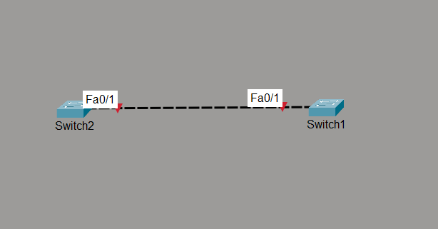

# STP BPDU Guard

## Objective

The objective of this lab is to configure BPDU Guard on a PortFast-enabled access port and verify that the switch automatically places the interface into the **err-disabled** state upon receiving a Bridge Protocol Data Unit (BPDU), preventing unauthorized switch connections and protecting the Layer 2 network.

---

## Topology



- **SW1** - Protected Switch
- **SW2** - Used to simulate an unauthorized switch connection

---

## Devices Used

- 2 × Cisco 2960 Switches
- Cisco Packet Tracer

---

## Configuration

### SW1

```cisco
enable
configure terminal

hostname SW1

interface fa0/1
 switchport mode access
 spanning-tree portfast
 spanning-tree bpduguard enable

end
```

No configuration was required on SW2.

---

## Verification Commands

```cisco
show interfaces status

show running-config interface fa0/1

show spanning-tree summary
```

---

## Verification

### Verify PortFast

Confirmed that FastEthernet0/1 was configured as an access port with PortFast enabled.

---

### Verify BPDU Guard

Confirmed that BPDU Guard was enabled on FastEthernet0/1.

---

### Verify BPDU Detection

Connected SW2 to the PortFast-enabled interface on SW1.

Since Cisco switches transmit BPDUs by default, SW1 immediately detected a BPDU on the PortFast interface.

---

### Verify Interface Protection

Confirmed that FastEthernet0/1 automatically transitioned to the **err-disabled** state after receiving the BPDU, preventing the unauthorized switch from participating in the network.

---

### Verify Interface Recovery

Disconnected SW2 from the protected interface.

Recovered the interface using:

```cisco
interface fa0/1
 shutdown
 no shutdown
```

Confirmed that the interface returned to its normal operational state after the unauthorized switch was removed.

---

## BPDU Guard Operation

### Normal Operation

```text
PortFast Enabled
        │
        ▼
End Device Connected
        │
        ▼
Immediate Forwarding
```

---

### Unauthorized Switch Connection

```text
PortFast Enabled
        │
        ▼
Switch Connected
        │
        ▼
BPDU Received
        │
        ▼
Interface → err-disabled
```

---

## Engineering Observations

- BPDU Guard protects PortFast-enabled interfaces from unauthorized switch connections.
- Receiving a BPDU on a PortFast interface is considered a network design violation.
- The protected interface is immediately placed into the **err-disabled** state.
- Manual recovery requires removing the unauthorized device before re-enabling the interface.
- BPDU Guard helps prevent accidental Layer 2 loops caused by users connecting unmanaged or unauthorized switches.
- In enterprise networks, PortFast and BPDU Guard are commonly deployed together on access ports.

---

## Practical Use Case

In enterprise environments, users may accidentally connect a small switch to an access port intended for a single end device.

Without BPDU Guard, the unauthorized switch becomes part of the Layer 2 network.

With BPDU Guard enabled, the switch immediately disables the interface after receiving a BPDU, protecting the network from unintended topology changes and potential switching loops.

---

## Outcome

Successfully configured and verified BPDU Guard on a PortFast-enabled access port. Confirmed automatic interface shutdown upon BPDU reception and demonstrated manual interface recovery after removing the unauthorized switch, validating Layer 2 protection against unauthorized switch connections.