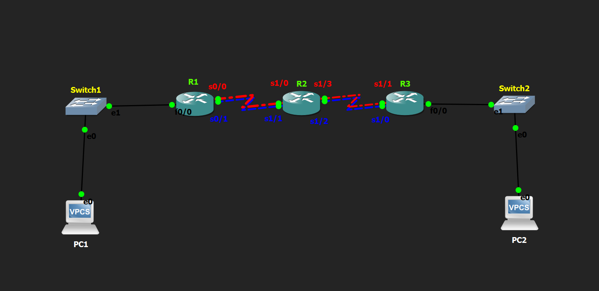

# Equal-Cost Static Routing Lab

## Objective

Configure equal-cost static routes to enable load balancing between two networks using multiple paths with the same Administrative Distance (AD).

---

## Topology

---

## How it Works

In this lab, I configured two equal-cost static routes to the same destination network using different next-hop addresses. First, I manually configured the IP addresses of all PCs and router interfaces. Then, I configured two static routes with the same Administrative Distance (AD = 1). Since both routes had the same cost, the router installed both routes in the routing table and performed Equal-Cost Multipath (ECMP) routing, allowing traffic to be forwarded through either path. Finally, I verified the configuration using the routing table and confirmed successful communication between the end devices.

---

## Verification

### Routing Table

Verified that both equal-cost static routes were installed using:

- `show ip route`

### Connectivity Test

Verified end-to-end connectivity by successfully pinging from:

- PC1 → PC2
- PC2 → PC1

### Path Verification

Verified that the router installed multiple next-hop routes to the same destination network, confirming Equal-Cost Multipath (ECMP) routing.

---

## Skills Learned

- Equal-Cost Static Routing
- Equal-Cost Multipath (ECMP)
- Static Route Configuration
- IPv4 Addressing
- Interface Configuration
- Routing Table Verification
- Basic Network Troubleshooting

---

## Devices Used

- 3 × Cisco 2691 Routers
- 2 × Ethernet Switches
- 2 × VPCS Hosts

---

## Files Included

- `equal cost static routing.gns3`
- `PC1-config.txt`
- `PC2-config.txt`
- `R1-config.txt`
- `R2-config.txt`
- `R3-config.txt`
- `topology.png`
- `PC1-config.png`
- `PC2-config.png`
- `R1-config.png`
- `R2-config.png`
- `R3-config.png`
