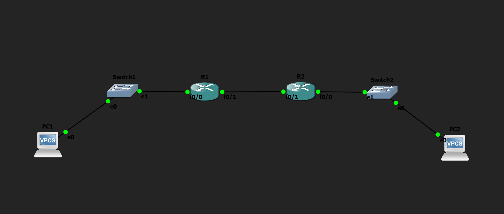

# Default Route Lab

## Objective

Configure a default route to enable communication between networks by forwarding all unknown destination traffic to a single next-hop router.

---

## Topology

---

## How it Works

In this lab, a default route was configured to allow traffic destined for unknown networks to be forwarded through a single gateway. First, I manually configured the IP addresses of all PCs and router interfaces. Then, I configured a default route using the `ip route 0.0.0.0 0.0.0.0 <next-hop>` command. This enabled the router to forward packets for any unknown destination to the specified next-hop router. Finally, I verified the configuration by successfully pinging between the end devices and confirming that the default route was installed in the routing table.

---

## Verification

### Routing Table

Verified that the default route was successfully added using:

- `show ip route`

### Connectivity Test

Verified end-to-end connectivity by successfully pinging from:

- PC1 → PC2
- PC2 → PC1

---

## Skills Learned

- Default Routing
- IPv4 Addressing
- Interface Configuration
- Routing Table Verification
- Basic Network Troubleshooting

---

## Devices Used

- 2 × Cisco 2691 Routers
- 2 × Ethernet Switches
- 2 × VPCS Hosts

---

## Files Included

- `default route.gns3`
- `PC1-config.txt`
- `PC2-config.txt`
- `R1-config.txt`
- `R2-config.txt`
- `topology.png`
- `PC1-config.png`
- `PC2-config.png`
