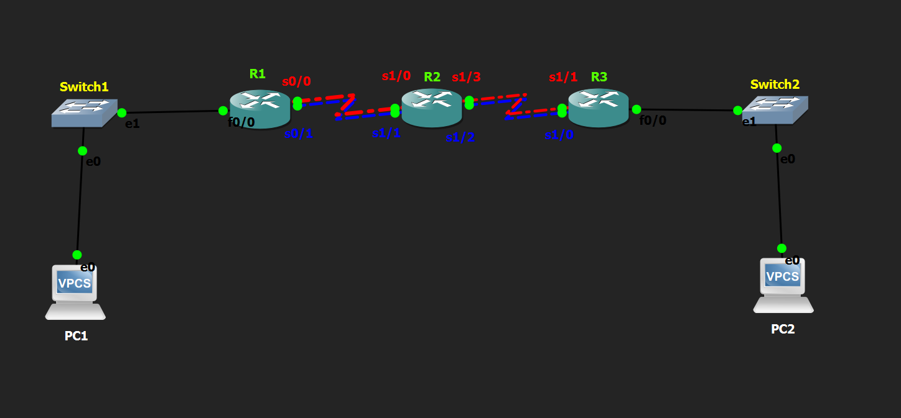

# Floating Static Route Lab

## Objective

Configure a floating static route to provide automatic backup path redundancy using Administrative Distance (AD) in case the primary route fails.

---

## Topology

---

## How it Works

In this lab, I configured both a primary static route and a backup (floating) static route between two networks. First, I manually configured the IP addresses of all PCs and router interfaces. Then, I configured the primary static route using the default Administrative Distance (AD = 1). After that, I configured a second static route to the same destination with a higher Administrative Distance (AD = 10), making it a floating static route. During normal operation, the router selected the primary route. When the primary link was shut down, the router automatically removed the primary route from the routing table and installed the floating static route, allowing communication to continue without manual intervention.

---

## Verification

### Routing Table

Verified the routing table before and after the primary link failure using:

- `show ip route`

### Failover Test

Verified automatic failover by:

- Shutting down the primary link.
- Confirming that the floating static route became active.
- Bringing the primary link back up and confirming that the router switched back to the preferred route.

### Connectivity Test

Verified end-to-end connectivity by successfully pinging from:

- PC1 → PC2
- PC2 → PC1

Both before and after the primary link failure.

---

## Skills Learned

- Floating Static Routing
- Administrative Distance (AD)
- Route Failover
- IPv4 Addressing
- Interface Configuration
- Routing Table Verification
- Basic Network Troubleshooting

---

## Devices Used

- 3 × Cisco 2691 Routers
- 2 × Ethernet Switches
- 2 × VPCS Hosts

---

## Files Included

- `floating route.gns3`
- `PC1-config.txt`
- `PC2-config.txt`
- `R1-config.txt`
- `R2-config.txt`
- `R3-config.txt`
- `topology.png`
- `PC1-config.png`
- `PC2-config.png`
- `R1-config.png`
- `R2-config.png`
- `R3-config.png`

