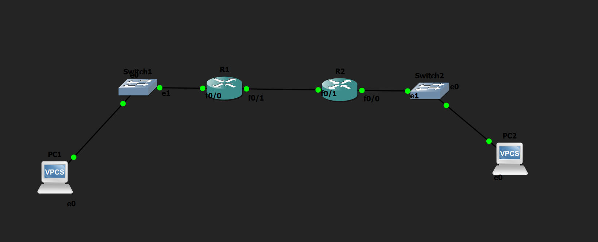

# Fully Specified Static Route Lab

## Objective

Configure a fully specified static route by defining both the exit interface and the next-hop IP address to enable communication between two different networks.

---

## Topology

---

## How it Works

In this lab, I configured a fully specified static route to enable communication between two different networks. First, I manually configured the IP addresses of all PCs and router interfaces. Then, I configured the static route using the `ip route <destination-network> <subnet-mask> <exit-interface> <next-hop>` command. By specifying both the exit interface and the next-hop IP address, the router forwards packets without performing an additional routing table lookup to determine the outgoing interface. Finally, I verified the configuration by successfully pinging between the end devices and confirming that the route was installed in the routing table.

---

## Verification

### Routing Table

Verified that the fully specified static route was successfully added using:

- `show ip route`

### Connectivity Test

Verified end-to-end connectivity by successfully pinging from:

- PC1 → PC2
- PC2 → PC1

---

## Skills Learned

- Fully Specified Static Routing
- IPv4 Addressing
- Interface Configuration
- Routing Table Verification
- Basic Network Troubleshooting

---

## Devices Used

- 2 × Cisco 2691 Routers
- 2 × Ethernet Switches
- 2 × VPCS Hosts

---

## Files Included

- `fully specified static route.gns3`
- `PC1-config.txt`
- `PC2-config.txt`
- `R1-config.txt`
- `R2-config.txt`
- `topology.png`
- `PC1-config.png`
- `PC2-config.png`
- `R1-config.png`
- `R2-config.png`