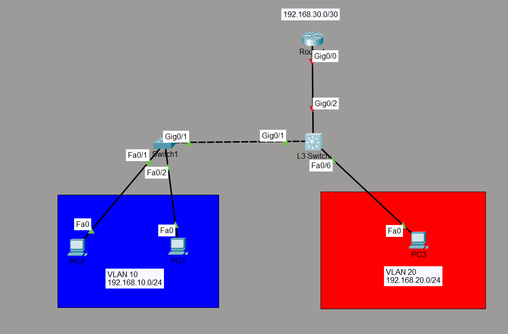

# Layer 3 Switching (Inter-VLAN Routing)

## Objective

To configure a Cisco Layer 3 Switch (3560) to perform inter-VLAN routing using Switch Virtual Interfaces (SVIs). This lab demonstrates how a multilayer switch can route traffic between VLANs without relying on Router-on-a-Stick, while also connecting to an external router using a routed port.

---

# Topology



---

# Network Addressing

| Device | Interface | IP Address | Subnet Mask |
|---------|-----------|------------|-------------|
| Router | G0/0 | 10.10.10.1 | 255.255.255.252 |
| Layer 3 Switch | G0/2 | 10.10.10.2 | 255.255.255.252 |
| Layer 3 Switch | VLAN 10 | 192.168.10.15 | 255.255.255.0 |
| Layer 3 Switch | VLAN 20 | 192.168.20.15 | 255.255.255.0 |
| PC1 | NIC | 192.168.10.10 | 255.255.255.0 |
| PC2 | NIC | 192.168.10.11 | 255.255.255.0 |
| PC3 | NIC | 192.168.20.10 | 255.255.255.0 |

### Default Gateways

- VLAN 10 PCs → **192.168.10.15**
- VLAN 20 PCs → **192.168.20.15**

---

# Network Policies

- VLAN 10 represents the **HR Department**.
- VLAN 20 represents the **Sales Department**.
- The Layer 2 switch forwards VLAN traffic to the Layer 3 switch over an IEEE 802.1Q trunk.
- The Layer 3 switch performs inter-VLAN routing using SVIs.
- The connection between the Layer 3 switch and the router is configured as a routed Layer 3 link.
- Static routes provide connectivity between the router and internal VLAN networks.

---

# How it Works

1. End devices are assigned to their respective VLANs on the Layer 2 switch.
2. The Layer 2 switch sends VLAN-tagged traffic over a trunk link to the Layer 3 switch.
3. Each VLAN has an SVI configured with an IP address that serves as the default gateway.
4. The `ip routing` command enables Layer 3 forwarding on the multilayer switch.
5. The switch routes packets internally between VLANs.
6. Traffic destined for external networks is forwarded to the router through the routed port.
7. The router uses static routes to reach the internal VLAN networks.

---

# Verification

Verify VLANs:

```bash
show vlan brief
```

Verify trunk:

```bash
show interfaces trunk
```

Verify SVI status:

```bash
show ip interface brief
```

Verify routing table:

```bash
show ip route
```

Verify routed interface:

```bash
show running-config interface g0/2
```

Test connectivity:

- PC1 → PC2
- PC1 → PC3
- PC1 → VLAN 10 Gateway
- PC3 → VLAN 20 Gateway
- Layer 3 Switch → Router
- PCs → Router

---

# Key Concepts Learned

- Layer 3 Switching
- Switch Virtual Interfaces (SVIs)
- Inter-VLAN Routing
- IEEE 802.1Q Trunking
- Routed Ports (`no switchport`)
- Static Routing
- Default Gateway Configuration
- IP Routing on Cisco Multilayer Switches

---

# Engineering Observations

- A multilayer switch routes packets internally at hardware speed without requiring Router-on-a-Stick.
- SVIs function as the default gateways for VLANs.
- The `ip routing` command is mandatory for inter-VLAN routing.
- Routed ports are configured using the `no switchport` command and behave like router interfaces.
- Trunk links are only required between switches, not between the Layer 3 switch and the router.

---

# Troubleshooting Experience

- Resolved trunk encapsulation error by configuring IEEE 802.1Q encapsulation before enabling trunk mode.
- Fixed Spanning Tree inconsistency caused by one side operating as a trunk while the other remained an access port.
- Enabled `ip routing` after identifying that SVIs alone do not perform routing.
- Verified VLAN membership and trunk operation using `show vlan brief` and `show interfaces trunk`.
- Confirmed SVI operational status before testing end-to-end connectivity.

---

# Skills Learned

- Configuring VLANs
- Configuring IEEE 802.1Q Trunks
- Creating and Configuring SVIs
- Enabling Layer 3 Switching
- Configuring Routed Ports
- Configuring Static Routes
- Verifying Routing Tables
- Troubleshooting Inter-VLAN Routing
- Cisco IOS Verification Commands

---

# Devices Used

- Cisco 3560 Multilayer Switch
- Cisco 2960 Layer 2 Switch
- Cisco Router
- PCs
- Cisco Packet Tracer

---

# Files Included

- `Layer3Switching.pkt`
- `topology.png`
- `README.md`