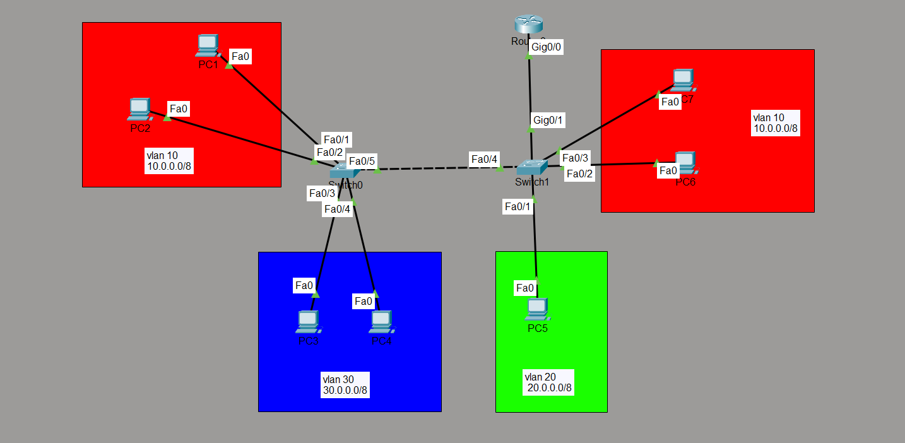

# Router-on-a-Stick (Inter-VLAN Routing) Lab

## Objective

Configure Router-on-a-Stick (ROAS) to enable communication between multiple VLANs using a single physical router interface and verify successful inter-VLAN routing.

---

## Topology

---

## How it Works

In this lab, multiple VLANs were configured on Layer 2 switches and connected through an IEEE 802.1Q trunk link. A router was configured with subinterfaces, each representing a different VLAN and serving as its default gateway. Using Router-on-a-Stick, the router received tagged frames from the trunk link, routed traffic between VLANs, and forwarded the packets back to their respective VLANs, enabling communication between different broadcast domains.

---

## Verification

### VLAN Configuration

Verified VLAN creation and port assignments using:

- `show vlan brief`

### Trunk Configuration

Verified trunk status and allowed VLANs using:

- `show interfaces trunk`

### Router Subinterfaces

Verified Router-on-a-Stick configuration using:

- `show ip interface brief`
- `show running-config`

### Connectivity Test

Verified successful communication:

- Between devices in the same VLAN
- Between devices in different VLANs
- Verified default gateway functionality

---

## Skills Learned

- Router-on-a-Stick (ROAS)
- IEEE 802.1Q Trunking
- Router Subinterfaces
- Inter-VLAN Routing
- Default Gateway Configuration
- VLAN Traffic Forwarding
- Layer 3 Routing Between VLANs

---

## Devices Used

- 2 × Cisco Layer 2 Switches
- 1 × Cisco Router
- 7 × PCs

---

## Files Included

- `router-on-a-stick.pkt`
- `Router-config.txt`
- `Switch0-config.txt`
- `Switch1-config.txt`
- `PC1-config.txt`
- `PC2-config.txt`
- `PC3-config.txt`
- `PC4-config.txt`
- `PC5-config.txt`
- `PC6-config.txt`
- `PC7-config.txt`
- `screenshots/Router-config.png`
- `screenshots/Switch0-config.png`
- `screenshots/Switch1-config.png`
- `screenshots/PC1-config.png`
- `screenshots/PC2-config.png`
- `screenshots/PC3-config.png`
- `screenshots/PC4-config.png`
- `screenshots/PC5-config.png`
- `screenshots/PC6-config.png`
- `screenshots/PC7-config.png`
- `screenshots/topology.png`