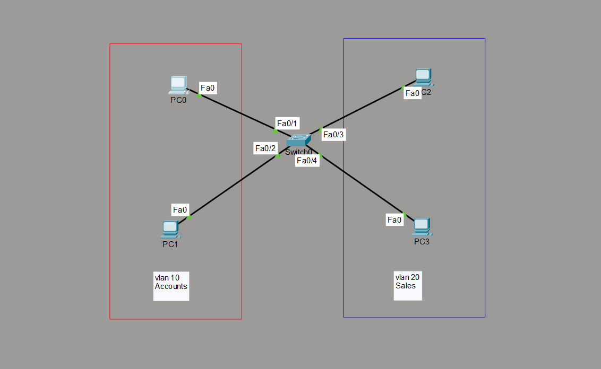

# VLAN Fundamentals Lab

## Objective

Configure VLANs on a Layer 2 switch to logically separate devices into different broadcast domains and verify communication within the same VLAN while preventing communication between different VLANs.

---

## Topology

---

## How it Works

In this lab, multiple VLANs were created on a Layer 2 switch to logically separate devices into different departments. Access ports were assigned to their respective VLANs, allowing communication only between devices within the same VLAN while isolating devices in different VLANs. This demonstrates how VLANs improve network organization, reduce unnecessary broadcast traffic, and enhance network security without requiring additional physical switches.

---

## Verification

### VLAN Configuration

Verified that VLANs were successfully created and ports were assigned using:

- `show vlan brief`

### Switchport Configuration

Verified the administrative mode, operational mode, and VLAN assignment using:

- `show interfaces switchport`

### Connectivity Test

Verified successful communication:

- Between PCs in the same VLAN
- No communication between PCs in different VLANs

---

## Skills Learned

- VLAN Creation
- VLAN Naming
- Access Port Configuration
- VLAN Membership
- Broadcast Domain Segmentation
- Layer 2 Traffic Isolation

---

## Devices Used

- 1 × Cisco Layer 2 Switch
- 4 × VPCS Hosts

---

## Files Included

- `vlan.pkt`
- `Switch0-config.txt`
- `PC0-config.txt`
- `PC1-config.txt`
- `PC2-config.txt`
- `PC3-config.txt`
- `screenshots/Switch-config.png`
- `screenshots/PC0-config.png`
- `screenshots/PC1-config.png`
- `screenshots/PC2-config.png`
- `screenshots/PC3-config.png`
- `screenshots/topology.png`