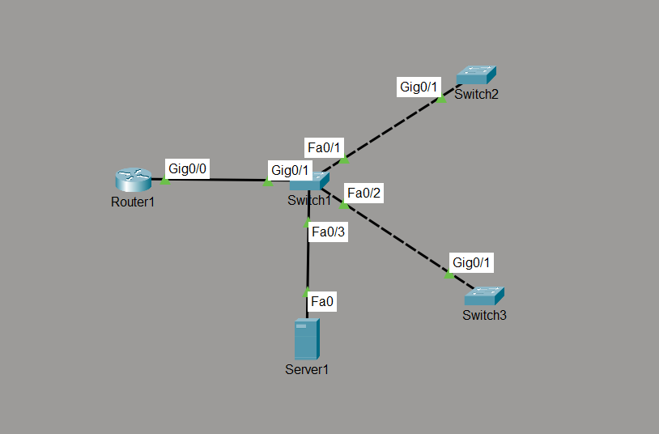

# Syslog

## Objective

Design and implement a centralized Syslog infrastructure where Cisco network devices forward system log messages to a dedicated Syslog server for centralized monitoring and troubleshooting.

This lab demonstrates how enterprise networks collect events from multiple devices in a single location to simplify monitoring, auditing, and fault diagnosis.

---

# Topology



---

# Network Addressing

| Device | Interface | IP Address | Role |
|----------|-----------|---------------|----------------|
| R1 | G0/0 | 192.168.1.1/24 | Router |
| Core-SW | VLAN 1 | 192.168.1.2/24 | Syslog Client |
| SW1 | VLAN 1 | 192.168.1.3/24 | Syslog Client |
| SW2 | VLAN 1 | 192.168.1.4/24 | Syslog Client |
| Server1 | FastEthernet0 | 192.168.1.10/24 | Syslog Server |

Default Gateway (Switches & Server)

```
192.168.1.1
```

---

# Network Policies

- A dedicated Syslog server receives log messages from all Cisco devices.
- Every network device forwards log events to the centralized server.
- Syslog is used for network monitoring and troubleshooting.
- Interface status changes are recorded for operational visibility.

---

# How it Works

1. A Syslog server is enabled on the management server.
2. Cisco devices are configured with the remote Syslog server address.
3. When network events occur, devices generate Syslog messages.
4. The messages are transmitted to the centralized server.
5. Administrators monitor all network events from a single location.

---

# Verification

## Cisco Devices

```
show running-config | include logging
show logging
```

Verified:

- Remote Syslog server configured.
- Devices generating system log messages.

---

## Syslog Server

Verified:

- Successfully received remote Syslog messages.
- Logged interface state changes.
- Displayed events from Cisco network devices.

---

# Key Concepts Learned

- Syslog
- Centralized Logging
- Remote Logging
- Logging Server
- Event Monitoring
- Network Auditing
- Log Collection
- Network Troubleshooting

---

# Engineering Observations

Centralized logging is a critical component of enterprise network management. Rather than checking individual devices during a failure, administrators can review events from multiple routers and switches in one location.

Syslog significantly reduces troubleshooting time by preserving a centralized record of network events such as interface failures, configuration changes, and operational status messages.

---

# Troubleshooting Experience

### Issue

Configuration changes such as hostname modifications were not displayed on the Syslog server.

### Cause

Packet Tracer does not emulate every Syslog message generated by Cisco IOS. Certain configuration events are not forwarded to the simulated Syslog server.

### Resolution

Interface state changes (`shutdown` / `no shutdown`) were used to generate Syslog messages, as these are fully supported within Packet Tracer.

### Verification

- Remote logging successfully configured.
- Interface events received by the Syslog server.
- Cisco devices successfully forwarded Syslog messages to the centralized logging server.

---

# Skills Learned

- Configure remote Syslog on Cisco devices
- Configure a centralized Syslog server
- Generate and analyze Syslog messages
- Verify remote logging configuration
- Monitor network events centrally
- Understand enterprise logging architecture
- Troubleshoot Syslog communication

---

# Devices Used

- Cisco 2911 Router
- Cisco Catalyst 2960 Switches
- Packet Tracer Server
- Cisco Packet Tracer

---

# Files Included

- topology.png
- Syslog.pkt
- README.md