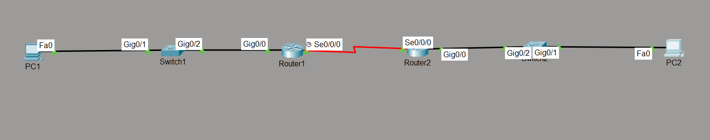

# PPP (Point-to-Point Protocol) Lab

## Objective

Configure Point-to-Point Protocol (PPP) encapsulation on a serial WAN link between two Cisco routers. Verify successful communication and understand the advantages of PPP over the default HDLC encapsulation.

---

## Topology



---

## Network Addressing

### LAN 1

| Device | IPv4 Address |
|----------|-------------|
| PC1 | 192.168.1.10/24 |
| R1 Fa0/0 | 192.168.1.1/24 |

Default Gateway: **192.168.1.1**

---

### WAN Link

| Device | IPv4 Address |
|----------|-------------|
| R1 Serial1/0 | 10.0.0.1/30 |
| R2 Serial1/0 | 10.0.0.2/30 |

---

### LAN 2

| Device | IPv4 Address |
|----------|-------------|
| R2 Fa0/0 | 192.168.2.1/24 |
| PC2 | 192.168.2.10/24 |

Default Gateway: **192.168.2.1**

---

## Network Policies

The following configuration was implemented:

- Configured IPv4 addressing on LAN and WAN interfaces.
- Replaced the default HDLC encapsulation with PPP.
- Configured static routing for end-to-end connectivity.
- Verified PPP encapsulation and successful communication.

---

## How it Works

Cisco serial interfaces use **HDLC** encapsulation by default.

PPP replaces HDLC as the Layer 2 protocol used on point-to-point serial links.

Unlike HDLC, PPP is an open standard and provides additional features including:

- Authentication (PAP and CHAP)
- Multi-vendor interoperability
- Link Quality Monitoring
- Error Detection

The IP packet remains unchanged. Only the Layer 2 encapsulation changes from HDLC to PPP before transmission across the serial link.

---

## Verification

### Interface Status

- `show ip interface brief`

### Verify PPP Encapsulation

- `show interfaces serial1/0`

Expected Output:

```
Encapsulation PPP
```

### Routing Table

- `show ip route`

### Connectivity Testing

- `ping`

---

## Key Concepts Learned

- Point-to-Point Protocol (PPP)
- HDLC vs PPP
- Layer 2 Encapsulation
- Point-to-Point WAN Links
- Static Routing
- PPP Verification Commands

---

## Engineering Observations

This lab demonstrated several important WAN concepts:

- Cisco routers use HDLC by default on serial interfaces.
- PPP replaces HDLC using the `encapsulation ppp` command.
- Both ends of the serial link must use the same encapsulation.
- PPP operates at Layer 2 of the OSI model.
- The IP packet is unchanged; only the Layer 2 frame changes.
- PPP serves as the foundation for PAP and CHAP authentication.

---

## Troubleshooting Experience

During implementation and testing:

- Verified interface status.
- Confirmed serial encapsulation was changed to PPP.
- Verified static routes on both routers.
- Tested end-to-end connectivity between both LANs.
- Confirmed successful PPP operation using `show interfaces`.

---

## Skills Learned

- PPP Configuration
- WAN Configuration
- Serial Interface Configuration
- Cisco IOS Verification
- WAN Troubleshooting

---

## Devices Used

- 2 × Cisco Routers
- 2 × Cisco Switches
- 2 × PCs

---

## Files Included

- `ppp-lab.gns3`
- `R1-config.txt`
- `R2-config.txt`
- `PC1-config.txt`
- `PC2-config.txt`
- `R1-config.png`
- `R2-config.png`
- `topology.png`